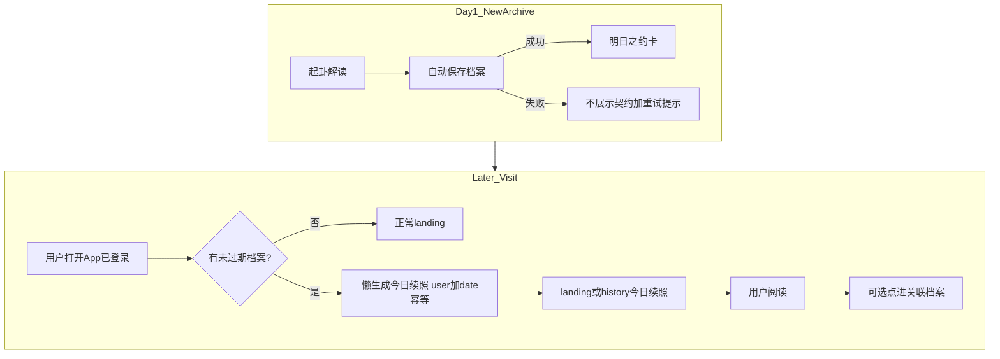
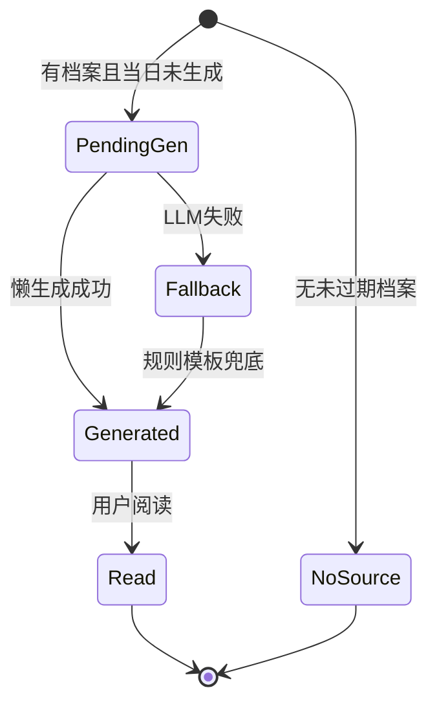
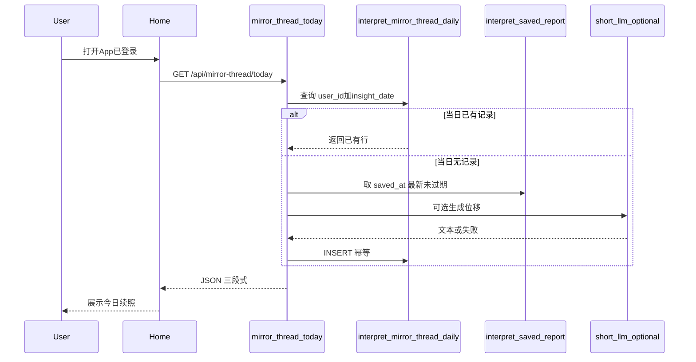

# Feature Spec: 镜脉 · 叙事续照

## 文首属性

| 属性 | 值 |
|------|-----|
| 状态 | backlog |
| 范围 | 镜脉续照（明日之约 + 今日续照）、`interpret_mirror_thread_daily`、镜脉 API、landing/history/interpretation UI |
| 关联文档 | [docs/product-brief.md](../../docs/product-brief.md)、[docs/supabase-tables.md](../../docs/supabase-tables.md)、[docs/backend-best-practices.md](../../docs/backend-best-practices.md)、[specs/prds/prd-00002-report-auto-save-retention.md](../prds/prd-00002-report-auto-save-retention.md) |
| 父特性 | 无 |
| 序号 | 00001 |

---

## 史诗目标与商业价值

### Epic

**提升 D1→D7 有意义回访率**——用户因想继续读「与自己相关的故事」而回访，而非为打卡、连续登录或外部奖励。

**北极星行为**：已登录用户打开 App 后，阅读「今日续照」≥30 秒（或点击进入关联档案阅读）。**不**将裸 DAU 或登录次数作为成功指标。

### 现状与要解决的问题

镜微（[docs/product-brief.md](../../docs/product-brief.md)）单次解读闭环强：起卦 → 四镜解读 → 自我觉察 → 深入追问 → 镜下对话。观心档案已可云端自动保存（[prd-00002](../prds/prd-00002-report-auto-save-retention.md)），但 **跨日叙事连接弱**——用户完成一次照见后缺少「明天还要回来」的内因理由。

| 痛点 | 说明 |
|------|------|
| 叙事断裂 | 每次解读是孤立事件，用户难以感知「自己的故事在延续」 |
| 回访无钩子 | [`Home.tsx`](../../src/pages/Home.tsx) 主状态机 `landing → divination → interpretation → history` 无跨日回访触点 |
| 外因留存禁区 | 打卡、streak、每日登录奖励等与产品「映照叙事」定位不符，且不可采用 |

### 目标（Release 0 / MVP）

- **明日之约**：每条新档案在解读流 autosave **成功**后，于 [`Interpretation.tsx`](../../src/components/IChing/Interpretation.tsx) 展示收尾契约——用户明确知道「明日会有新照见」。
- **今日续照**：已登录用户 **当日首次** 打开 App 时 **懒生成** 一条只读续照（东八区自然日幂等）；展示于 landing / history 顶部。
- **先看、低门槛**：续照为固定三段式（回响 / 位移 / 若有余力），**不要求**用户写作；阅读 1–3 分钟即完成回访。
- **不消耗解读额度**：续照生成与展示 **不** 调用 `consume_interpret_quota`。
- **规则 + 轻量 LLM**：位移段优先短 prompt 生成；失败时规则模板降级。

### 非目标（明确不做）

- 打卡、连续签到天数（streak）、每日登录奖励、任务中心式外因激励。
- 缺席日 **补发** 续照（用户 D2/D3 未打开，D4 只生成 D4 一条，不堆叠多张历史卡片）。
- 凌晨 batch 定时预生成；邮件 / 浏览器 Push 提醒（Release 0 仅站内）。
- 续照扣减主解读日额度。
- 镜下 8 轮对话（[`DeepDialogue.tsx`](../../src/components/IChing/DeepDialogue.tsx)）云端化。
- 方案 B「卦象回响」作为独立功能（可作为续照 **模板类型** 融入位移逻辑，不单独立项）。
- 分享页访客（`/s/:token`）的镜脉 / 续照能力。

### 术语表

| 术语 | 含义 |
|------|------|
| **镜脉** | 用户所有未过期观心档案在服务端串联形成的个人叙事线（非社交 Feed） |
| **明日之约** | 单条档案解读收尾处的契约 UI：承诺下一自然日会有新的续照 |
| **今日续照** | 东八区自然日内、用户首次访问时懒生成的只读三段式内容 |
| **回响** | 续照第一段：从主素材档案摘录 1 句（觉察优先，无则报告原文） |
| **位移** | 续照第二段：80–120 字「再照」短文（规则模板 + 可选短 LLM） |
| **若有余力** | 续照第三段：1 条可折叠苏格拉底式追问（纯读，Release 0 无写入口） |
| **主素材档案** | 生成当日续照时所依据的 `interpret_saved_report` 行；默认取 **`saved_at` 最新且未过期** 的一条 |
| **懒生成** | 用户当日首次打开（已登录）时触发生成；非凌晨批处理 |
| **同日多卦** | 用户在同一东八区自然日内保存多条档案；次日（或下次打开日）续照仍以 **最后保存** 的档案为主素材，当日仅 1 张续照 |

---

## 决策天条（已拍板 vs 开放）

| # | 决策 | 结论 | 状态 |
|---|------|------|------|
| 1 | 留存驱动力 | 内因：续照映照用户自身叙事 | **已拍板** |
| 2 | 回访 MVP | 先看，不要求写觉察 | **已拍板** |
| 3 | 明日之约触发 | **每条新档案** autosave 成功后展示一次 | **已拍板** |
| 4 | 续照生成时机 | 登录后当日 **首次** 访问懒生成；不补发缺席日 | **已拍板** |
| 5 | 日切时区 | 东八区自然日（与 `interpret_usage_daily` 一致） | **已拍板** |
| 6 | 同日多卦主素材 | `saved_at` **最新** 且未过期的档案 | **已拍板** |
| 7 | 缺席多日文案 | 可自然提及「距上次照见 N 天」；无断签 / 愧疚文案 | **已拍板** |
| 8 | autosave 失败 | **不** 展示明日之约 | **已拍板** |
| 9 | `auth/me` 内嵌续照 | Release 0 独立 `GET`；是否合并入 `/api/auth/me` | 开放 |
| 10 | 会员更长位移 LLM | 非 MVP | 开放 |

---

## 核心创意与内生动力学

### 机制

1. **自我参照效应**：用户最关心与自己相关的内容；续照从 **其本人档案** 摘录与再诠释。
2. **蔡加尼克效应（开放环）**：明日之约建立「明天会照出什么」的好奇，对象是 **自己的故事** 而非外部奖励。
3. **时间位移洞察**：隔日再读同一句，认知会发生变化——产品是「再照的镜子」，不是「签到簿」。

### 续照三段式（固定 UI）

```
【回响】—— 主素材档案 1 句摘录
【位移】—— 80–120 字再照（可提及距上次天数）
【若有余力】—— 1 条可折叠追问（默认折叠）
```

### 边界与异常清单

| # | 情形 | 行为 |
|---|------|------|
| 1 | 无未过期档案 | 不展示今日续照；landing 保持现状 |
| 2 | 全部档案已过期 | 同 #1；history 空态可提示「新的一次照见会重新开始镜脉」 |
| 3 | autosave 失败 | 不展示明日之约；保留现有重试 / 失败提示 |
| 4 | LLM 生成失败 / 超时 | 降级：回响 = 规则摘句；位移 = 固定模板（含可选天数占位） |
| 5 | 同日多 Tab 首次打开 | `(user_id, insight_date)` 幂等，返回同一条续照 |
| 6 | 越权访问 | API 仅服务当前 Cookie 会话 `user_id` |
| 7 | 分享访客 `/s/:token` | 无镜脉、无续照 |
| 8 | 恶意同日多次解读刷内容 | 续照不按解读次数递增；当日幂等一条 |
| 9 | 未登录 | 不请求续照 API；不展示今日续照 |

---

## 端到端剧本

### 剧本 A：名门正派（首档案 → 次日回访）

1. 小陈首次起卦，读完四镜报告，写了两句觉察；档案自动保存成功。
2. 解读页底部出现 **明日之约**：「镜脉已记下这一照。明日你再来，会照见这条线的下一笔。」
3. 次日中午打开 App；landing 顶部出现 **今日续照**。
4. 【回响】引用她昨日觉察；【位移】将觉察与「内心之镜」并置；【若有余力】一条追问（折叠）。
5. 她阅读约 1 分钟，未写任何内容，离开。**回访完成。**

### 剧本 B：造化弄人（未写觉察）

1. 小李只读报告，未填自我觉察，关闭页面；autosave 仍成功。
2. 同样看到明日之约（不依赖觉察字段）。
3. 次日续照从 **阴影之镜** 段落规则抽取一句报告原文作为回响。
4. 用户感到「隔了一夜这句话更扎心」——内因成立。

### 剧本 C：缺席多日（拒绝 streak 焦虑）

1. 小王 Day1 用完，Day2–4 未打开。
2. Day5 打开：**不出现**「你断了 3 天」或连续签到 UI。
3. 仅生成 **Day5 一条** 续照；位移段可写「距你上次照见已过 4 天」。
4. **不** 补发 Day2/D3/D4 的续照卡片。

### 剧本 D：断网 / autosave 失败

1. 解读 SSE 成功但 autosave 失败（`autosaveFailed` 路径）。
2. **不展示** 明日之约，避免空承诺。
3. 用户重试保存成功后，再展示明日之约。

### 剧本 E：心怀鬼胎（同日多卦）

1. 用户同一自然日内起卦 2 次，均 autosave 成功；每次解读结束各展示一次明日之约。
2. 次日（或下一打开日）**仅 1 张** 今日续照。
3. 主素材 = **`saved_at` 较新** 的那条档案。
4. API 按 `(user_id, insight_date)` 幂等，不可通过重复请求刷出不同正文。

---

## 业务闭环与状态机

### 全局流程



### 续照实体生命周期



---

## 开发 Backlog（可直接导入 Issue）

### 用户旅程步骤（精化）

1. 用户完成起卦与四镜解读
2. 档案自动保存成功 → 看到明日之约
3. （跨日或下次打开）用户登录进入 landing
4. 系统懒生成 / 返回当日续照
5. 用户阅读三段式续照（核心回访）
6. （可选）点击跳转关联档案 `interpretation`
7. （可选）用户因新困惑发起新一轮起卦
8. 新档案再次触发明日之约，镜脉延续

### Backlog 条目

- [ ] **FEAT-00001-01-FE**: [前端] 解读页「明日之约」收尾卡
  - **As a** 完成一次观心解读的登录用户 **I want to** 在档案记下后看到「明日会有新照见」的说明 **So that** 我带着对自己故事的好奇离开，而非任务感。
  - **AC (验收标准)**:
    - **Given** 解读 SSE 成功结束且 `onSave` / autosave **成功**返回档案 id
    - **When** 用户滚动至解读页收尾区域
    - **Then** 展示明日之约卡（叙事文案，无打卡/streak/奖励字样）
    - **Given** autosave **失败**或未返回有效档案 id
    - **When** 用户查看解读页收尾
    - **Then** **不** 展示明日之约；保留失败 / 重试提示

- [ ] **FEAT-00001-02-FE**: [前端] landing 态「今日续照」只读卡
  - **As a** 有未过期档案的回访用户 **I want to** 在首页顶部阅读今日续照 **So that** 无需起新卦也能继续照见自己的叙事。
  - **AC (验收标准)**:
    - **Given** 用户已登录且 `GET /api/mirror-thread/today` 返回 200 与正文
    - **When** 用户处于 `landing` 态
    - **Then** 置顶展示三段式续照（回响 / 位移 / 若有余力）；无写作输入框
    - **Given** API 返回 204 或 `enabled: false`（无未过期档案）
    - **When** 用户进入 landing
    - **Then** 不展示续照卡，页面其余行为不变
    - **Given** 用户点击「查看来源档案」类入口
    - **When** 触发导航
    - **Then** 进入 `interpretation` 并注入对应 `archivePayload`（`fromArchive`）

- [ ] **FEAT-00001-03-FE**: [前端] history 态复用续照卡
  - **As a** 从档案入口回访的用户 **I want to** 在 history 页也能看到与 landing 相同的今日续照 **So that** 我不必回到首页才能读到今日内容。
  - **AC (验收标准)**:
    - **Given** 今日续照已生成
    - **When** 用户进入 `history` 态
    - **Then** 列表上方展示与 landing **相同** 的 `MirrorThreadInsight` 组件实例（共享数据，不重复请求或请求结果一致）
    - **Given** 当日无续照可展示
    - **When** 用户进入 history
    - **Then** 不展示续照区域

- [ ] **FEAT-00001-04-BE**: [后端] `GET /api/mirror-thread/today`
  - **As a** 已登录客户端 **I want to** 拉取或触发当日续照 **So that** 前端可展示懒生成的只读内容。
  - **AC (验收标准)**:
    - **Given** 有效会话 Cookie 且存在未过期档案
    - **When** `GET /api/mirror-thread/today` 在东八区自然日 **首次** 调用
    - **Then** 返回 JSON：`source_report_id`、`echo_text`、`shift_text`、`optional_prompt`、`insight_date`（东八区 date 字符串）、`generated_at`；HTTP 200
    - **Given** 同日同用户 **再次** 调用
    - **When** 请求到达
    - **Then** 返回 **同一条** 已持久化记录（幂等），不重复调用 LLM
    - **Given** 无未过期档案
    - **When** `GET /api/mirror-thread/today`
    - **Then** HTTP 204 或 200 + `{ "enabled": false }`（团队实现时二选一并文档化）
    - **Given** 未登录或会话无效
    - **When** 请求到达
    - **Then** HTTP 401

- [ ] **FEAT-00001-05-BE**: [后端] 续照生成逻辑（主素材与缺席日）
  - **As a** 产品 **I want to** 续照内容始终锚定用户最新档案且尊重缺席日规则 **So that** 回访动机来自叙事本身而非任务补发。
  - **AC (验收标准)**:
    - **Given** 用户有多条未过期档案
    - **When** 生成当日续照
    - **Then** `source_report_id` = `saved_at` **最大** 的那条
    - **Given** 用户上次打开距今 N 个自然日（N>1）
    - **When** 生成位移段
    - **Then** 文案可自然提及间隔天数；**不** 为中间缺失日创建多条记录
    - **Given** 用户有自我觉察 Markdown 段落
    - **When** 生成回响段
    - **Then** 优先摘录觉察句；否则从 `interpretation` 规则选取一句

- [ ] **FEAT-00001-06-DB**: [数据库] `interpret_mirror_thread_daily` 表与迁移
  - **As a** 后端 **I want to** 持久化每日续照 **So that** 幂等、可审计且支持懒生成回读。
  - **AC (验收标准)**:
    - **Given** migration 应用成功
    - **When** 查看 `public.interpret_mirror_thread_daily`
    - **Then** 含字段：`id` (uuid PK)、`user_id` (FK auth.users)、`insight_date` (date)、`source_report_id` (FK interpret_saved_report)、`echo_text`、`shift_text`、`optional_prompt`、`created_at`；**唯一** `(user_id, insight_date)`
    - **Given** RLS 开启
    - **When** anon/authenticated 直连 PostgREST
    - **Then** 无 policy（与现有 `interpret_*` 表一致，仅 service_role 经服务端访问）

- [ ] **FEAT-00001-07-BE**: [后端] LLM 失败降级
  - **As a** 用户 **I want to** 在模型不可用时仍能读到续照 **So that** 回访链路不中断。
  - **AC (验收标准)**:
    - **Given** 短 LLM 调用超时或返回错误
    - **When** 生成位移段
    - **Then** 使用固定模板 + 回响句拼接；仍写入 `interpret_mirror_thread_daily`；HTTP 200
    - **Given** 降级路径
    - **When** 用户阅读续照
    - **Then** 不出现空白或 500 页面

- [ ] **FEAT-00001-08-FE**: [前端] 空态、加载与错误
  - **As a** 回访用户 **I want to** 在续照加载或失败时获得清晰反馈 **So that** 我不困惑于空白区域。
  - **AC (验收标准)**:
    - **Given** 续照 API 请求进行中
    - **When** landing 将展示续照位
    - **Then** 显示 skeleton 或轻量 loading，不占满屏
    - **Given** API 5xx 或网络错误
    - **When** 加载失败
    - **Then** 轻量 toast 或内联提示；**不** 阻断起卦等主流程
    - **Given** 文案含打卡、streak、奖励字样
    - **When** 产品验收
    - **Then** **拒绝合并**（全文检索不得出现）

---

## 数据与 API 衔接（高层）

### 数据流



### 表设计（建议）

**`interpret_mirror_thread_daily`**

| 字段 | 类型 | 说明 |
|------|------|------|
| `id` | `uuid` | 主键 |
| `user_id` | `uuid` | FK → `auth.users`，ON DELETE CASCADE |
| `insight_date` | `date` | 东八区自然日 |
| `source_report_id` | `uuid` | FK → `interpret_saved_report` |
| `echo_text` | `text` | 回响段 |
| `shift_text` | `text` | 位移段 |
| `optional_prompt` | `text` | 若有余力（可空） |
| `created_at` | `timestamptz` | 生成时刻 |

**唯一约束**：`(user_id, insight_date)`。

### HTTP

| 方法 | 路径 | 用途 |
|------|------|------|
| GET | `/api/mirror-thread/today` | 获取或懒生成当日续照 |

**双运行时**：[`server.ts`](../../server.ts) 注册路由 + [`api/mirror-thread/today.ts`](../../api/mirror-thread/today.ts)（遵循 [backend-best-practices.md](../../docs/backend-best-practices.md)）。

**不改动**：`POST /api/interpret/stream`、`consume_interpret_quota`、分享 API、深度对话 localStorage 键。

### 前端触点（实现期参考）

| 文件 | 变更意图 |
|------|----------|
| [`src/components/IChing/Interpretation.tsx`](../../src/components/IChing/Interpretation.tsx) | autosave 成功后明日之约 UI |
| [`src/pages/Home.tsx`](../../src/pages/Home.tsx) | landing 拉取并展示续照 |
| [`src/components/IChing/History.tsx`](../../src/components/IChing/History.tsx) | history 顶部复用续照 |
| `src/components/IChing/MirrorThreadInsight.tsx`（新建） | 三段式只读卡片 |
| `src/lib/mirror-thread-api.ts`（新建） | 封装 GET today |
| `server/mirror-thread-handlers.ts`（新建） | 生成、幂等、降级 |

---

## 假设与待确认 / 开放项

| 项 | 说明 |
|----|------|
| PRD-00002 依赖 | 明日之约依赖 autosave 成功；可与 PRD-00002 并行，但上线顺序须保证 autosave 可用 |
| `auth/me` 合并 | Release 0 使用独立 GET；后续可将 `mirrorThreadToday` 摘要并入以减少往返 |
| 会员加长位移 | 非 MVP；若做须在 Spec 修订记录中另开 FEAT |
| 文档漂移 | 若 [product-brief.md](../../docs/product-brief.md) 仍写「手动保存」，以 PRD-00002 as-built 为准 |
| 卦象回响模板 | 当主素材卦象在 30 天内第 2+ 次出现时，位移段 **可** 采用「回响模板 B」；实现细节由工程在 handler 内配置 |

### 冲突与决议需求

无与现有 PRD 冲突；本特性 **补充** PRD-00002 的留存价值，不修改其保留期与 autosave 契约。

---

## 修订记录

| 日期 | 说明 |
|------|------|
| 2026-06-18 | 初稿：探索收敛落盘；内因留存、懒生成、每条档案明日之约、同日多卦取最新档案 |
