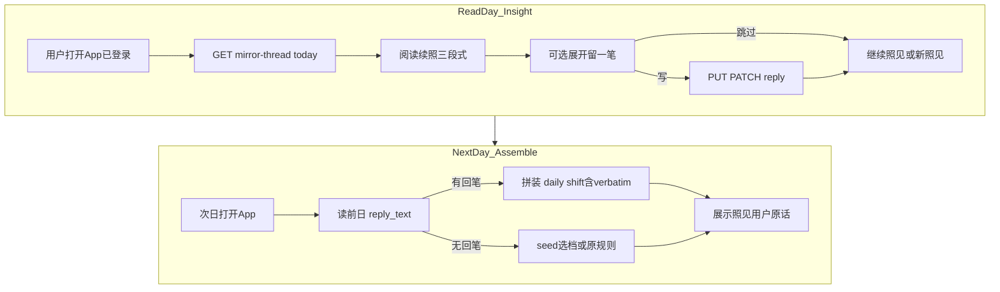
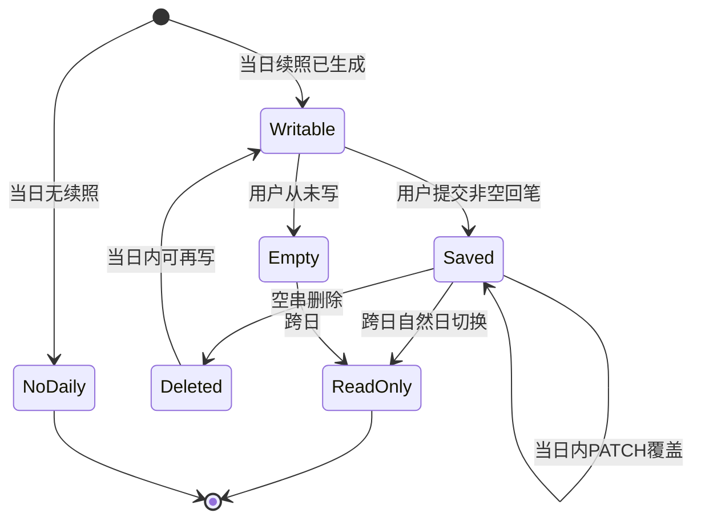
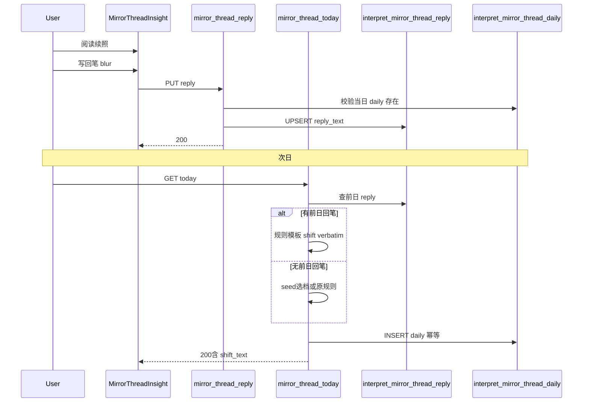

# Feature Spec: 镜脉 · 回笔

## 文首属性

| 属性 | 值 |
|------|-----|
| 状态 | backlog |
| 范围 | 镜脉回笔、`interpret_mirror_thread_reply`、`PUT/PATCH /api/mirror-thread/reply`、today 前日回笔注入位移、MirrorThreadInsight 回笔 UI |
| 关联文档 | [docs/product-brief.md](../../docs/product-brief.md)、[docs/supabase-tables.md](../../docs/supabase-tables.md)、[docs/backend-best-practices.md](../../docs/backend-best-practices.md)、[specs/features/feat-00001-mirror-thread-daily-insight.md](./feat-00001-mirror-thread-daily-insight.md)、[specs/prds/prd-00003-mirror-thread-daily-insight.md](../prds/prd-00003-mirror-thread-daily-insight.md)、[specs/prds/prd-00004-mirror-thread-seed-pregen.md](../prds/prd-00004-mirror-thread-seed-pregen.md) |
| 父特性 | [feat-00001-mirror-thread-daily-insight.md](./feat-00001-mirror-thread-daily-insight.md) |
| 序号 | 00002 |

---

## 史诗目标与商业价值

### Epic

**闭合镜脉开放环，强化 D1→D7 内因回访**——用户在读完今日续照后，可选用一两句留下「今天的我」；次日续照的位移段 **verbatim 照见** 用户昨日原话，形成「读 → 写 → 再被照见」的叙事螺旋，而非打卡、任务或外部奖励。

**北极星行为**（继承 [prd-00003](../prds/prd-00003-mirror-thread-daily-insight.md)）：已登录用户阅读「今日续照」≥30 秒，或点击进入关联档案。**新增观测**：回笔率、写回笔用户 D+1 打开率 vs 只读对照。**不**将裸 DAU、连续写回笔天数作为成功指标。

### 现状与要解决的问题

镜脉续照 R0 + seed v2（[prd-00004](../prds/prd-00004-mirror-thread-seed-pregen.md)）已建立内因回访闭环：明日之约 → 今日续照（echo Hero / shift / 若有余力）。但 R0 **刻意只读**——「若有余力」追问悬在空中，用户无法闭合叙事环；续照仍是「产品说给你听」，缺少 **用户 co-author** 的螺旋。

| 痛点 | 说明 |
|------|------|
| 开放环未闭合 | 蔡加尼克效应开了「明天会照出什么」，用户却无法用一句话回应今天的镜 |
| 单向叙事 | 自我觉察仅在起卦解读时写入档案；跨日回访无轻量「留一笔」入口 |
| 次日缺少用户声音 | seed / shift 仅锚定报告正文，不引用用户 **对续照** 的即时回响 |
| 外因留存禁区 | 不可采用 streak、打卡、闸卡登录、写回笔换额度 |

### 目标（Release 0 / MVP）

- **可选回笔**：在 [`MirrorThreadInsight.tsx`](../../src/components/IChing/MirrorThreadInsight.tsx) 续照下方提供折叠区「若有余力，留一笔」；单行/极短 Textarea；**不强制**写作。
- **绑定当日续照**：`(user_id, insight_date)` 与 `interpret_mirror_thread_daily` 1:1；语义为「对今天这面镜子的回应」。
- **当日可改、跨日只读**：东八区自然日内可 PATCH 覆盖或空串删除；跨日后只读展示（若有）。
- **次日位移引用**：生成当日 daily 时，若存在 **前一日** 非空 `reply_text`，位移段优先使用 **规则模板** 插入用户 verbatim（**打开日零 LLM**，继承 00004 P95 < 500ms）。
- **不消耗解读额度**：回笔 API 与 today 拼装路径 **不** 调用 `consume_interpret_quota`。
- **无 hard gate**：不依赖续照阅读 beacon ≥1s 才可写；回笔区域自然出现在续照下方。

### 非目标（明确不做）

- streak、连续写回笔天数、打卡、每日登录奖励、任务中心。
- 强制写回笔才能「继续照见 / 开启新的照见」。
- 回笔排行榜、分享回笔、他人可见（非私密 UGC）。
- 回笔换解读额度 / 会员试用。
- 邮件 / Push「你昨天留了话没来看」。
- MVP 打开日 LLM 重写 shift；R1 可选 seed 增量 refresh。
- 缺席日补发历史回笔卡片。

### 术语表

| 术语 | 含义 |
|------|------|
| **镜脉** | 用户未过期观心档案串联的个人叙事线（继承 feat-00001） |
| **今日续照** | 东八区自然日 lazy daily 三段式只读内容 |
| **回笔** | 用户对 **当日续照** 的可选短回应，绑定 `(user_id, insight_date)` |
| **前日回笔** | 生成今日 daily 时读取的 `insight_date - 1` 非空回笔 |
| **verbatim 照见** | 位移段规则模板中 **原样引用** 用户回笔文本，不做 LLM 改写 |
| **规则位移（回笔版）** | 有前日回笔时使用的固定模板 shift，零打开日 LLM |

---

## 决策天条（已拍板 vs 开放）

| # | 决策 | 结论 | 状态 |
|---|------|------|------|
| 1 | 留存驱动力 | 内因：用户想看见 **自己的话** 被再照 | **已拍板** |
| 2 | 回笔绑定 | `(user_id, insight_date)`，与 daily 1:1 | **已拍板** |
| 3 | 次日内容衔接 MVP | 规则位移模板 verbatim 引用前日回笔；打开日零 LLM | **已拍板** |
| 4 | 写回笔门槛 | 无 hard read gate；不依赖 beacon | **已拍板** |
| 5 | 回笔字数上限 | **120 字**（含标点；服务端校验） | **已拍板** |
| 6 | 编辑策略 | 当日可改/删（空串 = 删除）；跨日只读 | **已拍板** |
| 7 | 空回笔 | 与 R0 只读体验等价；seed / shift 行为不变 | **已拍板** |
| 8 | 时区 | 东八区自然日，与 daily 一致 | **已拍板** |
| 9 | seed 增量 refresh | 回笔后异步更新 seed shift 档 | R1 开放 |
| 10 | 会员加长位移 LLM | 回笔触发更长 LLM | R2 开放 |

---

## 核心创意与内生动力学

### 机制

1. **自我参照效应**：用户最关心与自己相关的内容；次日位移 **原样照见** 用户昨日写下的话，比 AI 独白更强回访动机。
2. **蔡加尼克效应（闭合环）**：feat-00001 用「若有余力」开了环；回笔让用户 **亲手合上** 一环，且明天会看见「自己的闭合被照见」。
3. **叙事 co-author**：从「产品说给你听」升级为「你在改写自己的故事」——Whole Widget 螺旋：续照 → 回笔 → 次日再照。
4. **可选与零任务感**：不写回笔 = 现网体验；无奖励、无 streak、无闸卡。

### 回笔 UI（固定形态）

```text
【若有余力，留一笔】—— 折叠区（默认折叠）
  单行/极短 Textarea，placeholder 邀请式
  blur 或轻量「记下」保存；当日可改
```

### 位移规则模板（有前日回笔时，MVP）

```text
你昨日留下：「{reply_text}」——隔了一夜，这句话是否多了一层滋味？照见不是为了给答案，而是多一个温柔的停顿。
```

- `{reply_text}` 为用户 verbatim；若超长展示由 UI 控制，入库仍完整 ≤120 字。
- 无前日回笔时，走现有 seed 选档 / 规则降级路径（与 00004 一致）。

### 边界与异常清单

| # | 情形 | 行为 |
|---|------|------|
| 1 | 当日无 daily（204） | 不可写回笔；API 404 或 409「续照尚未生成」 |
| 2 | 未登录 | 不展示回笔 UI；API 401 |
| 3 | 跨日编辑 | PATCH 拒绝或只读；前端禁用输入 |
| 4 | 空串提交 | 删除回笔行；次日不引用 |
| 5 | 超长回笔 | 422 + 客户端 maxlength |
| 6 | 同日多次 PATCH | 幂等覆盖 `reply_text` + `updated_at` |
| 7 | 前日有回笔、当日 daily 已生成 | **不**  retroactive 改当日 shift（仅生成时注入） |
| 8 | 断网保存失败 | toast 重试；不阻断继续照见 / 起卦 |
| 9 | 恶意刷字 | 120 字上限 + 同日覆盖；不增 daily 条数、不刷 LLM |
| 10 | daily 删除 CASCADE | 回笔随 `daily_id` 删除 |

---

## 端到端剧本

### 剧本 A：名门正派（读 → 写 → 次日被照见）

1. 小陈 D1 起卦 autosave → 明日之约。
2. D2 打开 landing，阅读今日续照；被 optionalPrompt 触动，展开「留一笔」，写「原来我怕的不是失败，是被人看见」。
3. blur 保存成功，继续离开（无任务完成感）。
4. D3 打开续照；位移段：「你昨日留下：「原来我怕的不是失败，是被人看见」——隔了一夜……」
5. 她因好奇 **自己的话** 如何被再照而 D3 回访完成。

### 剧本 B：只读用户（零回归）

1. 小李从不写回笔。
2. 体验与现网 feat-00001 + 00004 完全一致；位移走 seed 选档 / 原规则。

### 剧本 C：缺席多日

1. 小王 D5 才回来写回笔。
2. **不出现**「你断了 N 天」或连续写回笔 UI。
3. D6 位移照见 D5 回笔；中间缺席日 **不** 补发。

### 剧本 D：断网 / 保存失败

1. 用户写回笔后 PATCH 失败。
2. toast「暂未记下，请稍后再试」；本地保留草稿（可选 localStorage 键 `mirror_thread_reply_draft_{insightDate}`）。
3. 「继续照见 / 开启新的照见」仍可用。

### 剧本 E：心怀鬼胎（刷字 / 并发）

1. 用户同日 PATCH 回笔 10 次。
2. 仅保留最后一次；不增加续照条数。
3. 两 Tab 并发 PATCH → 最后写入胜出；唯一约束 `(user_id, insight_date)`。

### 剧本 F：跨日只读

1. 用户 D2 23:50 写回笔；D3 00:10 打开 history 看 D2 续照（若产品允许看历史 daily）。
2. Release 0：**回笔仅绑定当日续照**；history 展示 **当日** today 卡片的回笔区；历史日回笔 **只读**（若 GET today 返回 `userReply` 仅当日）。

---

## 业务闭环与状态机

### 全局流程



### 回笔实体生命周期



**死胡同预警：**

- 强制写回笔才能点「继续照见」→ **禁止**；破坏可选原则。
- 打开日为回笔调 LLM → **禁止** MVP；破坏 P95 < 500ms。
- daily 已生成后 retroactive 改 shift → **禁止**；仅生成时注入前日回笔。

---

## 开发 Backlog（可直接导入 Issue）

### 用户旅程步骤（精化）

1. 用户跨日打开 App，阅读今日续照（继承 feat-00001）
2. （可选）展开「若有余力，留一笔」
3. 写下一两句回应，blur / 点击记下
4. 系统持久化回笔，无任务反馈
5. （可选）继续照见档案或开启新照见
6. 次日打开，位移段 verbatim 照见昨日回笔
7. 用户因好奇「自己的话如何被再照」而回访
8. 循环：读 → 写 → 再被照见

### Backlog 条目

- [ ] **FEAT-00002-01-DB**: [数据库] `interpret_mirror_thread_reply` 表与迁移
  - **As a** 后端 **I want to** 持久化每日回笔 **So that** 幂等、可审计且支持前日引用。
  - **AC (验收标准)**:
    - **Given** migration 应用成功
    - **When** 查看 `public.interpret_mirror_thread_reply`
    - **Then** 含字段：`id` (uuid PK)、`user_id` (FK auth.users)、`insight_date` (date)、`daily_id` (FK interpret_mirror_thread_daily ON DELETE CASCADE)、`reply_text` (text NOT NULL when row exists)、`created_at`、`updated_at`；**唯一** `(user_id, insight_date)`
    - **Given** RLS 开启
    - **When** anon/authenticated 直连 PostgREST
    - **Then** 无 policy（与现有 `interpret_*` 镜脉表一致）

- [ ] **FEAT-00002-02-BE**: [后端] `PUT/PATCH /api/mirror-thread/reply`
  - **As a** 已登录用户 **I want to** 保存或更新当日回笔 **So that** 我的回应被记入镜脉。
  - **AC (验收标准)**:
    - **Given** 有效会话且当日 `interpret_mirror_thread_daily` 已存在
    - **When** `PUT /api/mirror-thread/reply` body `{ replyText: "..." }`（≤120 字）
    - **Then** HTTP 200 + `{ insightDate, replyText, updatedAt }`；upsert `(user_id, insight_date)`
    - **Given** `replyText` 为空串或仅空白
    - **When** PUT/PATCH
    - **Then** 删除该行（若存在）；HTTP 200 或 204
    - **Given** 当日无 daily
    - **When** PUT
    - **Then** HTTP 409 或 404（团队实现时二选一并文档化）
    - **Given** `replyText` 长度 > 120
    - **When** PUT
    - **Then** HTTP 422
    - **Given** 未登录
    - **When** 请求
    - **Then** HTTP 401

- [ ] **FEAT-00002-03-BE**: [后端] today 拼装注入前日回笔位移
  - **As a** 回访用户 **I want to** 在次日续照中看到昨日回笔被照见 **So that** 我有内因理由回来读。
  - **AC (验收标准)**:
    - **Given** 前一日 `(user_id, insight_date - 1)` 存在非空 `reply_text`
    - **When** 当日 **首次** GET `/api/mirror-thread/today` 拼装 daily
    - **Then** `shift_text` 使用规则模板且 **包含** 用户 verbatim 子串；**不** 调用打开日 LLM
    - **Given** 前日无回笔
    - **When** 拼装 daily
    - **Then** 行为与 00004 seed 选档 / 原降级 **完全一致**
    - **Given** 当日 daily 已持久化
    - **When** 前日回笔稍后 PATCH（边界：跨时区极少 case）
    - **Then** **不** retroactive 更新已生成 daily 的 `shift_text`

- [ ] **FEAT-00002-04-BE**: [后端] GET today 响应扩展 `userReply`
  - **As a** 前端 **I want to** 在续照卡展示当日已保存回笔 **So that** 用户可继续编辑或只读查看。
  - **AC (验收标准)**:
    - **Given** 当日存在回笔
    - **When** GET `/api/mirror-thread/today` 200
    - **Then** JSON 含 `userReply: string | null`（当日可编辑态由前端结合 `insight_date` 判断）
    - **Given** 无回笔
    - **When** GET today
    - **Then** `userReply: null` 或字段省略（文档化二选一）

- [ ] **FEAT-00002-05-FE**: [前端] MirrorThreadInsight 回笔 UI
  - **As a** 读完续照的用户 **I want to** 可选用一两句留下回应 **So that** 明天能看见自己的话被再照。
  - **AC (验收标准)**:
    - **Given** 续照 hero 展示且用户已登录
    - **When** 用户展开「若有余力，留一笔」
    - **Then** 显示 Textarea（maxLength 120）、邀请式 placeholder；风格对齐 [`Interpretation.tsx`](../../src/components/IChing/Interpretation.tsx) 自我觉察
    - **Given** 用户 blur 或点击记下
    - **When** 非空且 ≤120 字
    - **Then** 调用 PUT reply；成功无「任务完成」类 toast（可轻量「已记下」或静默）
    - **Given** 文案含 streak / 打卡 / 奖励 / +1
    - **When** 产品验收
    - **Then** **拒绝合并**

- [ ] **FEAT-00002-06-FE**: [前端] 跨日只读与错误态
  - **As a** 用户 **I want to** 在跨日或失败时获得清晰反馈 **So that** 我不困惑或被阻断主流程。
  - **AC (验收标准)**:
    - **Given** `insight_date` 非东八区当日
    - **When** 展示回笔区
    - **Then** 只读展示 `userReply`；无输入框
    - **Given** PATCH 失败
    - **When** 保存回笔
    - **Then** toast 重试提示；**不** 阻断「继续照见 / 开启新的照见」
    - **Given** 用户从不写回笔
    - **When** 使用续照
    - **Then** 与现网 UI 差异仅为可选折叠区（默认折叠）

- [ ] **FEAT-00002-07-FE**: [前端] API client 与 Home 接线
  - **As a** 前端 **I want to** 封装 reply API **So that** landing / history 共享回笔状态。
  - **AC (验收标准)**:
    - **Given** [`src/lib/mirror-thread-api.ts`](../../src/lib/mirror-thread-api.ts)
    - **When** 新增 `putMirrorThreadReply`
    - **Then** 与 GET today 类型扩展一致；Express + Vercel 同源路径
    - **Given** [`Home.tsx`](../../src/pages/Home.tsx) 拉取 today
    - **When** 展示 MirrorThreadInsight
    - **Then** 传入 `userReply` 与 `onReplySave` 回调

- [ ] **FEAT-00002-08-BE**: [后端] 双运行时路由注册
  - **As a** 工程 **I want to** Express 与 Vercel 行为一致 **So that** 本地与线上一致。
  - **AC (验收标准)**:
    - **Given** [`server.ts`](../../server.ts) 与 [`api/mirror-thread/reply.ts`](../../api/mirror-thread/reply.ts)（新建）
    - **When** PUT/PATCH `/api/mirror-thread/reply`
    - **Then** 共用 [`server/mirror-thread-handlers.ts`](../../server/mirror-thread-handlers.ts) 中 `handleMirrorThreadReply`
    - **Given** 回笔与 today 路径
    - **When** 任意请求
    - **Then** **不** 调用 `consume_interpret_quota`

- [ ] **FEAT-00002-09-DOC**: [文档] product-brief 与 supabase-tables 更新
  - **As a** 协作者 **I want to** 文档与 as-built 一致 **So that** PRD / Agent 不漂移。
  - **AC (验收标准)**:
    - **Given** 功能合并主分支
    - **When** 阅读 [`docs/product-brief.md`](../../docs/product-brief.md) §3 与 §5
    - **Then** 含镜脉·回笔一行与 API 表 `PUT /api/mirror-thread/reply`
    - **Given** [`docs/supabase-tables.md`](../../docs/supabase-tables.md)
    - **When** 查看镜脉表
    - **Then** 含 `interpret_mirror_thread_reply` 字段说明

---

## 数据与 API 衔接（高层）

### 数据流



### 表设计

**`interpret_mirror_thread_reply`**

| 字段 | 类型 | 说明 |
|------|------|------|
| `id` | `uuid` | 主键 |
| `user_id` | `uuid` | FK → `auth.users`，ON DELETE CASCADE |
| `insight_date` | `date` | 东八区自然日，与 daily 对齐 |
| `daily_id` | `uuid` | FK → `interpret_mirror_thread_daily`，ON DELETE CASCADE |
| `reply_text` | `text` | 用户回笔，≤120 字 |
| `created_at` | `timestamptz` | 首次创建 |
| `updated_at` | `timestamptz` | 最后更新 |

**唯一约束**：`(user_id, insight_date)`。

### HTTP

| 方法 | 路径 | 用途 |
|------|------|------|
| PUT / PATCH | `/api/mirror-thread/reply` | 保存/更新/删除当日回笔 |
| GET | `/api/mirror-thread/today` | 扩展 `userReply`；拼装时读前日回笔 |

**双运行时**：[`server.ts`](../../server.ts) + [`api/mirror-thread/reply.ts`](../../api/mirror-thread/reply.ts)。

**不改动**：`consume_interpret_quota`、分享 API、深度对话 localStorage、seed 异步主路径（MVP 不 refresh seed）。

### 前端触点

| 文件 | 变更意图 |
|------|----------|
| [`MirrorThreadInsight.tsx`](../../src/components/IChing/MirrorThreadInsight.tsx) | 回笔折叠区 + 保存 |
| [`src/lib/mirror-thread-api.ts`](../../src/lib/mirror-thread-api.ts) | `putMirrorThreadReply`、类型扩展 |
| [`Home.tsx`](../../src/pages/Home.tsx) | 传递 reply 状态与回调 |
| [`server/mirror-thread-handlers.ts`](../../server/mirror-thread-handlers.ts) | `handleMirrorThreadReply`、today 前日回笔注入 |
| [`server/prompts/mirror-thread-shift.ts`](../../server/prompts/mirror-thread-shift.ts) | 新增 `buildReplyAwareShiftFallback(replyText)` |

---

## 假设与待确认 / 开放项

| 项 | 说明 |
|----|------|
| 依赖 feat-00001 + prd-00004 | 回笔依赖当日 daily 已生成；shift 无前日回笔时走 seed v2 |
| 历史日回笔展示 | R0 仅当日续照卡可写；跨日只读策略若需 history 看旧回笔 → R1 |
| seed 增量 refresh | R1：回笔 PATCH 后 fire-and-forget 更新 seed `shift_by_day_offset["1"]` |
| 会员加长 LLM | R2；非 MVP |
| 本地草稿 | 断网时 optional `localStorage` 草稿键；非 MVP 可省略 |
| 埋点 | 可选 `reply_saved` 内部日志；继承 read beacon 不 gate 写作 |

### 冲突与决议需求

无与现有 PRD 冲突；本特性 **闭合** feat-00001 开放环，不修改 autosave / seed / 额度契约。

---

## 修订记录

| 日期 | 说明 |
|------|------|
| 2026-06-30 | 初稿：PO × Jobs 探索收敛落盘；绑定 insight_date、MVP 规则 verbatim 位移、无 hard gate、120 字上限 |
