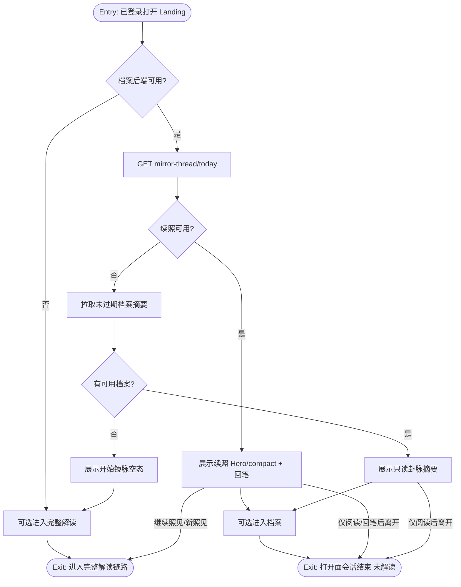
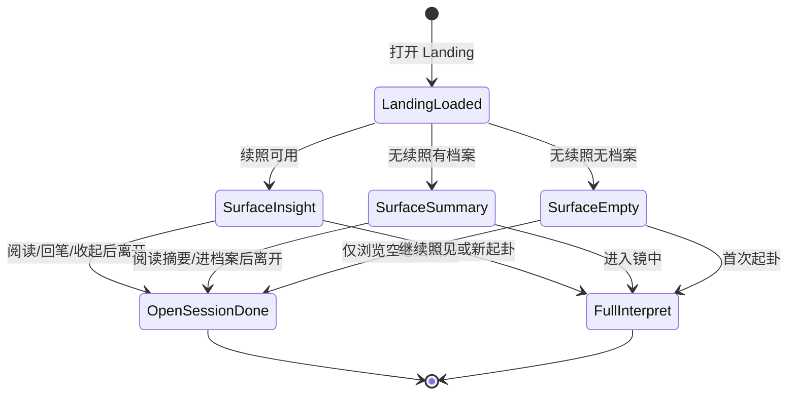

# Feature Spec: 镜脉 · 非解读日打开面（Daily Mirror Surface）

## 文首属性

| 属性 | 值 |
|------|-----|
| 状态 | partial（工程验收见 [prd-00007](../prds/prd-00007-mirror-open-without-interpret.md) 文末「工程验收状态」） |
| 范围 | Landing / History 镜脉着陆增强；无 `mirrorThreadInsight` 时的轻量落点；可选只读「近期卦象/主题」摘要；**不**新增签到/额度玩法 |
| 关联文档 | [docs/product-brief.md](../../docs/product-brief.md)、[docs/supabase-tables.md](../../docs/supabase-tables.md)、[docs/backend-best-practices.md](../../docs/backend-best-practices.md)、[specs/features/feat-00001-mirror-thread-daily-insight.md](./feat-00001-mirror-thread-daily-insight.md)、[specs/features/feat-00002-mirror-thread-reply.md](./feat-00002-mirror-thread-reply.md)、[specs/prds/prd-00003-mirror-thread-daily-insight.md](../prds/prd-00003-mirror-thread-daily-insight.md)、[specs/prds/prd-00005-mirror-thread-reply.md](../prds/prd-00005-mirror-thread-reply.md)、[specs/prds/prd-00007-mirror-open-without-interpret.md](../prds/prd-00007-mirror-open-without-interpret.md) |
| 父特性 | [feat-00001-mirror-thread-daily-insight.md](./feat-00001-mirror-thread-daily-insight.md)（增强着陆，非平行第二日活产品） |
| 序号 | 00003 |

---

## 史诗目标与商业价值

### Epic

**提升「非完整解读日」仍愿意打开的频次**——用户不必完成「困惑 → 起卦 → 四镜 → 长报告」也能获得一次有意义的「被照见 / 看见自己的叙事进展」；驱动力来自产品内生（镜脉、档案、回笔），**禁止**签到、连胜、催更弹窗等外驱。

**北极星行为（本特性）**：已登录用户在**未发起当日完整解读**的会话中，打开 App 并完成至少一次「轻量镜面互动」（见术语：打开面会话）。  
**对照（继承）**：feat-00001 的续照阅读 ≥30s / 进入关联档案仍有效。  
**不**将裸 DAU、连续打开天数、签到完成率作为成功指标。

### 现状与要解决的问题

镜脉续照（feat-00001）+ seed 预写（prd-00004）+ 回笔（feat-00002）已构成「有今日续照」时的内因回访闭环。但实测与代码均显示：

| 痛点 | 说明 |
|------|------|
| 无 insight 时着陆塌缩 | `showMirrorHero` / `showMirrorStrip` 均依赖 `mirrorThreadInsight`；无续照时 Landing **只剩**完整解读漏斗（输入困惑 → 进入镜中） |
| 空档案无第二落点 | History 空态文案引导「起一卦」；对「今天只想来看看」的用户不友好 |
| 与北极星错位 | 产品已有日活钩子，但钩子**不可用**时，打开行为被重新导向完整解读，抬高摩擦、稀释「非解读日打开」 |
| 外驱禁区 | 不可用签到、streak、弹窗催打开来补洞 |

**探索结论（已确认）**：Release 0 优先 **增强镜脉着陆**，辅以基于已有档案的 **只读近期卦象/主题一条**；不做独立第二日活产品、不做时令算命向玩法。

### 目标（Release 0 / MVP）

- **打开即有面**：已登录且档案后端可用时，Landing（及必要时 History）在「无今日续照」时仍展示 **非打卡** 的轻量镜面（空态或卦脉摘要），用户可 1–3 分钟内完成打开面会话后离开。
- **有续照时不抢戏**：存在 `mirrorThreadInsight` 时，仍以现有 Hero / compact「查看 · 今日续照」为主；本特性不平行再塞第二个每日主卡。
- **只读卦脉摘要（有档案时）**：从用户未过期档案中聚合最近 N 次本卦名/主题关键词（规则聚合优先，**打开日零 LLM**），展示为一句「近期叙事」只读文案；可点进档案或展开续照（若有）。
- **空档案空态**：明确邀请首次完整解读，但语气是「开始你的镜脉」，**不是**签到或任务；可附一句产品原则提醒（只映照、不预言）。
- **不扣解读额度**：打开面、卦脉摘要 API **不**调用 `consume_interpret_quota`。
- **话术边界**：严格 **只映照**；禁止吉凶、运势、决策指令。

### 非目标（明确不做）

- 签到、连续打开天数、徽章、积分、每日登录奖励、任务中心。
- 吉凶断语、时令「今日运势」、投资/医疗建议。
- 独立于镜脉的第二日活入口抢流量（如并列「每日运势」Tab）。
- Release 0 新增长报告 / 片刻完整四镜解读（属另一北极星「心流入口」，另立项）。
- Push / 邮件催打开。
- 公开社交 Feed、分享排行。
- 打开日为摘要调用 LLM（R1 可选）。

### 术语表

| 术语 | 含义 |
|------|------|
| **非完整解读日** | 用户当日未完成（或不打算完成）「起卦 + 观心报告」主链路的自然日（东八区） |
| **打开面（Daily Mirror Surface）** | Landing/History 上供「只打开、不解读」使用的轻量镜面 UI 与内容 |
| **打开面会话** | 打开 App 后：看见打开面内容 ≥ 可读完一句摘要，或展开/收起续照，或留下/查看回笔，或点进档案——且**未**发起新的完整解读 |
| **卦脉摘要** | 基于未过期档案的规则聚合（本卦名、可选主题词），只读一句/一小段 |
| **续照可用** | `GET /api/mirror-thread/today` 返回当日 insight（非 204） |
| **严格映照** | 文案与能力均不预言命运，只映照用户叙事与卦象意象 |

---

## 决策天条（已拍板 vs 开放）

| # | 决策 | 结论 | 状态 |
|---|------|------|------|
| 1 | 北极星 | 提高非完整解读日打开频次（非强化完整解读吞吐） | **已拍板** |
| 2 | 算命感边界 | **严格只映照**；禁止吉凶/运势话术 | **已拍板** |
| 3 | 与镜脉关系 | **增强镜脉着陆**（A）；R0 不加独立第二主入口 | **已拍板** |
| 4 | 无续照时内容 | 有档案 → 只读卦脉摘要；无档案 → 非打卡空态引导首次解读 | **已拍板** |
| 5 | 打开日 LLM | R0 **零 LLM**（规则聚合 / 既有 seed 拼装） | **已拍板** |
| 6 | 额度 | 打开面与摘要 **不扣** 解读额度 | **已拍板** |
| 7 | 外驱 | 禁止签到/streak/催更弹窗 | **已拍板** |
| 8 | 摘要窗口 N | 建议最近 **3～7** 条未过期档案（实现时定常量） | **待工程拍板** |
| 9 | 主题词来源 | 本卦名必选；困惑截断 / 既有字段可选 | **待工程拍板** |
| 10 | 会员差异化文案 | R0 免费/会员同一套摘要 | R1 开放 |

---

## 核心创意与内生动力学

### 机制

1. **降低「无钩子」空白**：续照不可用时，打开仍有「看见自己近期叙事」的理由——蔡加尼克与自我参照继续生效，而不靠打卡。
2. **与完整解读解耦**：成功会话定义明确排除「又起一卦」，避免优化成解读次数虚高。
3. **单一心智模型**：用户仍理解「镜脉是跨日那条线」；打开面是镜脉的 **缺省态/增强态**，不是新产品名并列。
4. **品牌一致**：空态与摘要文案延续「易经非预言之术」，避免时令运势感。

### 打开面形态（R0）

```text
【续照可用】
  → 现有 MirrorThreadInsight Hero / compact（feat-00001/00002）
  → 本特性：不平行加第二主卡；可选在 compact 旁保留摘要入口（R0 可不做）

【续照不可用 + 有未过期档案】
  → 「近期镜脉」只读卡：最近 N 次本卦名（+ 可选主题片段）
  → 次级 CTA：查看档案 /（若有）明日再来的期待文案（无 streak）
  → 主 CTA 区仍可保留「进入镜中」，但不遮挡摘要

【续照不可用 + 无档案】
  → 空态：开始你的镜脉（首次完整解读）
  → 禁止「连续 N 天未打开」类文案
```

### 边界与异常清单

| # | 情形 | 行为 |
|---|------|------|
| 1 | 未登录 | 不展示打开面增强；保持现有访客着陆 |
| 2 | 档案后端未配置 | 与现网一致；不伪造摘要 |
| 3 | 今日续照 204 | 走「无续照」分支（摘要或空态） |
| 4 | 档案全过期 | 视同无可用档案 → 空态 |
| 5 | 用户 dismiss 续照（compact） | 保留 strip；摘要 **不**强制展开抢注意力 |
| 6 | 摘要 API 失败 | 降级：仅空态文案或隐藏摘要块；不阻断起卦 |
| 7 | 恶意刷新摘要 | 规则结果稳定（同日同数据同文案）；无限流积分可刷 |
| 8 | 与「进入镜中」并存 | 允许；打开面会话指标排除已点起卦成功的会话 |
| 9 | 话术回归运势 | Code review / 文案清单拒绝「今日宜/忌」「大吉」等 |
| 10 | 多端打开 | 摘要只读；状态以服务端档案为准 |

---

## 端到端剧本

### 剧本 A：名门正派（有档案、无今日续照）

1. 用户数日前有过解读档案，但今日无 seed/daily（或缺席导致无今日续照）。
2. 打开 Landing → 看到「近期镜脉」只读摘要（如最近三卦名并列一句映照文案）。
3. 阅读后离开，或点进档案回顾；**当日不起卦**。
4. 计为一次打开面会话成功。

### 剧本 B：续照日（回归不破坏）

1. 用户昨日 autosave → 今日有续照。
2. 打开仍见 Hero/回笔（feat-00001/00002）；**不**被新卡压住。
3. 体验与现网一致；本特性回归通过。

### 剧本 C：空档案空态

1. 新用户登录，档案为空。
2. 打开见「开始你的镜脉」空态 + 原则句；CTA 引导首次完整解读。
3. **不出现**签到、连续天数、运势。

### 剧本 D：造化弄人（摘要失败）

1. 列表接口超时。
2. Landing 不白屏；摘要区隐藏或轻量错误；完整解读入口仍可用。

### 剧本 E：心怀鬼胎（把摘要当运势）

1. 用户截图传播「今日卦运」。
2. 产品文案无吉凶词；摘要明确「你的近期足迹」而非「今日天机」。
3. 无随机每日运势可刷。

---

## 业务闭环与状态机

### 全局流程（Landing 打开面）



### 打开面会话状态



**死胡同预警：**

- 无续照且无摘要且空态仍用「打卡领奖」话术 → **禁止**。
- 打开面成功却强制跳完整解读 → **禁止**。
- 为摘要在打开日调 LLM 导致慢/贵 → R0 **禁止**。
- 与续照并列两个同等 Hero 抢注意力 → R0 **禁止**。

---

## 敏捷故事地图与开发 Backlog

### 用户旅程步骤（精化）

1. 已登录用户在非完整解读意图下打开 App  
2. 系统判定续照是否可用  
3a. 有续照 → 进入既有镜脉 Hero/回笔体验  
3b. 无续照有档案 → 展示卦脉摘要打开面  
3c. 无续照无档案 → 展示开始镜脉空态  
4. 用户完成轻量阅读（或进档案）  
5. 用户离开 **或** 自愿进入完整解读  
6. 观测：打开面会话 vs 完整解读会话分流  
7. （跨日）有档案用户因想再看「近期足迹/续照」而回访  
8. 循环：打开 → 轻量被照见 →（可选）完整解读充实档案 → 更丰富的摘要/续照  

### 🛠️ 开发 Backlog (可直接导入 Issue)

- [ ] **FEAT-00003-01-FE**: [前端] Landing 无续照分支：卦脉摘要 / 空态打开面
  - **As a** 已登录用户 **I want to** 在没有今日续照时仍看到轻量镜面 **So that** 我不必起卦也愿意打开。
  - **AC (验收标准)**:
    - **Given** 已登录、档案后端可用、`mirrorThreadInsight == null`、存在 ≥1 条未过期档案
    - **When** 进入 Landing
    - **Then** 展示只读「近期镜脉」摘要区；**不**出现签到/连续天数文案；完整解读入口仍可用但不唯一占据首屏心智
    - **Given** 同上但无未过期档案
    - **When** 进入 Landing
    - **Then** 展示「开始你的镜脉」空态 + 严格映照原则句；CTA 引导首次解读
    - **Given** `mirrorThreadInsight` 非空
    - **When** 进入 Landing
    - **Then** 仍以现有 Hero/compact 为准；R0 不平行插入第二同等 Hero

- [ ] **FEAT-00003-02-FE**: [前端] History 与打开面一致的空态/摘要（若 History 首屏可见）
  - **As a** 从「档案」进入的用户 **I want to** 在无足迹或无续照时看到同一套非打卡话术 **So that** 心智一致。
  - **AC (验收标准)**:
    - **Given** History 无档案
    - **When** 打开档案页
    - **Then** 空态文案与 Landing 打开面空态原则一致（可共用文案组件）；禁止运势/签到措辞
    - **Given** History 有档案且当日无续照
    - **When** 打开档案页
    - **Then** 可展示与 Landing 同源的摘要块（或明确「见 Landing」——实现时二选一，须文档化）

- [ ] **FEAT-00003-03-BE**: [后端] 卦脉摘要接口（或扩展现有 archives/me）
  - **As a** 前端 **I want to** 一次拿到规则聚合的近期本卦摘要 **So that** 打开日零 LLM、不扣额度。
  - **AC (验收标准)**:
    - **Given** 有效会话
    - **When** 请求摘要（新建 `GET /api/mirror-thread/surface` **或** 扩展 `GET /api/archives` 聚合字段——实现选定后写进 PR）
    - **Then** 返回最近 N 条未过期档案的 `hexagram`/`name` 等只读字段及可选截断 `question`；HTTP 200；**不**调用 `consume_interpret_quota`
    - **Given** 无未过期档案
    - **When** 请求
    - **Then** 200 + 空列表（或 204，团队统一）
    - **Given** 未登录
    - **When** 请求
    - **Then** 401

- [ ] **FEAT-00003-04-FE**: [前端] 文案与无障碍：严格映照词表
  - **As a** 品牌与合规相关方 **I want to** 打开面文案不含吉凶运势 **So that** 不破坏「不预言命运」。
  - **AC (验收标准)**:
    - **Given** 打开面所有可见字符串（空态、摘要标题、辅助句）
    - **When** 对照禁用词表（宜/忌、大吉、今日运势、必走等）
    - **Then** 零命中；摘要自称「近期足迹/镜脉」类，不自称「今日天机」

- [ ] **FEAT-00003-05-AN**: [观测] 打开面会话埋点（轻量）
  - **As a** 产品 **I want to** 区分打开面成功与完整解读 **So that** 能验证北极星。
  - **AC (验收标准)**:
    - **Given** 用户展示摘要或空态或续照后离开且未 `startDivination` 成功
    - **When** 会话结束（或页面 unload / 路由离开 Landing）
    - **Then** 记录一类事件（可复用现有 beacon 风格，如 `mirror_surface_open`）；与解读成功事件可分流统计
    - **Given** 用户随后完成起卦
    - **When** 统计
    - **Then** 该会话不计入「纯打开面成功」或打上 `escalated_to_interpret` 标记（二选一，PR 说明）

- [ ] **FEAT-00003-06-QA**: [验收] 回归镜脉续照与回笔
  - **As a** 既有镜脉用户 **I want to** 有续照日体验不变 **So that** 本特性不破坏 feat-00001/00002。
  - **AC (验收标准)**:
    - **Given** 当日 today 返回完整 insight
    - **When** 打开 Landing
    - **Then** Hero/回笔/继续照见路径与现网一致
    - **Given** 用户写回笔
    - **When** 保存
    - **Then** 仍走既有 `PUT /api/mirror-thread/reply`；本特性不改回笔契约

---

## 数据与 API 衔接（高层）

| 方向 | 说明 |
|------|------|
| 复用 | `GET /api/mirror-thread/today`、`GET /api/archives`、`interpret_saved_report` 未过期行、feat-00002 回笔 |
| 新增（建议） | `GET /api/mirror-thread/surface`：`{ items: [{ archiveId, hexagramName, questionPreview?, createdAt }], empty: boolean }`；或等价聚合，避免前端拼业务规则 |
| 额度 | 全路径不调用 `consume_interpret_quota` |
| 性能 | 打开日 P95 目标对齐续照：摘要查询应轻量（单次 list + 截断），无 LLM |
| 双运行时 | Express `server.ts` + Vercel `api/*` 共用 handler（见 backend-best-practices） |

---

## 假设与待确认 / 开放项

| # | 项 | 默认假设 | 需谁确认 |
|---|----|----------|----------|
| 1 | 摘要 N | 最近 5 条未过期 | 工程 |
| 2 | History 是否重复摘要 | Landing 必须有；History 可同源组件复用 | 产品/工程 |
| 3 | 主题词 | R0 仅本卦名列表 + 一句固定模板 | 产品文案 |
| 4 | R1 | 可选轻量 LLM「叙事弧一句」（仍禁吉凶）；会员差异化 | 产品 |
| 5 | 正式 PRD | 已落盘 [prd-00007-mirror-open-without-interpret.md](../prds/prd-00007-mirror-open-without-interpret.md) | 已完成 |

---

## 修订记录

| 日期 | 说明 |
|------|------|
| 2026-07-13 | 初稿：PO 探索收敛（北极星=非解读日打开；严格映照；增强镜脉着陆；浏览器实测无续照时着陆塌缩）落盘 `feat-00003` |
| 2026-07-13 | 正式 PRD 落盘 [prd-00007](../prds/prd-00007-mirror-open-without-interpret.md)；关联文档与开放项同步 |
