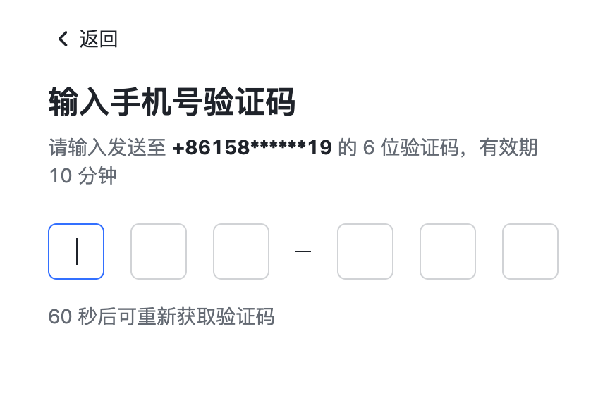
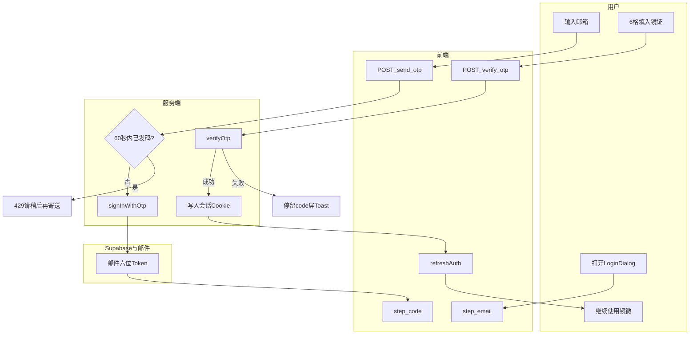
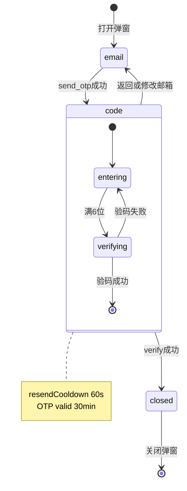

# PRD: 邮箱六位镜证登录

> **已被取代**：登录主路径由 [prd-00006-phone-otp-login.md](./prd-00006-phone-otp-login.md) 接管（手机号六位镜证、硬切换、不迁移存量邮箱用户）。本文档保留作历史与邮箱 OTP 工程验收记录。

## 文首属性

| 属性 | 值 |
|------|-----|
| 状态 | **superseded**（见 [prd-00006-phone-otp-login.md](./prd-00006-phone-otp-login.md)）；工程历史：partial（见文末「工程验收状态」章） |
| 范围 | 登录弹窗、Auth API、Supabase 邮件模板；不含短信/密码登录 |
| 关联文档 | docs/product-brief.md、docs/backend-best-practices.md、docs/supabase-tables.md、AGENTS.md |
| UI 参考图 | [login-otp-six-boxes-ui-reference.png](./reference/login-otp-six-boxes-ui-reference.png)（见 [reference/README.md](./reference/README.md)） |
| 父 PRD | 无 |
| 序号 | 00001 |

---

## 背景与问题

### 现状

镜微当前通过 **邮箱魔法链接** 登录（[`LoginDialog.tsx`](../src/components/auth/LoginDialog.tsx)）：

1. 用户输入邮箱 → `POST /api/auth/send-otp`（路径名为 OTP，实现为 `signInWithOtp` + `emailRedirectTo`）。
2. 用户点击邮件链接 → [`AuthCallback.tsx`](../src/pages/AuthCallback.tsx) 从 URL hash 取 `access_token` → `POST /api/auth/session` 换取本站 **HttpOnly 签名 Cookie**（[`server/auth-handlers.ts`](../server/auth-handlers.ts)）。

[`docs/product-brief.md`](../docs/product-brief.md) §3 仍记为「邮箱 Magic Link 登录」；与路径 `send-otp` 存在命名漂移，本 PRD 落地后须同步 brief。

### 要解决的问题

| 痛点 | 说明 |
|------|------|
| 邮件客户端预取链接 | 部分厂商（如 Safe Links）预取 `ConfirmationURL`，导致 token 被消耗、用户看到「已过期」 |
| 跨应用切换成本高 | 用户需离开镜微打开邮件再点链接，移动端体验割裂 |
| 产品预期 | 用户希望在应用内输入 **6 位数字** 完成登录，文案与视觉延续镜微「照见 / 档案」叙事，而非通用运营商 OTP 话术 |

### 价值假设

- **为谁**：需登录起卦、同步观心档案与额度的注册用户（含新注册）。
- **做什么**：用 Supabase 原生 **邮箱 6 位 OTP** 完全替换魔法链接主路径。
- **为何现在**：与现有 `signInWithOtp` / anon key 栈一致；改造成本可控，且可复用既有 Cookie 会话模型。

---

## 目标与非目标

### 目标（MVP / Release 0）

- 发码：服务端 `signInWithOtp`，**不传** `emailRedirectTo`；邮件模板含 `{{ .Token }}`。
- 验码：新增 `POST /api/auth/verify-otp`，服务端 `verifyOtp` 后写入与现网一致的会话 Cookie。
- UI：`LoginDialog` 两屏——邮箱 → **6 格镜证输入**（3 + `-` + 3）；镜微文案定稿表。
- 规则：**验证码有效 30 分钟**；同邮箱 **重发间隔 60 秒**（前后端一致）。
- 废弃魔法链接主路径：`/auth/callback` 不再作为登录必经；`POST /api/auth/session` 不再用于新登录。

### 非目标

- 短信 / 手机号 OTP、密码登录、第三方 OAuth 新增。
- 客户端持久化 Supabase `refresh_token`（仍仅用服务端换发的应用 Cookie）。
- 保留魔法链接与验证码双轨并列。
- 英文邮件 / 多语言（默认仅中文模板）。
- 本 PRD 不规定会员购买、运营后台。

---

## 术语

| 术语 | 含义 |
|------|------|
| 镜证 | 产品文案中对「邮箱 6 位 OTP」的称呼，避免「验证码」套话 |
| OTP | Supabase Auth 一次性密码；邮箱场景为 **6 位数字** |
| Magic Link | 邮件内可点击的 `ConfirmationURL` 登录方式（本 PRD 移除主路径） |
| `{{ .Token }}` | Supabase 邮件模板变量，渲染为 6 位 OTP |
| 应用会话 Cookie | `USER_SESSION_COOKIE`，由 `USER_SESSION_SECRET` 签名的 HttpOnly Cookie |
| 脱敏邮箱 | UI 展示用，如 `a***@example.com` |

---

## 已拍板规则

| 规则 | 结论 |
|------|------|
| 登录方式 | **仅** 邮箱 6 位 OTP |
| Auth 提供商 | Supabase Auth（`SUPABASE_URL` + `SUPABASE_ANON_KEY`） |
| 会话 | 验码成功后继续 **自定义 HttpOnly Cookie**，逻辑对齐现 `handleExchangeSession` |
| 验证码有效期 | **30 分钟**（1800 秒） |
| 重发间隔 | **60 秒**（同邮箱两次 `send-otp`） |
| OTP 输入 UI | **6 个独立格**，布局 3 + `-` + 3 |
| 满 6 位 | 自动调用验码 API（无需单独「确认」按钮） |
| 文案 | **镜微口吻**；禁止「请输入邮箱验证码」类通用标题 |
| 第二屏标题（定稿） | **「照见信中之码」** |
| `/auth/callback` | 非登录主路径；Release 0 后无新用户依赖 |
| `POST /api/auth/session` | 新登录 **废弃**（可对旧链接返回 410 或移除路由，见开放项） |

### 敏感能力

| 能力 | 约束 |
|------|------|
| 发码 | 须校验邮箱格式；60 秒内同邮箱不可重复发码（应用层 + Supabase 限流取较严） |
| 验码 | 仅服务端持有 anon key 调 `verifyOtp`；不向浏览器下发长期 Supabase session |
| 密钥 | `USER_SESSION_SECRET`、`SUPABASE_*` 仅服务端；禁止写入前端 bundle |

---

## 用户与角色

| 角色 | 目标 |
|------|------|
| 内省用户（访客→注册） | 在弹窗内完成登录，同步档案与额度 |
| 运营 / 支持 | 减少「链接失效 / 点不开」类工单 |
| 工程 | Express + Vercel 双运行时行为一致；最小改动会话与 RLS 身份来源（`auth.uid()` 仍对应 Supabase `sub`） |

---

## Supabase 能力调研（结论）

**支持邮箱 6 位 OTP，与 Magic Link 共用 `signInWithOtp` / `verifyOtp`。**

| 来源 | 结论 |
|------|------|
| [Passwordless email logins](https://supabase.com/docs/guides/auth/auth-email-passwordless) | OTP 为用户键入 **6 位数字**；`verifyOtp({ email, token, type: 'email' })` |
| [Email Templates](https://supabase.com/docs/guides/auth/auth-email-templates) | `{{ .Token }}` 为 6-digit OTP；须在 **Magic Link** 模板中加入方可发码 |
| 现网代码 | [`handleSendMagicLink`](../server/auth-handlers.ts) 因 `emailRedirectTo` 实际发链接 |

**差异摘要：**

- 发码：同一 `signInWithOtp({ email })`；OTP 模式 **不应** 传 `emailRedirectTo`（或模板以 `{{ .Token }}` 为主）。
- 验码：`verifyOtp` 返回 `session.access_token` → 服务端 `getUser` 或 session 内 user → 写应用 Cookie。

**控制台依赖（Release 0 前置）：**

| 配置项 | 要求 |
|--------|------|
| Auth → Email Templates → Magic Link | 正文含 `{{ .Token }}`；镜微中文品牌句；弱化纯链接文案 |
| Auth → Email OTP Expiration | **1800** 秒（30 分钟） |
| Auth → Providers → Email | 保持启用 |
| Site URL / Redirect URLs | Site URL 合法；OTP 主流程不依赖 callback |

---

## 功能域

### 1. 登录弹窗（`LoginDialog`）

**步骤：** `email` → `code` → 关闭并刷新 `auth/me`（移除现 `sent`「请查收邮件点链接」）。

#### 第一屏（email）

- 保留标题「开启并同步你的档案」及内省说明（与现网一致）。
- 主按钮文案改为：**「寄送六位镜证」**（原「发送登录链接」）。
- Toast 成功：**「镜证已寄至你的邮箱」**。
- 提交后进入 `code` 屏，非 `sent` 屏。

#### 第二屏（code）

布局参考 [`./reference/login-otp-six-boxes-ui-reference.png`](./reference/login-otp-six-boxes-ui-reference.png)（6 格分框 + 返回 + 倒计时信息架构；镜微为邮箱场景，文案见定稿表）。视觉延续 `rounded-[48px]`、`font-serif`、`bg-bg` / `text-ink`。

| 区域 | 规格 |
|------|------|
| 导航 | 左上「返回」→ 回第一屏；保留已填邮箱；改邮箱后再次发码则 **重算 60 秒** 冷却 |
| 标题 | **照见信中之码** |
| 说明 | 我们已向 **{脱敏邮箱}** 寄出一组六位镜证，请于 **三十分钟** 内填入下方。 |
| 输入 | 6 独立方框，3 + `-` + 3；仅 `0-9`；当前格描边高亮；支持退格、整段粘贴填满 |
| 提交 | 满 6 位自动 `POST /api/auth/verify-otp` |
| 重发 | 冷却：「**{n}** 秒后可重新寄送镜证」；可点：「重新寄送镜证」 |
| 次要 | 「修改邮箱」（样式对齐现网） |
| 页脚 | **镜微镜像档案 · 加密存储您的每一次照见** |

**邮箱脱敏规则（定稿）：** 本地部分保留首字符 + `***` + `@` 后完整域名，例：`zhangsan@example.com` → `z***@example.com`。

**验码失败：** Toast 镜微口吻（如「镜证有误，请再照见一次」）；默认 **保留** 已填数字便于改正。

### 2. 镜微文案定稿表

| 场景 | 文案 |
|------|------|
| 第一屏主按钮 | 寄送六位镜证 |
| 发码成功 Toast | 镜证已寄至你的邮箱 |
| 第二屏标题 | 照见信中之码 |
| 第二屏说明 | 我们已向 **{脱敏邮箱}** 寄出一组六位镜证，请于三十分钟内填入下方。 |
| 重发（冷却） | {n} 秒后可重新寄送镜证 |
| 重发（可点） | 重新寄送镜证 |
| 返回 | 返回 |
| 修改邮箱 | 修改邮箱 |
| 验码成功 Toast | 登录成功，欢迎来到镜微（可保留现网句） |
| 验码失败 Toast | 镜证有误或已失效，请再照见一次 |
| 过期提示 | 镜证已逾三十分钟，请重新寄送 |
| 重发过快 | 请稍后再寄送镜证 |
| sr-only（code） | 照见信中之码 |

**禁止：**「请输入邮箱验证码」「输入手机号验证码」等通用运营商标题。

### 3. HTTP API

| 方法 | 路径 | 请求体 | 成功响应 | 说明 |
|------|------|--------|----------|------|
| POST | `/api/auth/send-otp` | `{ "email": string }` | `{ "ok": true, "resendAvailableAt"?: ISO8601 }` | 60s 内同邮箱 → **429** + `resendAvailableAt`；`signInWithOtp` **无** `emailRedirectTo` |
| POST | `/api/auth/verify-otp` | `{ "email", "token" }`（6 位字符串） | `{ "ok": true, "user": { id, email } }` + Set-Cookie | `verifyOtp` type `email` → 写 Cookie |
| GET | `/api/auth/me` | — | 不变 | |
| POST | `/api/auth/logout` | — | 不变 | |
| POST | `/api/auth/session` | — | **废弃** | 仅服务旧 Magic Link；Release 0 返回 410 或移除 |

**环境变量（不变）：** `SUPABASE_URL`、`SUPABASE_ANON_KEY`、`USER_SESSION_SECRET`；可选 `PUBLIC_ORIGIN` 用于发信（OTP 模式不再用于 redirect）。

**双运行时：** [`server.ts`](../server.ts) 与 [`api/auth/`](../api/auth/) 须同步注册 `verify-otp` 并修改 `send-otp` 实现。

### 4. 发码冷却实现（应用层）

- 服务端以 `email`（规范化小写）为键记录 `lastSentAt`（内存 Map 或 Redis；Release 0 可用进程内 Map + 文档注明多实例需外置）。
- 若 `now - lastSentAt < 60s` → 429，`body`: `{ "error": "请稍后再寄送镜证", "resendAvailableAt": "..." }`。
- 与 Supabase OTP rate limit 并存，**取较严**。

### 5. 路由与遗留

| 项 | Release 0 |
|----|-----------|
| [`App.tsx`](../src/App.tsx) `useMagicLinkRoute` | 不再为登录必需；可移除或仅兼容旧书签 |
| [`AuthCallback.tsx`](../src/pages/AuthCallback.tsx) | 非主路径；可保留空提示「请使用镜证登录」或删除路由 |
| [`src/lib/auth-api.ts`](../src/lib/auth-api.ts) | 新增 `postVerifyLoginOtp`；更新 `postSendLoginEmail` 注释 |

---

## 用户故事地图与版本切片

### 旅程主干

| 阶段 | 用户目标 | 系统触点 | Entry/Exit |
|------|----------|----------|------------|
| 唤起 | 起卦/档案需登录 | Home → `LoginDialog` open | Entry |
| 留邮 | 输入邮箱 | `email` 屏 | |
| 收证 | 收到 6 位镜证 | 邮件 + `send-otp` | |
| 填入 | 6 格输入镜证 | `code` 屏 + `verify-otp` | |
| 入镜 | 成为登录用户 | Cookie + `auth/me` | Exit：弹窗关闭、`refreshAuth` |

### 故事地图

| 阶段 | 故事 | 验收要点 |
|------|------|----------|
| 留邮 | 作为用户，我想用镜微口吻寄送六位镜证，以便在应用内完成登录 | 主按钮为「寄送六位镜证」；`send-otp` 200；Toast「镜证已寄至你的邮箱」；邮件含 6 位数字且模板含 `{{ .Token }}` |
| 收证 | 作为用户，我想在三十分钟内完成填入，以便镜证仍有效 | UI 说明含「三十分钟」；Supabase Expiration=1800；超时验码失败并提示重新寄送 |
| 填入 | 作为用户，我想在第二屏用 6 格照见信中之码，以便体验清晰 | 标题「照见信中之码」；3+`-`+3；脱敏邮箱；无「请输入邮箱验证码」 |
| 填入 | 作为用户，我想粘贴六位数字自动验码，以便少操作 | 粘贴填满 6 格后自动 `verify-otp` |
| 纠错 | 作为用户，我想在镜证错误时保留输入，以便修改 | 失败不清空（默认）；Toast「镜证有误或已失效…」 |
| 重发 | 作为用户，我想在 60 秒后可重新寄送，以便未收到邮件 | 60s 内 UI 倒计时且 API 429；满 60s 可 200 |
| 返回 | 作为用户，我想返回修改邮箱，以便纠正输错 | 「返回」回第一屏；「修改邮箱」可用 |
| 入镜 | 作为用户，我想验码后保持登录态同步档案 | `verify-otp` Set-Cookie；`GET /api/auth/me` 返回正确 `user`/`entitlements` |
| 安全 | 作为系统，我想限制刷信 | 60s 重发 + Supabase 限流；无效邮箱 400 |

### Release 切片

| 版本 | 范围 | 可验收结果 |
|------|------|------------|
| **R0（MVP）** | send/verify API、LoginDialog 两屏 6 格、镜微文案表、Supabase 模板与 Expiration=1800、60s 重发、移除 Magic Link 主路径、brief 同步 | 新用户全程在弹窗内 OTP 登录；旧链接不再作为标准流程 |
| **R1** | `resendAvailableAt` 前后端校准、错误码细分（过期/错误/限流）、多实例发码冷却存储 | 倒计时与服务器一致；支持水平扩展 |
| **R2（可选）** | OTP 格读屏标签、邮件 HTML 品牌润色 | a11y 与运营满意度 |

---

## 核心流程与状态机图

### 主业务流程（泳道）

### LoginDialog 与 OTP 状态

**死胡同预警：** 若邮件模板无 `{{ .Token }}`，用户停留在 `code` 无法验码——Release checklist 必须验收邮件内容。

---

## 数据与 API 衔接

- **身份**：Cookie 内 `sub` 仍为 Supabase `auth.users.id`；[`interpret_saved_report`](../docs/supabase-tables.md) 等 RLS 无需因登录方式变更。
- **无新表**：发码冷却 Release 0 可用进程内存储；R1 可引入 Redis/KV。
- **文档漂移（Release 0 后须改）：** product-brief §3「Magic Link」→「邮箱六位镜证登录」；§5 API 表增加 `verify-otp`、标注 `session` 废弃；AGENTS.md 登录一句。

---

## 成功标准

| 指标 | 标准 |
|------|------|
| 功能 | 100% 新登录走 OTP 弹窗路径；`verify-otp` + Cookie + `me` 打通 |
| 体验 | 第二屏符合 6 格布局与镜微文案表；无通用 OTP 标题 |
| 安全 | 60s 内同邮箱不可重复发码（服务端可验证） |
| 运维 | 生产 Supabase 模板含 Token、Expiration=1800 |

---

## 依赖

| 依赖 | 负责人 | 说明 |
|------|--------|------|
| Supabase 邮件模板 | 运维 / 项目负责人 | Magic Link 模板改 `{{ .Token }}` |
| Supabase OTP 过期 | 同上 | 1800 秒 |
| 环境变量 | 工程 | 三件套已配置 |
| 双运行时部署 | 工程 | Vercel + 本地 Express 同步 |

---

## 风险与缓解

| 风险 | 缓解 |
|------|------|
| 模板未改导致无码 | R0 上线 checklist；staging 先发测试邮 |
| 多实例内存冷却不一致 | R1 外置存储；R0 文档注明单实例或 sticky |
| Supabase 限流文案生硬 | 映射为镜微 Toast |
| 旧 Magic Link 书签失效 | 短公告；`session` 410 |

---

## 假设与待确认

| # | 项 | 默认假设 |
|---|-----|----------|
| 1 | `POST /api/auth/session` | Release 0 返回 **410 Gone** + 简短 JSON，不删文件以便 diff |
| 2 | `/auth/callback` 路由 | 保留页面提示重新登录，不自动跳转会话 |
| 3 | 发码冷却存储 | R0 进程内 `Map` |
| 4 | 验码失败后是否清空格 | **保留** |
| 5 | 邮件模板品牌句 | 工程提供一句占位，运营定稿 |

---

## 修订记录

| 日期 | 说明 |
|------|------|
| 2026-05-23 | 初稿：邮箱 OTP 替换 Magic Link；6 格 UI；有效 30min / 重发 60s；镜微文案定稿表 |
| 2026-05-23 | 参考图落盘 `specs/prds/reference/login-otp-six-boxes-ui-reference.png` |

---

## 1. 工程验收状态

> 由 `/team:prd-accept` 维护；勿手工编造「通过」。最后更新：2026-06-18T12:00:00Z，main@f269c1f，范围：all。

### 总览

| 项 | 内容 |
|----|------|
| 工程状态 | `partial` |
| 验收判定 | **R0 核心通过**；R1/R2 未纳入本次交付 |
| 最近验收 | 2026-06-18，main@f269c1f |
| 摘要 | 邮箱 OTP 双屏 UI、send/verify API、HttpOnly Cookie、410 废弃 session 均已落地；发码 60s 冷却为进程内 Map；无自动化测试 |

### Release 交付

| Release | 状态 | 说明 |
|---------|------|------|
| R0 | 通过 | API + LoginDialog + MirrorOtpInput + 双运行时 |
| R1 | 未实现 | 多实例/分布式发码冷却（仍为 `auth-otp-cooldown.ts` 内存 Map） |
| R2 | 未实现 | 逐格 a11y 读屏标签 |

### 功能验收清单（Agent 优先读此表）

| ID | 能力摘要 | Release | 状态 | 证据 |
|----|----------|---------|------|------|
| A1 | POST send-otp（无 emailRedirectTo） | R0 | 通过 | `server/auth-handlers.ts`、`api/auth/send-otp.ts` |
| A2 | POST verify-otp + Cookie | R0 | 通过 | `server/auth-handlers.ts`、`server/user-session-cookie.ts` |
| A3 | 60s 冷却 429 + resendAvailableAt | R0 | 通过 | `server/auth-otp-cooldown.ts`、`src/hooks/use-resend-cooldown.ts` |
| A4 | POST /api/auth/session → 410 | R0 | 通过 | `handleExchangeSession` |
| A5 | LoginDialog 6 格 + 镜微文案 | R0 | 通过 | `src/components/auth/LoginDialog.tsx`、`MirrorOtpInput.tsx` |
| A6 | GET /api/auth/me、logout | R0 | 通过 | `server/auth-handlers.ts`、`api/auth/me.ts` |
| A7 | 分布式发码冷却 | R1 | 未实现 | 文档已注明 Vercel 多实例限制 |
| A8 | OTP 自动化测试 | R0 | 部分 | 仓库无 auth 相关 test |

### 未完成与遗留

- Supabase 控制台邮件模板含 `{{ .Token }}`、OTP 1800s 需运维 checklist 人工确认
- R1 外置冷却存储未做

### 质量检查

| 检查项 | 状态 |
|--------|------|
| pnpm run lint | 通过（2026-06-18） |
| 文档与仓库实现同步 | 通过（product-brief §3/§5） |

---
统计：通过 6 / 部分 1 / 未实现 2 / 范围外 0
