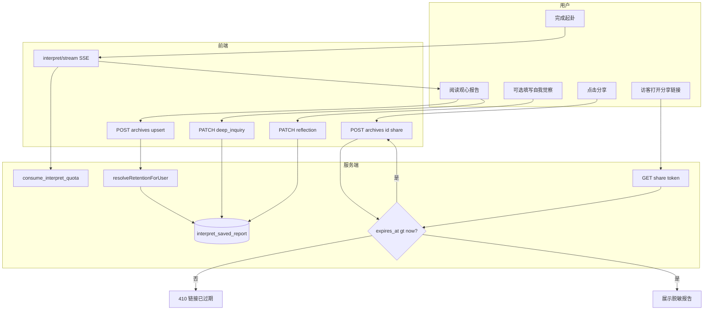
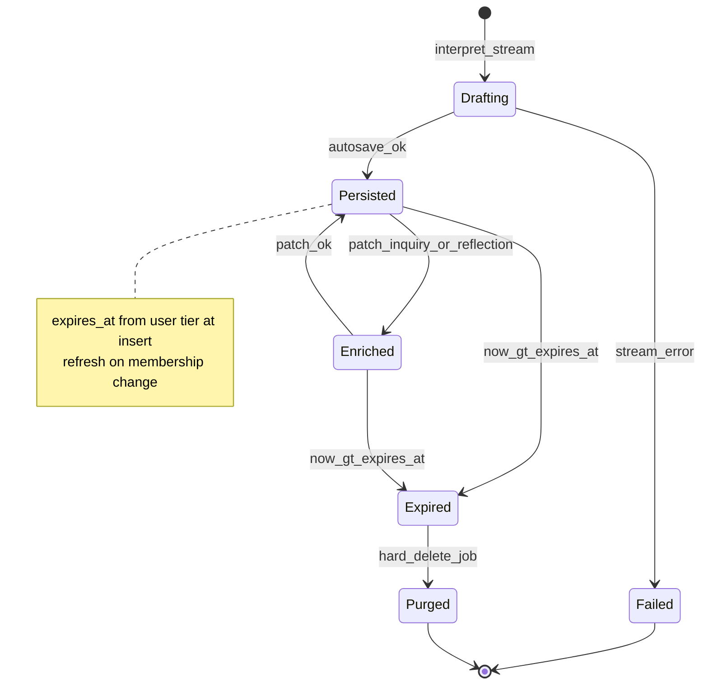

# PRD: 观心报告自动保存与分层保留

## 文首属性

| 属性 | 值 |
|------|-----|
| 状态 | backlog |
| 范围 | 观心档案 `interpret_saved_report`、档案/分享 API、解读页 `Interpretation`；不含镜下 8 轮对话云端化 |
| 关联文档 | docs/product-brief.md、docs/supabase-tables.md、docs/backend-best-practices.md、docs/supabase-migration-practices.md、AGENTS.md |
| 父 PRD | 无（依赖已登录会话，见 [prd-00001-email-otp-login.md](./prd-00001-email-otp-login.md)） |
| 序号 | 00002 |

---

## 背景与问题

### 现状

镜微在完成起卦与四镜解读后，用户可在 [`Interpretation.tsx`](../src/components/IChing/Interpretation.tsx) 阅读 **观心报告**（SSE 流式生成），并可选填写「自我觉察」、使用三条「深入追问」进入镜下对话。

**持久化现状**（以 [`docs/product-brief.md`](../docs/product-brief.md) 为准）：

| 能力 | 存储 | 触发方式 |
|------|------|----------|
| 观心报告全文 | Supabase `interpret_saved_report` | 用户点击 **「保存这次照见」** → `POST /api/archives` |
| 分享链接 | `interpret_share_link` | 用户点分享时，若尚无档案 id，前端 `resolveArchiveIdForShare` **隐式调用** `onSave` 再创建分享 |
| 镜下 8 轮对话 | 浏览器 `localStorage` `iching_deep_dialogue_*` | 每轮本地草稿（**本 PRD 不改**） |

[`server/archives-handlers.ts`](../server/archives-handlers.ts) 对同一 `(user_id, client_session_id)` 仅支持 **INSERT**；重复保存返回 **409**，**不能**更新 `interpretation` 或 `deep_inquiry_questions`。列表 `GET /api/archives` **无过期过滤**，报告永久保留直至用户删除。

### 要解决的问题

| 痛点 | 说明 |
|------|------|
| 认知落差 | 用户以为「报告看完 / 聊完」即已留存，未点保存则档案列表与分享均无可靠记录 |
| 分享断点 | 未保存时分享依赖隐式保存，失败路径文案含「请先保存」类体验，加重困惑 |
| 存储与档位 | 无免费/付费差异化保留策略，无法表达会员价值与控制成本 |
| API 缺口 | 自动保存后需更新「深入追问」「自我觉察」，现网无 PATCH/UPSERT |

### 价值假设

- **为谁**：已登录并完成一次主解读流的用户（起卦已要求登录，见 Home `startDivination`）。
- **做什么**：解读 SSE **成功结束即自动写入云端**；按会员档保留 **7 天（免费）/ 180 天（有效 standard）**；移除手动保存按钮，**分享**成为主要对外动作。
- **为何现在**：档案与分享已上线，手动保存是唯一断点；分层保留与产品会员模型（`user_membership`）一致。

---

## 目标与非目标

### 目标（Release 0 / MVP）

- 解读流结束且正文有效后 **5 秒内**（目标）完成首次自动保存（`POST /api/archives` upsert）。
- 表 `interpret_saved_report` 仅增加 **`expires_at`**（**不**在报告上存「免费/付费」标签）；保留天数来自 **`user_membership` 当前档位** + **`app_config_kv`** `archive.retention_days`（默认 7 / 180）。
- `GET /api/archives` 默认仅返回未过期报告；`GET /api/share/:token` 校验报告未过期。
- 深入追问生成后、自我觉察离开输入时 **PATCH** 更新档案（幂等、不延长 `expires_at` 除非另定开放项）。
- 解读页 **移除**「保存这次照见」按钮；展示轻量留存提示（如「已为你保留 7 天」）；分享不再隐式保存。
- 双运行时（[`server.ts`](../server.ts) + [`api/archives/`](../api/archives/)）行为一致。

### 非目标

- 镜下对话 / [`DeepDialogue.tsx`](../src/components/IChing/DeepDialogue.tsx) 云端同步或保留期。
- 新建历史中心 UI、跨设备续聊未完成 8 轮。
- 会员自助购买/续费、运营后台、PDF 导出。
- 改变主解读 **日额度**（`consume_interpret_quota`）逻辑。
- 单条报告过期后用户自助「续期」单条（Release 0 不做；见开放项）。
- 未登录本地档案列表恢复。

---

## 术语

| 术语 | 含义 |
|------|------|
| 观心报告 | 四镜解读 SSE 生成的 Markdown 正文，可含 `### 自我觉察` 段落 |
| 观心档案 | 已持久化到 `interpret_saved_report` 的一条记录 |
| 自动保存 | 无需用户点击保存按钮，由前端在流结束后触发 `POST`（upsert） |
| `client_session_id` | 单次照见会话幂等键（新解读为 `interpretClientSessionId`，从档案进入为档案 `id`） |
| 有效 standard | `user_membership.tier='standard'` 且 `expires_at > now()`（与额度 RPC 一致） |
| 报告保留期 | 随 **账号** 当前有效档位变化：`expires_at = saved_at + 保留天数`；档位以 `user_membership` 为准，**不在报告行存 tier** |
| 分享快照 | 访客经 `/s/:token` 只读的脱敏报告（不含 `user_id`） |

---

## 已拍板规则

| 规则 | 结论 |
|------|------|
| 保存对象 | **仅** `interpret_saved_report`（观心报告），非深度对话 |
| 自动保存触发 | 解读 SSE 结束、`interpretation` 非空且非「未能生成解读」 |
| 免费保留 | **7 天**（自 `saved_at` 起） |
| 有效 standard 保留 | **180 天**（自该条 `saved_at` 起） |
| 保留期归属 | **跟人走**：读/写 `expires_at` 时依据 **`user_membership` 当前有效档位**；**禁止**在报告表存 `retention_tier` 一类字段 |
| 升级会员 | 用户变为有效 standard 后，其 **全部未过期报告** 的 `expires_at` 刷新为 `saved_at + 180 天`（若新值更晚则延长，见功能域） |
| 降级/过期会员 | 有效档位回到 free 后，其报告 `expires_at` 刷新为 `saved_at + 7 天`（若新值更早则缩短，与「跟人走」一致） |
| 手动保存按钮 | **移除**；`fromArchive` 只读路径不变 |
| 分享 | 保留；须已有档案 id；**不再**在分享时隐式 `onSave` |
| 过期后分享 | `GET /api/share/:token` → **410**（推荐）或 404，JSON/页文案：「链接已过期」 |
| 配置键 | `app_config_kv.config_key = archive.retention_days` |
| 自动保存反馈 | **静默**（无成功 toast）；解读区展示「已为你保留 N 天」类小字 |
| 清空档案 | 仍删除该用户 **全部** 档案行（含已过期，若仍存库） |
| 存量档案回填（O1） | **已拍板**：迁移时一律 `expires_at = saved_at + 7 days`；上线后若用户已是会员，由 **会员变更刷新** 逻辑延长，不在迁移里按会员区分 |

### 敏感能力

| 能力 | 约束 |
|------|------|
| 档案读写 | 须登录 + HttpOnly Cookie；`service_role` 服务端写入；RLS 仍无 anon 直访 |
| 分享公开读 | 仅未过期且未撤销的 `interpret_share_link` |
| 配置 | `archive.retention_days` 仅服务端读取；禁止前端篡改 `expires_at` |

### 待定（见「假设与待确认」）

| # | 项 | 状态 |
|---|-----|------|
| O1 | 存量档案 `expires_at` 回填 | **已拍板**（见上表） |
| O2 | Release 0 是否 PATCH 自我觉察 | **是**：`onBlur` + `visibilitychange` 离开页 |
| O3 | 物理删除过期行 | Release 0 **仅过滤**；Release 1 定时 `DELETE` |

---

## 用户与角色

| 角色 | 目标 |
|------|------|
| 免费注册用户 | 报告自动留存 7 天；可分享、在既有档案列表回看 |
| 有效 standard 会员 | 自动留存 180 天 |
| 分享访客 | 在报告未过期时只读查看 |
| 运营/工程 | 保留天数可配置；过期可清理；客服按 **用户当前会员** 解释保留时长 |
| 产品 | 减少「忘了保存」类反馈；会员价值可感知 |

---

## 功能域

### 0. 设计说明：为何不在报告上存「免费/付费」

初稿曾建议 `retention_tier` 快照（保存瞬间档位），便于审计且避免降级缩短。产品确认：**报告是用户的内容，保留时长应随账号会员变化**——免费升付费后，既有报告也应享有更长保留（`saved_at + 180 天`），而不是被标成「免费报告」。

因此：

- **唯一事实源**：`user_membership`（与解读额度一致）+ `app_config_kv` 天数。
- **报告行只存结果**：`expires_at`（可由会员变更 **批量刷新**），含义是「这条报告何时失效」，不是「这条报告属于哪种套餐」。
- **升级**：延长 `expires_at`；**降级**：按 free 规则重新计算并可能提前失效（与人走一致）。

### 1. 数据库（Supabase migration）

**表 `interpret_saved_report` 新增：**

| 字段 | 类型 | 说明 |
|------|------|------|
| `expires_at` | `timestamptz NOT NULL` | 该条报告失效时刻；由 `saved_at` + 用户当时档位对应天数写入，会员变更时 **可刷新** |

**不新增** `retention_tier` 或任何「报告档位」字段。

**回填（迁移脚本内，O1 已拍板）：** 全部存量行 `expires_at = saved_at + interval '7 days'`。若 `saved_at` 距今已超过 7 天，则 `expires_at` 落在过去，列表与分享按已过期处理。迁移完成后，对当前已是有效 standard 的用户执行一次 **刷新函数**（见 §2），将其未过期报告延长至 `saved_at + 180 days`。

**`app_config_kv` 种子：**

```json
{
  "config_key": "archive.retention_days",
  "config_value": { "free_days": 7, "standard_days": 180 }
}
```

非法或缺键时服务端回退 **7 / 180**（与种子一致）。

**清理策略：**

| Release | 行为 |
|---------|------|
| R0 | 查询 `WHERE expires_at > now()`；过期行可仍占库 |
| R1 | 每日 job `DELETE FROM interpret_saved_report WHERE expires_at <= now()`（`interpret_share_link` CASCADE） |

### 2. 服务端：保留天数解析与刷新

- 新建模块（如 `server/archive-retention.ts`）或并入 `archives-handlers`：
  - 读 `app_config_kv` `archive.retention_days`。
  - `resolveRetentionDaysForUser(userId)`：查 `user_membership`，有效 standard → `standard_days`，否则 `free_days`（与额度 RPC 判定一致）。
  - `computeExpiresAt(savedAt, days)` → `saved_at + days`。
- **insert / 首次 autosave**：`expires_at = computeExpiresAt(saved_at, resolveRetentionDaysForUser(userId))`。
- **upsert / PATCH 正文**：默认 **不** 改 `expires_at`（起算点仍为 `saved_at`）。
- **`refresh_archive_expires_for_user(p_user_id uuid)`**（RPC 或 `SECURITY DEFINER` 函数，**R0 必做**）：
  - 对该用户全部 `interpret_saved_report` 行，设 `expires_at = saved_at + interval '<N> days'`，其中 `N` 为 **当前** `resolveRetentionDaysForUser`。
  - 实现上等价于按当前档位重算；升级后旧报告自然变长，降级后可能变短。
- **触发刷新时机（R0）**：
  - `user_membership` 行 **UPDATE** 后（触发器调用刷新函数）；覆盖运营 SQL 开通/续费/降级。
  - 迁移回填后 **一次性** 对「当前有效 standard」用户执行刷新（补偿 O1 存量仅 7 天起点）。
- **R2 可选**：自助购会员 webhook 显式调刷新；R0 不依赖购买链路。

### 3. HTTP API

| 方法 | 路径 | 变更 |
|------|------|------|
| POST | `/api/archives` | **Upsert**：冲突时 **UPDATE** `interpretation`、`deep_inquiry_questions`（不覆盖 `saved_at`/`expires_at`）；新 insert 按 **当前用户档位** 写 `expires_at` |
| PATCH | `/api/archives/:id` | **新增**：更新 `interpretation`、`deep_inquiry_questions`；校验归属、`expires_at > now()`；禁止改 `question`/`lines`/`client_session_id` |
| GET | `/api/archives` | 默认 `expires_at > now()`；响应 item 可含 `expiresAt`（毫秒时间戳）供 UI |
| DELETE | `/api/archives`、`/api/archives/:id` | 行为不变 |
| POST/DELETE | `/api/archives/:id/share` | 创建分享前校验报告 **未过期**；过期 → **403** + 镜微文案 |
| GET | `/api/share/:token` | join 报告；`expires_at <= now()` → **410** `{ "error": "链接已过期" }` |
| GET | `/api/auth/me` | `entitlements.archiveRetentionDays`：当前用户档位对应的 **上限天数**（7 或 180），非单笔剩余天数 |

**POST body（与现网兼容，扩展行为）：**

| 字段 | 说明 |
|------|------|
| `client_session_id` | 必填，幂等键 |
| `question`, `lines`, `interpretation` | 与现网一致 |
| `deep_inquiry_questions` | 可选；长度 3 字符串数组 |

**成功响应：** 201（新建）或 200（更新）；`item` 含 `id`、`expiresAt`（或由 `timestamp` + 新字段表达）。

### 4. 前端：解读页 [`Interpretation.tsx`](../src/components/IChing/Interpretation.tsx)

| 行为 | 说明 |
|------|------|
| 自动保存 | `reportReadyForFollowUp` 首次为 true 时调用 `persistArchive`（仅 `interpretation`，无觉察） |
| 防重复 | `useRef` 标记本会话已 autosave；StrictMode 下与解读流相同推迟/取消模式 |
| 深入追问 | 现有 `fetchDeepInquiry` 成功后 `PATCH` `deep_inquiry_questions` |
| 自我觉察 | `reflection` 在 `onBlur` 与 `document.visibilitychange`（hidden）时 PATCH 合并 `### 自我觉察` 段落 |
| UI | 移除保存按钮区块；展示「已为你保留 {n} 天」（`n` 来自 `me.entitlements.archiveRetentionDays`，表示 **账号** 当前档位上限，非单笔剩余天数） |
| 分享 | `handleShare` / `handleCopyShareLink` 仅使用 `effectiveArchiveId`；无 id 时 toast「报告尚未就绪，请稍候」 |
| 失败 | autosave 失败：非阻塞 toast「档案未能自动保存，请检查网络」；可提供「重试」链接触发再次 POST |
| fromArchive | 只读；不触发 autosave |

### 5. 前端：[`Home.tsx`](../src/pages/Home.tsx) / [`archives-api.ts`](../src/lib/archives-api.ts)

- `postArchive` 处理 200/201 与 upsert。
- 新增 `patchArchive(id, body)`。
- `fetchArchives` 类型增加可选 `expiresAt`。
- `persistArchive`：去掉「观心档案已保存」成功 toast（改静默或仅 debug）；列表仍 `setHistory`  prepend。

### 6. 档案列表 [`History.tsx`](../src/components/IChing/History.tsx)

- Release 0 **不**改布局；父组件 `fetchArchives` 已过滤过期项。
- 可选 R1：条目角标「剩余 X 天」。

### 7. 双运行时

[`server.ts`](../server.ts) 注册 `PATCH /api/archives/:id`；[`api/archives/[id].ts`](../api/archives/[id].ts) 增加 PATCH handler（与 DELETE 同文件或拆分，遵循现有 Vercel 约定）。

---

## 用户故事地图与版本切片

### 旅程主干

| 阶段 | 用户目标 | 系统触点 | Entry / Exit |
|------|----------|----------|----------------|
| 起卦 | 完成六爻 | Home → divination | Entry |
| 解读 | 观看观心报告 SSE | interpretation 流 | |
| 留存 | 报告自动入库 | autosave POST | |
| 深化 | 阅读追问、写觉察 | PATCH 更新 | |
| 分享 | 发给他人 | share API + `/s/:token` | |
| 回看 | 在档案列表打开 | history → interpretation | Exit：离开或新起卦 |
| 过期 | 超期不可见 | GET 过滤 / share 410 | Exit（数据面对用户「消失」） |

### 故事地图

| 阶段 | 故事 | 验收要点 |
|------|------|----------|
| 解读 | 作为登录用户，我希望报告生成后自动保存，以便无需记得点保存 | SSE 成功后 5s 内 `POST /api/archives` 返回 201/200；`expires_at` 正确；无手动保存按钮 |
| 解读 | 作为用户，我希望解读失败时不产生空档案，以便列表干净 | 「未能生成解读」或 error 态 **不** 调用 autosave |
| 深化 | 作为用户，我希望三条深入追问写入档案，以便从档案回看时可见 | `fetchDeepInquiry` 成功后 PATCH；档案 `deep_inquiry_questions` 长度 3 |
| 深化 | 作为用户，我希望自我觉察写入档案，以便分享/回看含觉察 | 离开输入或切页时 PATCH；`interpretation` 含 `### 自我觉察` |
| 分享 | 作为用户，我希望直接分享而不用再保存，以便减少步骤 | 分享不调用隐式 save；有 `archiveId` 时 `POST share` 200 |
| 分享 | 作为用户，当 autosave 未完成时点分享，我希望明确提示 | 无 id 时 toast「报告尚未就绪」 |
| 回看 | 作为用户，我希望在 7/180 天内从档案列表打开报告 | `GET /api/archives` 含该项；过期后不含 |
| 会员 | 作为有效 standard 用户，我希望新报告保留 180 天 | autosave 时 `expires_at = saved_at + 180d`（配置默认） |
| 会员 | 作为从免费升级的用户，我希望 **已有报告** 也延长保留 | `user_membership` 变为有效 standard 后，刷新函数将该用户各行 `expires_at` 延至 `saved_at + 180d` |
| 会员 | 作为会员过期回到 free 的用户，保留期与账号一致 | 刷新后各行 `expires_at = saved_at + 7d`；已超 7 天的旧报告可能立即从列表消失 |
| 访客 | 作为分享访客，我希望过期链接友好失败 | `GET /api/share/:token` 410 + 镜微文案 |
| 幂等 | 作为用户，我刷新解读页不应 duplicate 档案 | 同 `client_session_id` 仅一行；重复 autosave 为 UPDATE |
| 配置 | 作为运营，我希望调整保留天数而不发版 | 改 `app_config_kv` 后 **新** insert 使用新天数 |
| 清空 | 作为用户，清空观心档案仍删除我的全部记录 | `DELETE /api/archives` 行为与现网一致 |

### Release 切片

| 版本 | 范围 | 可验收结果 |
|------|------|------------|
| **R0（MVP）** | migration（仅 `expires_at`）、`archive.retention_days`、`refresh_archive_expires_for_user` + `user_membership` 触发、POST upsert、PATCH、GET 过滤、share 过期校验、Interpretation autosave + 去保存按钮、`entitlements.archiveRetentionDays` | 解读成功即入库；跟人走 7/180；升级延长旧报告 |
| **R1** | 定时物理删除、即将过期轻提示（如剩余 ≤1 天）、History 可选剩余天数 | 库内无长期过期垃圾；用户可感知将过期 |
| **R2（可选）** | 自助购会员 webhook、运营只读报表 | 购买成功自动触发刷新（R0 已由运营改表 + 触发器覆盖） |

---

## 核心流程与状态机图

### 主业务流程（泳道）



### 观心档案生命周期（状态图）



**死胡同预警：**

- autosave 失败且用户立即分享 → 无 `archiveId`；须有「尚未就绪」提示与重试，避免空白分享。
- Supabase 未配置 → 503；与现网一致，不静默失败。

---

## 数据与 API 衔接

- **表**：[`interpret_saved_report`](../docs/supabase-tables.md)、[`interpret_share_link`](../docs/supabase-tables.md)、[`user_membership`](../docs/supabase-tables.md)、[`app_config_kv`](../docs/supabase-tables.md)。
- **身份**：Cookie `sub` = `auth.users.id`；与 prd-00001 会话模型一致。
- **迁移**：`pnpm run db:migration:new -- interpret_saved_report_retention` → 编辑 SQL → `pnpm run db:migrate`（见 supabase-migration-practices）。
- **文档漂移（R0 后须改）**：
  - [`docs/product-brief.md`](../docs/product-brief.md) §3：档案行补充「自动保存、7/180 天保留」；§5 API 表增加 `PATCH /api/archives/:id`；§7 可勾掉「深度对话云端」以外的档案自动保存议题。
  - [`docs/supabase-tables.md`](../docs/supabase-tables.md)：`interpret_saved_report` 字段与 `archive.retention_days`。
  - [`AGENTS.md`](../AGENTS.md) 产品一句：观心档案自动保存 + 分层保留。
  - README 若仍写「手动保存」须同步。

---

## 成功标准

| 指标 | 标准 |
|------|------|
| 自动保存 | 解读成功会话中 ≥99% 在 5s 内完成首次 POST（抽样或日志） |
| 分享 | 分享主路径不再出现「因未保存失败」类错误（隐式 save 移除后） |
| 过期 | 过期报告不出现在默认 `GET /api/archives`；分享 token 返回 410 |
| 档位 | 有效 standard 新报告 `expires_at - saved_at` = 180 天（配置默认时） |
| 双运行时 | 本地 Express 与 Vercel `api/archives` PATCH/过滤行为一致 |

---

## 依赖

| 依赖 | 说明 |
|------|------|
| 登录会话 | 用户已登录；[`prd-00001-email-otp-login.md`](./prd-00001-email-otp-login.md) 或等价会话 |
| Supabase | `SUPABASE_URL`、`SUPABASE_SERVICE_ROLE_KEY` 已配置 |
| 会员表 | `user_membership` 与额度 RPC 判定 standard 有效一致 |
| 迁移部署 | `db:migrate` 至已 link 环境 |

---

## 风险与缓解

| 风险 | 缓解 |
|------|------|
| StrictMode 双次 autosave | `useRef` 门禁 + 与解读流相同的 effect 取消模式 |
| PATCH 与 autosave 竞态 | 串行：autosave 完成后再 PATCH；或 PATCH 重试 |
| 存量回填争议 | 默认 7 天保守策略；开放项供产品拍板 |
| 过期行占库 | R1 purge job |
| 用户不知 7 天限制 | 解读区小字 + R1 将过期提示 |

---

## 假设与待确认

| # | 项 | 结论 |
|---|-----|------|
| 1 | 存量 `expires_at`（**已确认**） | 历史数据一律 `saved_at + 7 days`；当前会员用户迁移后跑刷新函数 |
| 2 | PATCH 觉察 | Release 0 包含 |
| 3 | 成功 toast | 静默 + 小字提示 |
| 4 | 单条续期 | 不做（非目标） |
| 5 | `include_expired` 查询参数 | R0 不做 |
| 6 | 更新档案是否刷新 `saved_at` | **不刷新**（保留起算点） |

---

## 修订记录

| 日期 | 说明 |
|------|------|
| 2026-05-24 | 初稿：观心报告自动保存；免费 7 天 / standard 180 天；移除手动保存；POST upsert + PATCH；分享过期校验 |
| 2026-05-24 | 修订记录：R0 落地后须同步 docs/product-brief.md §3（自动保存与保留期）、§5 API、supabase-tables.md、AGENTS.md |
| 2026-05-24 | 产品确认 O1：存量档案统一按 7 天回填 `expires_at` |
| 2026-05-24 | 产品确认：去掉报告级 `retention_tier`；保留期随 `user_membership` 变化，升级延长既有报告 |
