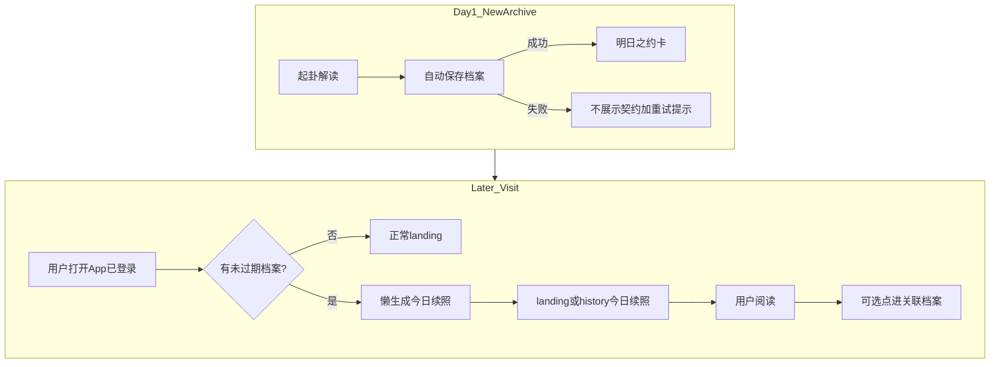
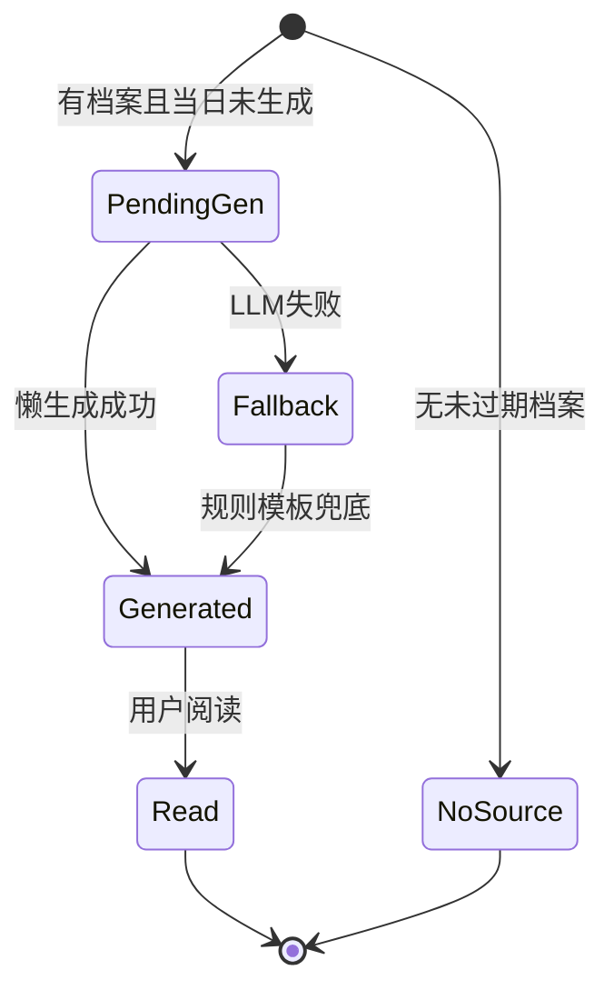
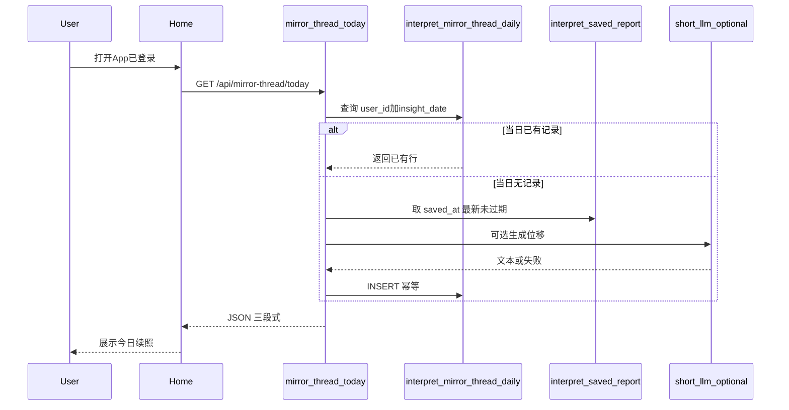

# PRD: 镜脉 · 叙事续照

## 文首属性

| 属性 | 值 |
|------|-----|
| 状态 | backlog |
| 范围 | 镜脉续照（明日之约 + 今日续照）、`interpret_mirror_thread_daily`、镜脉 API、landing / history / interpretation UI |
| 关联文档 | [docs/product-brief.md](../docs/product-brief.md)、[docs/supabase-tables.md](../docs/supabase-tables.md)、[docs/backend-best-practices.md](../docs/backend-best-practices.md)、[docs/supabase-migration-practices.md](../docs/supabase-migration-practices.md)、[AGENTS.md](../../AGENTS.md) |
| 父 PRD | [prd-00002-report-auto-save-retention.md](./prd-00002-report-auto-save-retention.md)（明日之约依赖 autosave 成功） |
| 参考 Feature Spec | [specs/features/feat-00001-mirror-thread-daily-insight.md](../features/feat-00001-mirror-thread-daily-insight.md) |
| 序号 | 00003 |

---

## 背景与问题

### 现状

镜微（[docs/product-brief.md](../docs/product-brief.md)）单次解读闭环强：起卦 → 四镜解读 → 自我觉察 → 深入追问 → 镜下对话。观心档案已可云端自动保存（[prd-00002-report-auto-save-retention.md](./prd-00002-report-auto-save-retention.md)），主应用状态机 `landing → divination → interpretation → history`（[`Home.tsx`](../../src/pages/Home.tsx)）**无跨日回访触点**。

### 要解决的问题

| 痛点 | 说明 |
|------|------|
| 叙事断裂 | 每次解读是孤立事件，用户难以感知「自己的故事在延续」 |
| 回访无钩子 | landing / history 无「明天还要回来」的内因理由 |
| 外因留存禁区 | 打卡、streak、每日登录奖励等与产品「映照叙事」定位不符，**不可采用** |

### 价值假设

- **为谁**：已登录且至少有一条未过期观心档案的用户。
- **做什么**：在每条新档案 autosave 成功后展示 **明日之约**；用户 **当日首次** 打开 App 时 **懒生成** 一条只读 **今日续照**（回响 / 位移 / 若有余力），锚定其最新档案叙事。
- **为何现在**：PRD-00002 解决了「照见有没有被记下」，本 PRD 解决「记下了之后，用户为何明天还想回来读」。
- **北极星行为**：已登录用户打开 App 后，阅读「今日续照」≥30 秒，或点击进入关联档案阅读。**不**将裸 DAU 或登录次数作为成功指标。

---

## 目标与非目标

### 目标（Release 0 / MVP）

- **明日之约**：每条新档案在解读流 autosave **成功**后，于 [`Interpretation.tsx`](../../src/components/IChing/Interpretation.tsx) 展示收尾契约——用户明确知道「明日会有新照见」。
- **今日续照**：已登录用户 **当日首次** 打开 App 时 **懒生成** 一条只读续照（东八区自然日幂等）；展示于 landing / history 顶部。
- **先看、低门槛**：续照为固定三段式（回响 / 位移 / 若有余力），**不要求**用户写作；阅读 1–3 分钟即完成回访。
- **不消耗解读额度**：续照生成与展示 **不** 调用 `consume_interpret_quota`。
- **规则 + 轻量 LLM**：位移段优先短 prompt 生成；失败时规则模板降级。

### 非目标

- 打卡、连续签到天数（streak）、每日登录奖励、任务中心式外因激励。
- 缺席日 **补发** 续照（用户 D2/D3 未打开，D4 只生成 D4 一条，不堆叠多张历史卡片）。
- 凌晨 batch 定时预生成；邮件 / 浏览器 Push 提醒（Release 0 仅站内）。
- 续照扣减主解读日额度。
- 镜下 8 轮对话（[`DeepDialogue.tsx`](../../src/components/IChing/DeepDialogue.tsx)）云端化。
- 方案 B「卦象回响」作为独立功能（可作为续照 **模板类型** 融入位移逻辑，不单独立项；详见 R2）。
- 分享页访客（`/s/:token`）的镜脉 / 续照能力。

### 成功标准

| 指标 | 标准 |
|------|------|
| 内因回访闭环 | 有未过期档案的用户，跨日首次打开可看到今日续照（或 204 空态） |
| 生成性能 | `GET /api/mirror-thread/today` 懒生成 P95 < 3s（含 LLM 降级路径仍 HTTP 200） |
| 幂等 | 同日同用户多次请求返回同一条持久化记录，不重复调用 LLM |
| 文案合规 | 产品验收全文检索 **不得** 出现 streak / 打卡 / 连续登录 / 奖励 等外因留存字样 |
| 额度隔离 | 续照 API 与展示路径 **不** 调用 `consume_interpret_quota` |
| 双运行时 | 本地 Express 与 Vercel `api/mirror-thread/today` 行为一致 |

---

## 术语

| 术语 | 含义 |
|------|------|
| **镜脉** | 用户所有未过期观心档案在服务端串联形成的个人叙事线（非社交 Feed） |
| **明日之约** | 单条档案解读收尾处的契约 UI：承诺下一自然日会有新的续照 |
| **今日续照** | 东八区自然日内、用户首次访问时懒生成的只读三段式内容 |
| **回响** | 续照第一段：从主素材档案摘录 1 句（觉察优先，无则报告原文） |
| **位移** | 续照第二段：80–120 字「再照」短文（规则模板 + 可选短 LLM） |
| **若有余力** | 续照第三段：1 条可折叠苏格拉底式追问（纯读，Release 0 无写入口） |
| **主素材档案** | 生成当日续照时所依据的 `interpret_saved_report` 行；默认取 **`saved_at` 最新且未过期** 的一条 |
| **懒生成** | 用户当日首次打开（已登录）时触发生成；非凌晨批处理 |
| **同日多卦** | 用户在同一东八区自然日内保存多条档案；次日（或下次打开日）续照仍以 **最后保存** 的档案为主素材，当日仅 1 张续照 |

---

## 已拍板规则

| # | 规则 | 结论 |
|---|------|------|
| 1 | 留存驱动力 | 内因：续照映照用户自身叙事 |
| 2 | 回访 MVP | 先看，不要求写觉察 |
| 3 | 明日之约触发 | **每条新档案** autosave 成功后展示一次 |
| 4 | 续照生成时机 | 登录后当日 **首次** 访问懒生成；不补发缺席日 |
| 5 | 日切时区 | 东八区自然日（与 `interpret_usage_daily` 一致） |
| 6 | 同日多卦主素材 | `saved_at` **最新** 且未过期的档案 |
| 7 | 缺席多日文案 | 用 §0.1「缺席位移」句式；无断签 / 愧疚文案 |
| 8 | autosave 失败 | **不** 展示明日之约 |
| 9 | 无未过期档案 | 不展示今日续照；landing 保持现状 |
| 10 | 未登录 | 不请求续照 API；不展示今日续照 |
| 11 | 分享访客 | 无镜脉、无续照 |
| 12 | API 空态 | **推荐 HTTP 204**（无 body）；工程可文档化最终约定 |

### 敏感能力

| 能力 | 约束 |
|------|------|
| 续照读写 | 须登录 + HttpOnly Cookie；`service_role` 服务端写入；RLS 无 anon 直访 |
| 主素材读取 | 仅当前 `user_id` 且 `expires_at > now()` 的 `interpret_saved_report` |
| 额度 | 续照路径 **禁止** 调用 `consume_interpret_quota` |
| 文案 | **禁止** streak / 打卡 / 连续登录 / 奖励 类外因留存表述；用户可见文案须符合 §0.1 镜微用户语言 |

### 待定（见「假设与待确认」）

| # | 项 | 状态 |
|---|-----|------|
| O1 | `auth/me` 内嵌续照摘要 | R1 |
| O2 | 会员更长位移 LLM | R2 可选 |
| O3 | 卦象回响模板 B（30 天内同卦第 2+ 次） | R2 可选，handler 内配置 |

---

## 用户与角色

| 角色 | 目标 |
|------|------|
| 免费注册用户 | 完成照见后带着「明天还会照见自己的故事」离开；次日无需起新卦也能继续内省 |
| 有效 standard 会员 | 同上；R2 可选享受更长位移 LLM（非 MVP） |
| 分享链接访客 | 只读脱敏报告；**无**镜脉与续照 |
| 产品 / 运营 | 提升 D1→D7 有意义回访；北极星可度量；文案符合「映照叙事」原则 |
| 工程 | 幂等懒生成、双运行时一致、LLM 降级不中断回访链路 |

---

## 功能域

### 0. 设计说明：镜脉 vs Feed、内因动力学

**镜脉不是 Feed**：不展示他人内容、无点赞评论、无算法推荐流。它是用户 **本人** 未过期档案在时间上串联形成的 **个人叙事线**。

**内生动力学**（产品机制，非工程模块）：

1. **自我参照效应**：续照从用户本人档案摘录与再诠释。
2. **蔡加尼克效应（开放环）**：明日之约建立「明天会照出什么」的好奇，对象是 **自己的故事** 而非外部奖励。
3. **时间位移洞察**：隔日再读同一句，认知会发生变化——产品是「再照的镜子」，不是「签到簿」。

**续照三段式（固定 UI）**：

```text
【回响】—— 主素材档案 1 句摘录
【位移】—— 80–120 字再照（可提及距上次天数）
【若有余力】—— 1 条可折叠追问（默认折叠）
```

### 0.1 镜微用户语言（文案规范）

面向用户的定稿文案须与 [`Interpretation.tsx`](../../src/components/IChing/Interpretation.tsx) 现有语气对齐：**照见叙事，不断言命运**；邀请式、温柔、不制造任务感。

**原则**

| 原则 | 说明 | 参照 |
|------|------|------|
| 照见，不断言 | 呈现叙事与感受，不给吉凶或行动清单式「答案」 | 「这里照见的是叙事与感受，而非断言。」 |
| 邀请式语气 | 用「若你愿意」「不妨」；不用命令、任务、奖惩话术 | 「若有余力，可再想一想……」 |
| 第二人称「你」 | 直接对用户说话，亲切但不轻浮 | 「明日你再来，会照见这条线的下一笔。」 |
| 叙事动词 | 优先：照见、记下、续照、回响、叙事线 | 避免：打卡、签到、完成任务、日报 |
| 错误不指责 | 说明状态 + 出路；不阻断起卦等主流程 | 「续照暂未就绪，你仍可照常起卦。」 |

**禁用词**（验收 grep，与敏感能力表一致）：streak、打卡、连续登录、连续签到、奖励、任务、断签、补签、你断了 N 天。

**推荐用词**

| 场景 | 推荐 | 避免 |
|------|------|------|
| 档案 | 照见、观心档案、这一次照见 | 报告（用户可见主文案）、条数 |
| 续照 | 续照、镜脉、叙事线 | 推送、提醒、日报 |
| 回访 | 再来、展开、多读一眼 | 回来领、签到 |
| 保留 | 在镜中保留、淡出 | 即将失效（生硬）、删除倒计时 |

**各触点定稿文案**

| 触点 | 定稿文案 | 备注 |
|------|----------|------|
| 明日之约 · 主文 | 镜脉已记下这一照。明日你再来，会照见这条线的下一笔。 | autosave 成功后展示 |
| 明日之约 · 可选辅文 | 照见不是为了判定对错，只是让故事多一笔可以回看的痕迹。 | 可省略；与解读页 REFLECTION_HINT 同调 |
| 今日续照 · 区域标题 | 镜脉 · 今日续照 | landing / history 置顶 |
| 今日续照 · 引导语 | 不必起新卦，先把昨日的故事读完。 | 可选一行小字 |
| 段落标签 | 回响 / 位移 / 若有余力 | UI 标题；与术语表一致 |
| 查看来源 CTA | 展开这一次照见 | 跳转 interpretation |
| 缺席位移（N>1） | 距你上次照见，已过 {N} 天。隔了一些日子，同一句话往往会显出不同的质地——镜微不想替你下结论，只是想请你再照一次。 | 无断签 / 愧疚话术 |
| LLM 降级位移模板 | 隔了一夜，{echo} 是否多了一层滋味？照见不是为了给答案，而是多一个温柔的停顿。 | `{echo}` 为回响句；失败兜底 |
| 续照加载失败 toast | 续照暂未就绪，你仍可照常起卦。 | 非阻断 |
| 续照网络错误 toast | 镜脉暂未能连上，请稍后再来。 | 非阻断；与 auth-api「请稍后再试」同调 |
| 全部档案过期 · history 辅文 | 新的一次照见，会重新牵起镜脉。 | 可与既有空态并存 |
| R1 · 即将淡出提示 | 这条叙事线还会在镜中保留 {N} 天。 | 主素材 `expires_at` ≤7 天 |

**LLM 生成约束**（位移段、若有余力）：system / prompt 须继承上表原则——不预言、不吉凶、不行动清单；口吻与观心报告 SSE 一致（叙事疗法 + 苏格拉底式提问的 **轻量** 变体）。

### 1. 数据库（Supabase migration）

**新表 `interpret_mirror_thread_daily`：**

| 字段 | 类型 | 说明 |
|------|------|------|
| `id` | `uuid` | 主键 |
| `user_id` | `uuid` | FK → `auth.users`，`ON DELETE CASCADE` |
| `insight_date` | `date` | 东八区自然日 |
| `source_report_id` | `uuid` | FK → `interpret_saved_report` |
| `echo_text` | `text` | 回响段 |
| `shift_text` | `text` | 位移段 |
| `optional_prompt` | `text` | 若有余力（可空） |
| `created_at` | `timestamptz` | 生成时刻 |

**约束**：唯一 `(user_id, insight_date)`。

**RLS**：已开启，**无 policy**；与现有 `interpret_*` 表一致，仅 `service_role` 经服务端访问。

**迁移**：`pnpm run db:migration:new -- interpret_mirror_thread_daily` → 编辑 SQL → `pnpm run db:migrate`（见 [supabase-migration-practices.md](../docs/supabase-migration-practices.md)）。

### 2. 服务端：续照生成逻辑

新建 [`server/mirror-thread-handlers.ts`](../../server/mirror-thread-handlers.ts)（或等价模块）：

| 步骤 | 行为 |
|------|------|
| 日切 | `insight_date` = 东八区当前自然日（与 `interpret_usage_daily` 算法一致） |
| 幂等查询 | 先查 `(user_id, insight_date)`；已有则直接返回 |
| 主素材 | `interpret_saved_report` 中 `user_id` 匹配且 `expires_at > now()`，按 `saved_at DESC` 取第一条 |
| 无素材 | 返回空态（204） |
| 回响 | 优先从 `interpretation` 中 `### 自我觉察` 段落摘 1 句；否则从四镜报告规则选取（如阴影之镜段落） |
| 位移 | 短 LLM prompt（80–120 字，须符合 §0.1 镜微用户语言）；失败 → §0.1 降级模板 + 回响句；N>1 时可含 §0.1「缺席位移」句式 |
| 若有余力 | 1 条苏格拉底式追问（邀请式、不断言）；可规则生成或 LLM；可空 |
| 持久化 | `INSERT` 后返回完整 JSON |

**LLM 降级**：超时或错误时位移走规则模板，仍写入表并 HTTP 200；用户侧不出现空白或 500。

### 3. HTTP API

| 方法 | 路径 | 用途 |
|------|------|------|
| GET | `/api/mirror-thread/today` | 获取或懒生成当日续照 |

**成功响应（200）**：

```json
{
  "sourceReportId": "uuid",
  "echoText": "string",
  "shiftText": "string",
  "optionalPrompt": "string | null",
  "insightDate": "YYYY-MM-DD",
  "generatedAt": "ISO8601",
  "sourceReportExpiresAt": "ISO8601",
  "sourceQuestion": "string"
}
```

`sourceQuestion` 为生成续照时主素材档案的起卦意念（`interpret_saved_report.question`），供 Page1「继续照见」预填起卦区。

**空态**：无未过期档案 → **HTTP 204**（推荐，无 body）。

**未授权**：无效或未登录会话 → **HTTP 401**。

**双运行时**：[`server.ts`](../../server.ts) 注册路由 + [`api/mirror-thread/today.ts`](../../api/mirror-thread/today.ts)（遵循 [backend-best-practices.md](../docs/backend-best-practices.md)）。

**不改动**：`POST /api/interpret/stream`、`consume_interpret_quota`、分享 API、深度对话 localStorage 键。

### 4. 前端：明日之约（[`Interpretation.tsx`](../../src/components/IChing/Interpretation.tsx)）

| 行为 | 说明 |
|------|------|
| 触发 | 解读 SSE 成功且 autosave **成功**返回有效档案 id |
| 展示 | 解读页收尾区域展示叙事契约卡；**主文** 用 §0.1「明日之约 · 主文」；可选辅文同表 |
| 不展示 | autosave 失败或未返回有效 id；保留现有失败 / 重试提示（如「档案未能自动保存，请检查网络」） |
| 文案 | 遵循 §0.1；禁用词验收 grep |
| 每条档案 | 每次新档案 autosave 成功各展示一次（同日多卦亦然） |

### 5. 前端：今日续照

| 文件 | 变更 |
|------|------|
| `src/components/IChing/MirrorThreadInsight.tsx`（新建） | 三段式只读卡片；标题 / 引导语 / 段落标签 / CTA 用 §0.1 定稿表 |
| `src/lib/mirror-thread-api.ts`（新建） | 封装 `GET /api/mirror-thread/today` |
| [`Home.tsx`](../../src/pages/Home.tsx) | landing 态拉取并置顶展示续照 |
| [`History.tsx`](../../src/components/IChing/History.tsx) | history 列表上方复用同一组件与数据 |

**数据共享**：landing 与 history 共用同一份续照 state（Home 层 fetch 一次下发，或共享 hook）；避免重复 LLM 触发（服务端幂等兜底）。

**跳转来源档案**：注入 `archivePayload` + `fromArchive`，进入 `interpretation` 态。

### 6. 空态、加载与错误

| 情形 | 行为 |
|------|------|
| 请求中 | skeleton 或轻量 loading，不占满屏 |
| 204 / 无档案 | 不展示续照区域；landing / history 其余行为不变 |
| 5xx / 网络错误 | §0.1 定稿 toast（「续照暂未就绪…」/「镜脉暂未能连上…」）；**不**阻断起卦 |
| 未登录 | 不请求 API |

### 7. 双运行时与 R1 扩展点

- R0：`GET /api/mirror-thread/today` 独立端点。
- R1：`GET /api/auth/me` 可嵌入 `mirrorThreadToday: { enabled, insightDate?, sourceReportExpiresAt? }` 摘要，减少 landing 往返（详见 Release 切片）。
- R1：主素材 `expires_at` 距现在 ≤7 天时，续照卡展示 §0.1「即将淡出提示」（与 PRD-00002 保留期联动）。

---

## 用户故事地图与版本切片

### 旅程主干

| 阶段 | 用户目标 | 系统触点 | Entry / Exit |
|------|----------|----------|----------------|
| 起卦解读 | 完成一次照见 | divination → interpretation SSE | Entry |
| 记下 | 档案自动保存 | autosave POST | |
| 契约 | 知道明日还有照见 | 明日之约卡 | |
| 跨日打开 | 回访 App | landing（已登录） | |
| 续照 | 阅读今日三段式 | GET mirror-thread/today + MirrorThreadInsight Page1 | |
| 继续照见 | （可选）顺着追问再起卦 | Page1「继续照见」→ landing 起卦区预填意念 | |
| 深读 | （可选）看来源档案 | 观心档案列表 → interpretation | |
| 新照 | （可选）全新困惑起卦 | Page1「开启新的照见」或 landing 起卦 | Exit：离开或新循环 |

### 故事地图

| 阶段 | 故事 | 验收要点 |
|------|------|----------|
| 解读 | 作为完成观心解读的登录用户，我希望档案记下后看到明日之约，以便带着对自己故事的好奇离开 | autosave 成功后在解读页收尾展示 §0.1 明日之约主文；语气符合镜微用户语言 |
| 解读 | 作为用户，当 autosave 失败时，我不应看到空承诺的明日之约 | autosave 失败或未返回 id 时不展示契约；保留「档案未能自动保存…」类重试提示 |
| 解读 | 作为未写觉察的用户，我仍应看到明日之约 | 明日之约不依赖自我觉察字段；autosave 成功即可 |
| 回访 | 作为有未过期档案的回访用户，我希望在首页顶部阅读今日续照，以便无需起新卦继续内省 | landing Page1 独占三段式；无写作输入框 |
| 回访 | 作为用户，读完续照后我希望选择继续追问或全新起卦 | Page1 双 CTA：「继续照见」（预填 optionalPrompt 或 sourceQuestion）与「开启新的照见」（空白起卦）；均为可点按钮 |
| 回访 | 作为用户，我仍可从观心档案打开历史照见 | 档案列表 → interpretation（续照 Page1 不再跳转旧档案） |
| 回访 | 作为无未过期档案的用户，我不应看到空白续照区域 | API 204；landing/history 不展示续照卡 |
| 缺席 | 作为缺席多日的用户，我不应看到断签或愧疚文案 | 仅生成打开日一条续照；位移用 §0.1 缺席句式；无 streak UI |
| 同日多卦 | 作为同日保存多条档案的用户，次日我只应看到一张续照 | 主素材 = `saved_at` 最新；`(user_id, insight_date)` 幂等 |
| 幂等 | 作为用户，我同日多次打开或刷新不应刷出不同续照 | 同日重复 GET 返回同一条；不重复 LLM |
| 降级 | 作为用户，当 LLM 不可用时我仍能读到续照 | §0.1 降级位移模板兜底；HTTP 200；无空白页 |
| 安全 | 作为未登录用户，我不应触发续照请求 | 不调用 API；不展示续照 |
| 额度 | 作为用户，阅读续照不应消耗主解读日额度 | 续照路径不调用 `consume_interpret_quota` |
| 合规 | 作为产品，验收时用户可见文案须符合镜微用户语言且无外因留存字样 | §0.1 定稿表 + grep 禁用词 |
| R1·性能 | 作为回访用户，我希望 landing 少一次 API 往返 | `auth/me` 含 mirrorThreadToday 摘要时，有素材且已生成则 landing 可不单独 GET today |
| R1·保留 | 作为档案即将过期的用户，我希望感知叙事线将淡出 | §0.1「这条叙事线还会在镜中保留 {N} 天。」 |
| R1·度量 | 作为产品，我希望统计续照阅读时长以验证北极星 | 前端上报 `insight_read_duration_ms` 契约（或内部日志）；服务端已有 `generated_at` |

### Release 切片

| 版本 | 范围 | 可验收结果 |
|------|------|------------|
| **R0（MVP）** | migration `interpret_mirror_thread_daily`；`GET /api/mirror-thread/today`（生成、幂等、降级）；明日之约 UI；`MirrorThreadInsight` + landing/history；空态/加载/错误 | 完整内因回访闭环；不扣解读额度；同日幂等；LLM 失败可降级 |
| **R1** | ① `GET /api/auth/me` 嵌入 `mirrorThreadToday` 摘要；② §0.1 即将淡出提示；③ 北极星埋点契约（`insight_read_duration_ms` + `generated_at`） | landing 少一次 RTT；用户感知叙事线将淡出；产品可拉 D1 续照阅读率 |
| **R2（可选）** | 邮件/Push 提醒、会员加长位移 LLM、卦象回响模板 B、续照写作入口 | 不写入 R0/R1 验收 |

---

## 核心流程与状态机图

### 全局业务流程



### 续照实体生命周期



**死胡同预警：**

- autosave 失败仍展示明日之约 → **禁止**；空承诺损害信任。
- 同日多 Tab 并发首次 GET → 唯一约束 `(user_id, insight_date)` + 插入冲突处理（返回已有行）。
- LLM 失败无降级 → 用户看到 500 或空白 → **必须** 规则模板兜底并 200。

### 数据流（序列图）



---

## 数据与 API 衔接

- **表**：[`interpret_saved_report`](../docs/supabase-tables.md)（主素材）、**新** `interpret_mirror_thread_daily`。
- **身份**：Cookie `sub` = `auth.users.id`；与 [prd-00001-email-otp-login.md](./prd-00001-email-otp-login.md) 会话模型一致。
- **日切**：东八区自然日，与 [`interpret_usage_daily`](../docs/supabase-tables.md) 一致。
- **依赖 PRD-00002**：明日之约仅在 autosave 成功时展示；主素材查询 `expires_at > now()`。
- **文档漂移（R0 后须改）**：
  - [`docs/product-brief.md`](../docs/product-brief.md) §3：增加镜脉 / 今日续照 / 明日之约；§5 API 表增加 `GET /api/mirror-thread/today`。
  - [`docs/supabase-tables.md`](../docs/supabase-tables.md)：增加 `interpret_mirror_thread_daily` 字段说明。
  - [`AGENTS.md`](../../AGENTS.md) 产品一句：可补充镜脉续照回访能力。

---

## 依赖

| 依赖 | 说明 |
|------|------|
| 登录会话 | 用户已登录；[prd-00001-email-otp-login.md](./prd-00001-email-otp-login.md) |
| 观心档案 autosave | [prd-00002-report-auto-save-retention.md](./prd-00002-report-auto-save-retention.md) 须已上线或并行但 **明日之约依赖 autosave 成功** |
| Supabase | `SUPABASE_URL`、`SUPABASE_SERVICE_ROLE_KEY` 已配置 |
| LLM | 位移段可选短调用；失败可纯规则降级 |

---

## 风险与缓解

| 风险 | 缓解 |
|------|------|
| autosave 与明日之约时序 | 仅在 `onSave` 成功回调后展示契约 |
| 同日并发懒生成 | DB 唯一约束 + upsert / catch conflict 回读 |
| LLM 延迟影响首屏 | skeleton + P95 目标 3s；降级路径不二次调 LLM |
| 外因文案误用 | 产品验收 grep + PRD 敏感能力表 |
| 与 PRD-00002 上线顺序 | 可先并行开发；发布时保证 autosave 可用 |
| R1 auth/me 膨胀 | 仅嵌入摘要字段，完整正文仍走 today 端点（按需） |

---

## 假设与待确认

| # | 项 | 结论 |
|---|-----|------|
| 1 | PRD-00002 依赖 | 明日之约依赖 autosave；可与 PRD-00002 并行，上线顺序须保证 autosave 可用 |
| 2 | API 空态形态 | **推荐 HTTP 204**；若工程选 200 + `{ enabled: false }` 须在 backend-best-practices 文档化 |
| 3 | `auth/me` 合并 | R1；R0 独立 GET |
| 4 | 会员加长位移 | R2 可选 |
| 5 | 卦象回响模板 B | R2 可选；主素材卦象 30 天内第 2+ 次出现时可切换位移模板 |
| 6 | 文档漂移 | 若 product-brief 仍写「手动保存」，以 PRD-00002 as-built 为准 |

### 冲突与决议需求

无与现有 PRD 冲突；本特性 **补充** PRD-00002 的留存价值，不修改其保留期与 autosave 契约。

---

## 修订记录

| 日期 | 说明 |
|------|------|
| 2026-06-18 | 初稿：基于 feat-00001-mirror-thread-daily-insight 落盘；内因留存、懒生成、明日之约、R0/R1 Release 切片 |
| 2026-06-18 | 增补 §0.1 镜微用户语言（文案规范）与各触点定稿表；故事地图 / 功能域引用对齐 |
