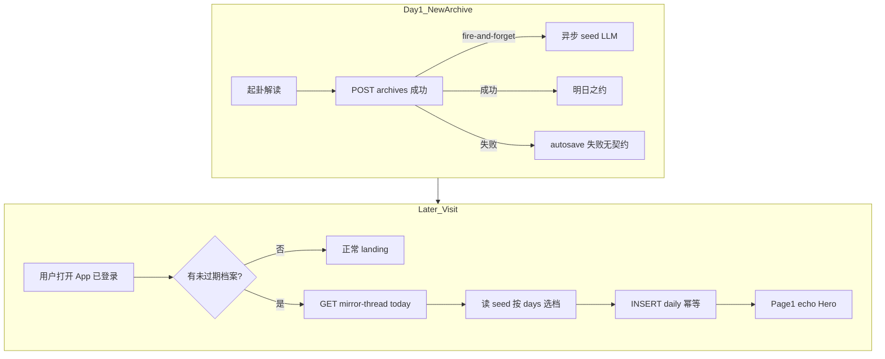
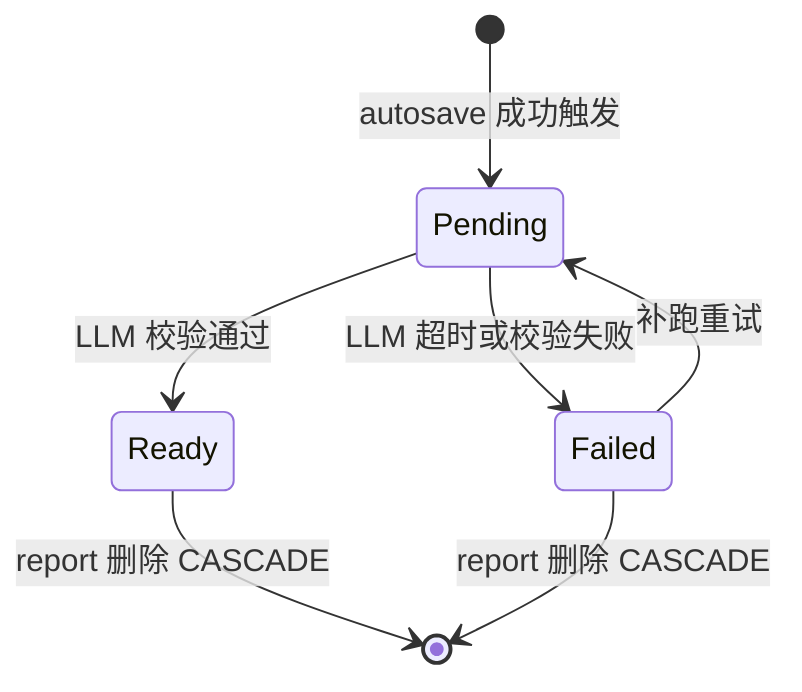
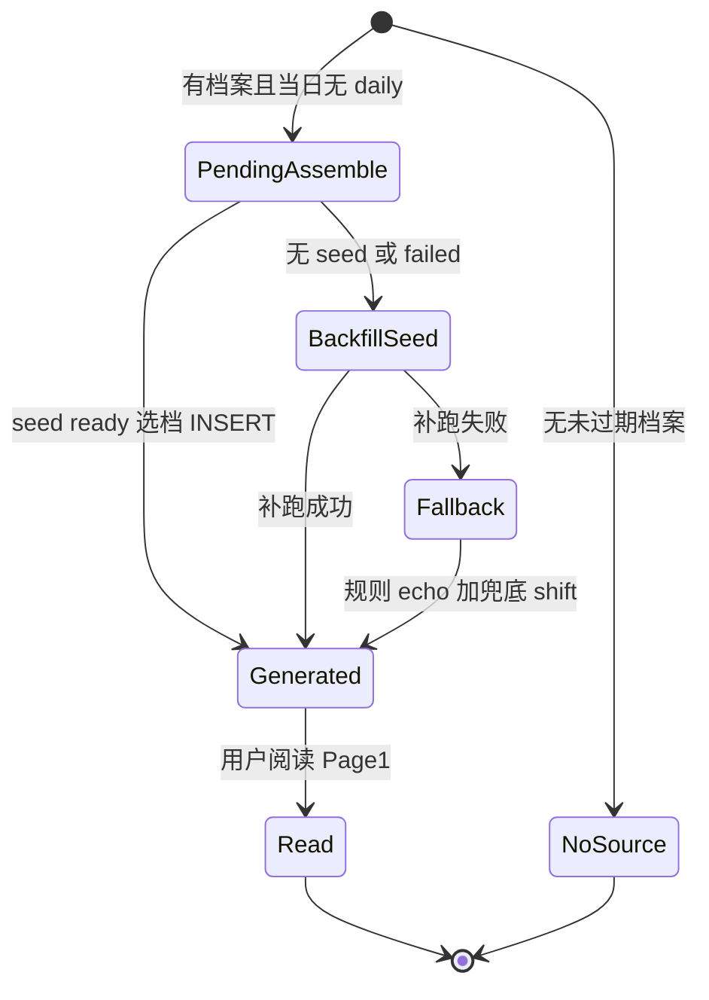
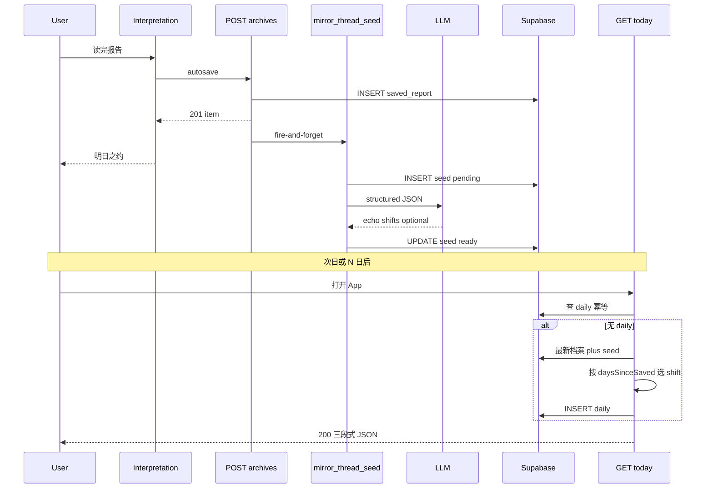

# PRD: 镜脉 · 续照 Seed 预写（触动升级）

## 文首属性

| 属性 | 值 |
|------|-----|
| 状态 | backlog |
| 范围 | 镜脉续照生成 v2、`interpret_mirror_thread_seed`、autosave 异步 seed 生成、`GET /api/mirror-thread/today` 选档拼装、续照 UI echo Hero |
| 关联文档 | [docs/product-brief.md](../docs/product-brief.md)、[docs/supabase-tables.md](../docs/supabase-tables.md)、[docs/backend-best-practices.md](../docs/backend-best-practices.md)、[docs/supabase-migration-practices.md](../docs/supabase-migration-practices.md)、[AGENTS.md](../../AGENTS.md) |
| 背景 PRD | [prd-00003-mirror-thread-daily-insight.md](./prd-00003-mirror-thread-daily-insight.md)（镜脉 R0 已上线：明日之约 + 今日续照 lazy daily；本 PRD 为 **独立** 续照体系 v2 定义，不修订 00003 正文） |
| 父 PRD | [prd-00002-report-auto-save-retention.md](./prd-00002-report-auto-save-retention.md)（seed 挂载 autosave 成功路径） |
| 序号 | 00004 |

---

## 背景与问题

### 现状

镜微镜脉续照 R0（[prd-00003-mirror-thread-daily-insight.md](./prd-00003-mirror-thread-daily-insight.md)）已上线：

- 表 [`interpret_mirror_thread_daily`](../../supabase/migrations/20260618102418_interpret_mirror_thread_daily.sql) 按东八区 `(user_id, insight_date)` 幂等一条。
- [`server/mirror-thread-handlers.ts`](../../server/mirror-thread-handlers.ts) 在用户 **当日首次** 打开时 **懒生成** 三段式续照（回响 / 位移 / 若有余力）。
- 前端 [`MirrorThreadInsight.tsx`](../../src/components/IChing/MirrorThreadInsight.tsx) Page1 独占展示；[`TomorrowPromiseCard.tsx`](../../src/components/IChing/TomorrowPromiseCard.tsx) 在 autosave 成功后展示明日之约。

**当前生成链路的质量瓶颈：**

| 段落 | R0 实现 | 用户感知 |
|------|---------|----------|
| 回响 | 规则摘句（自我觉察 → 阴影之镜 → 首句） | 常摘到过渡句，非报告中最「扎心」的一句 |
| 位移 | 打开日短 LLM（2.5s 超时）或固定模板；缺席 >1 天直出模板 | 「隔了一夜…」「已过 N 天…」等 **固定模式** 占比高 |
| 若有余力 | 100% 规则模板 | 句式雷同 |

此外，打开日调 LLM 带来 **延迟与不确定性**（P95 目标 3s），与「第一眼被照见、触动灵魂」的产品目标冲突。

### 要解决的问题

| 痛点 | 说明 |
|------|------|
| 内容难触动 | 规则摘句 + 模板位移无法形成「隔一夜再读更刺」的内因体验 |
| 打开日慢 | 懒生成含 LLM 调用，首屏需 skeleton 等待 |
| shift 不动态 | 缺席多日与隔日若共用模板，时间位移洞察失效 |
| 浪费窗口 | 用户情绪峰值在解读结束 autosave 时，R0 未在该时刻预写素材 |

### 价值假设

- **为谁**：已登录、完成 autosave 且至少有一条未过期观心档案的用户。
- **做什么**：在 **autosave 成功** 后异步 **一次结构化 LLM** 预写 **Seed**（智能选句 echo + 7 档 shift + optional）；用户跨日打开时 **读 seed 选档拼装 daily**，**打开日零 LLM**。
- **为何现在**：00003 内因回访闭环已通，下一刀提升 **续照内容质量** 与 **打开性能**。
- **北极星行为**（继承 00003）：已登录用户阅读今日续照 ≥30s，或点击「继续照见 / 开启新的照见」。**新增可观测**：seed `ready` 率、续照降级率、echo 非规则摘句占比。

---

## 目标与非目标

### 目标（Release 0 / MVP）

- **两阶段生成**：阶段 A autosave 后异步写 seed；阶段 B 打开日读 seed 选档写 daily。
- **Seed 表**：新表 `interpret_mirror_thread_seed`，**1 档案 : 1 seed**（`report_id` 唯一）。
- **一次结构化 LLM**（方案三）：单次输出 `echoText` + `shiftByDayOffset`（键 `"1"`…`"7"` + `"default"`）+ `optionalPrompt`。
- **echo Hero**：无独立 prologue；UI 最大字号展示 **报告 verbatim 智能选句**。
- **shift 7 档预写（合体 A）**：打开日按 `daysSinceSaved` 选档，`min(days, 7)` 映射键，>7 用 `default`；**禁止** R0 打开日再调 LLM 写 shift。
- **性能**：有 seed 且 `ready` 时 `GET /api/mirror-thread/today` P95 **< 500ms**（无 LLM）。
- **不消耗解读额度**：seed 与 today 路径均 **不** 调用 `consume_interpret_quota`。
- **不阻断主流程**：seed 失败 **不影响** autosave 201/200 与明日之约展示。

### 非目标

- 独立 `prologue_text` 字段（R0 不做；echo 大字 Hero 足够；R2 可选）。
- 打开日再调 LLM 写 shift（合体 B；R2 备选）。
- 缺席日 **补发** 历史续照卡片；streak / 打卡 / 每日登录奖励。
- 凌晨 batch 预生成；邮件 / Push 提醒。
- 修订 [prd-00003-mirror-thread-daily-insight.md](./prd-00003-mirror-thread-daily-insight.md) 正文（本 PRD **独立自洽**）。
- 分享页访客（`/s/:token`）的 seed / 续照能力。

### 成功标准

| 指标 | 标准 |
|------|------|
| 打开性能 | seed `ready` 时 `GET /today` P95 **< 500ms** |
| shift 动态 | 同 seed、同档案；`daysSinceSaved=1` 与 `=4` 的 `shift_text` **必须不同** |
| echo 质量 | `echo_text` 为 `interpretation` **原文子串**（服务端校验） |
| seed 覆盖 | 新 autosave 档案 **≥95%** 在 24h 内 seed 状态为 `ready` |
| 降级 | seed 缺失 / `failed` / `pending` 超时后仍有 HTTP 200 续照 |
| 额度隔离 | seed / today 路径 **不** 调用 `consume_interpret_quota` |
| 文案合规 | 用户可见文案 **不得** 出现 streak / 打卡 / 连续登录 / 奖励 等外因留存字样 |
| 双运行时 | 本地 Express 与 Vercel `api/mirror-thread/*` 行为一致 |

---

## 术语

| 术语 | 含义 |
|------|------|
| **镜脉** | 用户所有未过期观心档案在服务端串联形成的个人叙事线（非社交 Feed） |
| **明日之约** | 单条档案解读 autosave 成功后的契约 UI（继承 00003） |
| **今日续照** | 东八区自然日内懒生成（daily 层）的只读三段式内容 |
| **Seed** | autosave 成功后预写的续照素材包，绑定 `interpret_saved_report.id` |
| **两阶段生成** | 阶段 A：autosave → seed；阶段 B：打开日 → 选档 → daily |
| **echo Hero** | UI 最大字号 blockquote 展示的智能选句（**无**独立序章 prologue） |
| **回响（echo）** | 从主素材报告 **verbatim** 选的 1 句（LLM 智能选句，非规则首句） |
| **位移（shift）** | 80–120 字「再照」短文；seed 内 **预写 7 档 + default**，打开日 **选档** |
| **shift 分档** | `shift_by_day_offset` JSON 键 `"1"`…`"7"` 与 `"default"` |
| **daysSinceSaved** | 主素材 `saved_at` 东八区日历日与 `insight_date` 的整天差 |
| **若有余力** | 1 条苏格拉底式追问；seed 内 LLM 生成 |
| **主素材档案** | 生成当日 daily 所依据的 `interpret_saved_report`；`saved_at` 最新且 `expires_at > now()` |
| **懒生成（daily）** | 用户当日首次 GET `/today` 时拼装并 INSERT daily；**非**打开日调 LLM |
| **补跑 seed** | 旧档或无 seed 时，在 GET `/today` 路径 **同步** 触发 seed 生成 |
| **同日多卦** | 同日保存多条档案；次日续照主素材 = `saved_at` 最新；当日 daily 幂等 1 条 |

---

## 已拍板规则

| # | 规则 | 结论 |
|---|------|------|
| 1 | prologue | **不做**；echo 大字 Hero |
| 2 | shift 动态 | **7 档 + default 预写**；打开日 `min(daysSinceSaved, 7)` 选键，>7 用 `default` |
| 3 | seed 触发 | autosave **201/200 成功**后 **fire-and-forget** 异步；不阻塞响应与明日之约 |
| 4 | LLM 次数 | 每档案 **1 次** structured output；用户不再打开视为 **可接受浪费** |
| 5 | 打开日 LLM | **禁止**（R0）；R2 可选合体 B |
| 6 | echo 来源 | 必须报告 **原文子串**；禁止 AI 改写 echo |
| 7 | daily 幂等 | `(user_id, insight_date)` 唯一；daily 生成后 shift **快照锁定**，当日不再变 |
| 8 | 主素材 | `saved_at` 最新且未过期档案 |
| 9 | 缺席日 | 不补发；仅生成打开日 1 条 daily |
| 10 | 无 seed 旧档 | GET `/today` 时 **同步补跑 seed**（默认）；超时后规则降级 |
| 11 | seed pending | 同步等待上限 **3s**（默认）；超时走降级 |
| 12 | autosave 失败 | 不生成 seed；不展示明日之约（继承 00003） |

### 敏感能力

| 能力 | 约束 |
|------|------|
| seed / daily 读写 | 须登录 + HttpOnly Cookie；`service_role` 服务端；RLS 无 anon 直访 |
| 主素材读取 | 仅当前 `user_id` 且 `expires_at > now()` |
| 额度 | seed / today 路径 **禁止** `consume_interpret_quota` |
| echo 校验 | 写入前 `interpretation.includes(echoText)` 或等价子串校验 |
| 文案 | **禁止** streak / 打卡 / 连续登录 / 奖励；须符合 §0.1 |

### 待定（见「假设与待确认」）

| # | 项 | 状态 |
|---|-----|------|
| O1 | `auth/me` 嵌入 seed 状态摘要 | R1 |
| O2 | `prologue_text` 独立 Hero | R2 可选 |
| O3 | 打开日 shift LLM（合体 B） | R2 可选 |
| O4 | 卦象回响模板 B | R2 可选 |

---

## 用户与角色

| 角色 | 目标 |
|------|------|
| 免费注册用户 | 跨日打开时被 **自己的叙事** 触动；续照秒开、无任务感 |
| 有效 standard 会员 | 同上 |
| 分享链接访客 | 只读脱敏报告；**无** seed / 续照 |
| 产品 / 运营 | 提升 D1→D7 有意义回访；可度量 seed 命中率与降级率 |
| 工程 | 两阶段幂等、异步不拖 autosave、双运行时一致、降级不 500 |

---

## 功能域

### 0. 设计说明：触动来自内因 + 时间位移

**镜脉不是 Feed**（继承 00003）：仅映照 **用户本人** 未过期档案形成的叙事线。

**内生动力学**：

1. **自我参照效应**：echo 为报告 **原文** 智能选句，非 AI 编造金句。
2. **蔡加尼克效应**：明日之约 + 预写 seed 建立「明天会照出什么」的开放环。
3. **时间位移洞察**：shift **7 档预写**，隔日 vs 数日后打开 **文案不同**——产品是「再照的镜子」，不是「签到簿」。

**续照 v2 信息架构（无 prologue）**：

```text
【echo · Hero】—— LLM 从报告选 1 句原文（大字 blockquote）
【shift】—— 打开日按 daysSinceSaved 从 seed 选档（斜体段落）
【若有余力】—— seed 内 1 条追问
```

**与 R0 生成链路对比**：

| 维度 | PRD-00003 R0 | 本 PRD v2 |
|------|--------------|-----------|
| echo | 规则摘句 | LLM 智能选 **verbatim** 句 |
| shift | 打开日 LLM / 模板 | autosave 预写 7 档；打开日 **选档** |
| optional | 规则模板 | seed 内 LLM |
| LLM 时机 | 打开日 | autosave 异步（+ 补跑例外） |
| 打开延迟 | 含 LLM，P95 3s | seed ready 时 P95 **< 500ms** |

### 0.1 镜微用户语言（文案规范）

面向用户的定稿文案须与 [`Interpretation.tsx`](../../src/components/IChing/Interpretation.tsx) 对齐：**照见叙事，不断言命运**；邀请式、温柔、不制造任务感。

**原则**（继承 00003 §0.1）

| 原则 | 说明 |
|------|------|
| 照见，不断言 | 呈现叙事与感受，不给吉凶或行动清单式「答案」 |
| 邀请式语气 | 「若你愿意」「不妨」；不用命令、任务、奖惩 |
| 第二人称「你」 | 直接对用户说话 |
| 叙事动词 | 照见、记下、续照、回响、叙事线 |
| 错误不指责 | 说明状态 + 出路；不阻断起卦 |

**禁用词**（验收 grep）：streak、打卡、连续登录、连续签到、奖励、任务、断签、补签、你断了 N 天。

**各触点定稿文案**

| 触点 | 定稿文案 | 备注 |
|------|----------|------|
| 明日之约 · 主文 | 镜脉已记下这一照。明日你再来，会照见这条线的下一笔。 | 不变 |
| 今日续照 · 区域标题 | 镜脉 · 今日续照 | 不变 |
| 今日续照 · 引导语 | 不必起新卦，先把昨日的故事读完。 | 不变 |
| echo · 段落标签 | 你曾照见 | 替代或弱化「回响」表单标签 |
| shift · 段落标签 | 可选省略小标签，以斜体段落呈现 | v2 弱化三段表单感 |
| seed pending · loading | 镜脉正在续照… | skeleton；**最长 3s** 后降级 |
| seed 失败兜底 shift | 隔了一夜，{echo} 是否多了一层滋味？照见不是为了给答案，而是多一个温柔的停顿。 | 仅降级路径 |
| 缺席兜底 shift（N>1） | 距你上次照见，已过 {N} 天。隔了一些日子，同一句话往往会显出不同的质地——镜微不想替你下结论，只是想请你再照一次。 | 仅降级路径 |
| 续照加载失败 toast | 续照暂未就绪，你仍可照常起卦。 | 非阻断 |
| 续照网络错误 toast | 镜脉暂未能连上，请稍后再来。 | 非阻断 |
| R1 · 即将淡出提示 | 这条叙事线还会在镜中保留 {N} 天。 | 主素材 `expires_at` ≤7 天 |

**LLM 生成约束**（seed structured output）：

- 不预言、不吉凶、不行动清单；口吻与观心报告 SSE 一致（叙事疗法 + 苏格拉底式提问轻量变体）。
- `shiftByDayOffset` 各档 **80–120 字**；**语义须不同**，禁止复制粘贴同一段。
- 键 `"1"` 偏「隔了一夜」；`"4"`–`"7"` 可自然提及隔了数日；`"default"` 用于 >7 天缺席语气，**无断签 / 愧疚**。

### 1. 数据库（Supabase migration）

**新表 `interpret_mirror_thread_seed`：**

| 字段 | 类型 | 说明 |
|------|------|------|
| `report_id` | `uuid` | 主键；FK → `interpret_saved_report(id)`，`ON DELETE CASCADE` |
| `user_id` | `uuid` | FK → `auth.users(id)`，`ON DELETE CASCADE` |
| `echo_text` | `text` | LLM 智能选的报告原句 |
| `shift_by_day_offset` | `jsonb` | `{"1":"...","2":"...",...,"7":"...","default":"..."}` |
| `optional_prompt` | `text` | 可空；若有余力 |
| `status` | `text` | `pending` \| `ready` \| `failed` |
| `model_id` | `text` | 可空；生成所用模型 |
| `error_detail` | `text` | 可空；失败原因摘要 |
| `created_at` | `timestamptz` | 创建时刻 |
| `updated_at` | `timestamptz` | 更新时刻 |

**约束**：主键 `report_id`（一档案一 seed）。

**索引**：`(user_id, updated_at desc)`（可选，便于运维排查）。

**RLS**：已开启，**无 policy**；与 `interpret_mirror_thread_daily` 一致，仅 `service_role` 经服务端访问。

**既有表 `interpret_mirror_thread_daily`**：字段 **不变**；`echo_text` / `shift_text` / `optional_prompt` 为打开日拼装时的 **快照**（shift 为选档结果，非实时计算）。

**迁移**：`pnpm run db:migration:new -- interpret_mirror_thread_seed` → 编辑 SQL → `pnpm run db:migrate`（见 [supabase-migration-practices.md](../docs/supabase-migration-practices.md)）。

### 2. 阶段 A：autosave 后 seed 生成

**挂载点**：[`server/archives-handlers.ts`](../../server/archives-handlers.ts) `handleArchivesPost`（及幂等 update 成功路径）返回 **201/200 后**，**fire-and-forget** 调用 seed  worker（**不 await** 进 HTTP 响应）。

**新模块（建议）**：

- [`server/mirror-thread-seed.ts`](../../server/mirror-thread-seed.ts) — 写入 / 补跑 / 读取 seed
- [`server/prompts/mirror-thread-seed.ts`](../../server/prompts/mirror-thread-seed.ts) — structured prompt

**流程**：

| 步骤 | 行为 |
|------|------|
| 1 | INSERT seed 行 `status=pending`（或 upsert 若已存在且非 `ready`） |
| 2 | 调用 LLM **一次**，要求 **仅输出 JSON** |
| 3 | 校验 echo 子串、shift 键齐全、各档字数 |
| 4 | 成功 → `status=ready`，写 `shift_by_day_offset` 等 |
| 5 | 失败 → `status=failed`，写 `error_detail`；**不影响** archives 响应 |

**Structured JSON schema（LLM 输出）**：

```json
{
  "echoText": "必须是 interpretation 中的原文句子",
  "shiftByDayOffset": {
    "1": "隔日语境，80-120字",
    "2": "…",
    "3": "…",
    "4": "…",
    "5": "…",
    "6": "…",
    "7": "…",
    "default": "缺席较久，80-120字，无断签愧疚"
  },
  "optionalPrompt": "若有余力，不妨…"
}
```

**Prompt 输入**：`question`、`interpretation` 全文、`deep_inquiry_questions`（若有）、`lines`（卦象 metadata，若有）。

**幂等**：同 `report_id` 已 `ready` → skip；`failed` / `pending` 可重试。

**超时建议**：autosave 异步路径 **8–15s**（不阻塞用户）；可配置。

### 3. 阶段 B：`GET /api/mirror-thread/today` 拼装 daily

改写 [`server/mirror-thread-handlers.ts`](../../server/mirror-thread-handlers.ts) 目标行为：

| 步骤 | 行为 |
|------|------|
| 日切 | `insight_date` = 东八区当前自然日（[`mirror-thread-date.ts`](../../server/mirror-thread-date.ts)） |
| 幂等 | 已有 `(user_id, insight_date)` → 直接返回 |
| 主素材 | `interpret_saved_report`：`saved_at DESC`，`expires_at > now()`，limit 1 |
| 无素材 | **HTTP 204** |
| 读 seed | 按 `source_report_id` 查 seed |
| seed `ready` | `days = daysBetweenShanghai(saved_at, insight_date)`；`key = min(days, 7)` 或 `days===0` 时用 `"1"`；`shift = shift_by_day_offset[key] ?? default` |
| seed `pending` | 同步等待 ≤ **3s**；仍 pending → 降级或触发补跑 |
| 无 seed / `failed` | **同步补跑 seed**（默认）；补跑仍失败 → 规则 echo（[`mirror-thread-echo.ts`](../../server/mirror-thread-echo.ts)）+ §0.1 兜底 shift |
| 持久化 | INSERT `interpret_mirror_thread_daily`；冲突 23505 → 回读已有行 |
| 响应 | HTTP 200 JSON（字段同 00003，含 `sourceQuestion`） |

**打开日 LLM**：R0 **禁止**。

**选档示例**：

| daysSinceSaved | 选用键 |
|----------------|--------|
| 0 或 1 | `"1"` |
| 2 | `"2"` |
| … | … |
| 7 | `"7"` |
| ≥8 | `"default"` |

### 4. HTTP API

| 方法 | 路径 | 变更 |
|------|------|------|
| GET | `/api/mirror-thread/today` | 拼装逻辑改为 seed 选档；响应 schema **不变** |
| POST | `/api/mirror-thread/read` | **不变**（内部日志） |
| POST | `/api/archives` | 成功返回后 **内部** 触发 seed 异步；**无** 新公开端点 |

**成功响应（200）**：与 [prd-00003](./prd-00003-mirror-thread-daily-insight.md) §3 一致。

**双运行时**：[`server.ts`](../../server.ts) + [`api/mirror-thread/today.ts`](../../api/mirror-thread/today.ts)。

### 5. 前端

| 文件 | 变更 |
|------|------|
| [`MirrorThreadInsight.tsx`](../../src/components/IChing/MirrorThreadInsight.tsx) | echo Hero 顶格大字；段落标签「你曾照见」；弱化表单感 |
| [`Home.tsx`](../../src/pages/Home.tsx) | seed pending 时 skeleton +「镜脉正在续照…」；3s 后仍可用降级数据 |
| [`mirror-thread-api.ts`](../../src/lib/mirror-thread-api.ts) | **无** schema 变更 |
| [`mirror-thread-summary.ts`](../../server/mirror-thread-summary.ts) | R1 可扩展 `seedStatus` |

**Loading 策略**：

| 情形 | UI |
|------|-----|
| seed `ready` | 通常 **秒开**，轻量或无 loading |
| seed `pending` / 补跑中 | skeleton + 文案；最长 **3s** |
| 降级成功 | 仍展示三段式；用户无 500 |

### 6. 降级矩阵

| 情形 | 行为 |
|------|------|
| seed `ready` | echo + 选档 shift + optional 来自 seed |
| seed `pending` | 等待 ≤3s；超时 → 补跑或降级 |
| seed `failed` / 无 seed | 同步 **补跑 seed**；失败 → 规则 echo + §0.1 兜底 shift |
| JSON 缺 shift 键 | 用 `default` + 日志；仍 200 |
| echo 子串校验失败 | 重试 1 次 LLM 或规则 `extractEchoText` |
| autosave 失败 | 不 seed；不明日之约 |

### 7. R1 / R2 扩展点

- **R1**：`GET /api/auth/me` 嵌入 `mirrorThreadToday.seedStatus?: pending|ready|failed`；旧档补跑策略监控；seed 指标日志。
- **R2**：`prologue_text`；合体 B 打开日 shift LLM；卦象回响模板 B。

---

## 用户故事地图与版本切片

### 旅程主干

| 阶段 | 用户目标 | 系统触点 | Entry / Exit |
|------|----------|----------|----------------|
| 起卦解读 | 完成照见 | divination → interpretation SSE | Entry |
| 记下 | 档案 autosave | POST `/api/archives` | |
| 预写 | （无感）seed 异步生成 | seed worker + LLM | |
| 契约 | 明日之约 | TomorrowPromiseCard | |
| 跨日打开 | 回访 App | landing Page1 | |
| 续照 | 秒开三段式 | GET `/today` 选档拼装 | |
| 继续 / 新照 | 双 CTA | 继续照见 / 开启新的照见 | Exit |

### 故事地图

| 阶段 | 故事 | 验收要点 |
|------|------|----------|
| 解读 | 作为完成解读的用户，我希望 autosave 不被 seed 拖慢 | POST `/archives` P95 不受 seed LLM await 影响；明日之约及时展示 |
| 解读 | 作为用户，seed 生成失败不应导致档案保存失败 | autosave 仍 201/200；seed `status=failed` 仅内部可见 |
| 回访 | 作为有次日 seed 的用户，我希望续照秒开 | seed `ready` 时 GET `/today` P95 < 500ms；无打开日 LLM |
| 回访 | 作为用户，我希望 echo 是报告里最触动的一句 **原话** | echo 为 interpretation 子串；非规则首句摘取 |
| 回访 | 作为用户，隔 4 天打开时 shift 应与次日不同 | 同 seed，`days=1` vs `days=4` 的 `shift_text` 不同 |
| 回访 | 作为用户，Page1 第一眼应是 echo 大字 Hero | 无 prologue 字段；无「回响/位移」强表单感 |
| 旧档 | 作为 R0 前已存档的用户，首次打开应能补跑 seed | 无 seed 时触发同步补跑；loading ≤3s 或降级 |
| 降级 | 作为用户，补跑失败我仍能读到续照 | HTTP 200；规则 echo + 兜底 shift |
| 缺席 | 作为缺席多日的用户，我不应看到断签文案 | 选档 `default` 或 `"7"` 符合 §0.1；无 streak UI |
| 幂等 | 作为用户，同日刷新不应换 shift | `(user_id, insight_date)` 唯一；重复 GET 同一条 |
| 并发 | 作为用户，多 Tab 首次打开不应插入两条 daily | 23505 冲突回读 |
| 额度 | 作为用户，seed 与续照不扣解读额度 | 不调用 `consume_interpret_quota` |
| 安全 | 作为未登录用户，我不应触发 seed / today | 401 / 不请求 |
| 合规 | 作为产品，文案无外因留存字样 | grep 禁用词 |
| R1 | 作为回访用户，我希望 landing 预知 seed 是否就绪 | `auth/me` 可选 `seedStatus` |

### Release 切片

| 版本 | 范围 | 可验收结果 |
|------|------|------------|
| **R0（MVP）** | migration `interpret_mirror_thread_seed`；archives 异步 hook；structured LLM；today 选档拼装；echo Hero UI；降级矩阵 + 补跑 | 新档案次日秒开；shift 1 vs 4 不同；autosave 不阻塞 |
| **R1** | `auth/me` seed 摘要；seed 监控指标；补跑策略文档化 | landing 可预判 loading；运营可看 ready 率 |
| **R2（可选）** | `prologue_text`；合体 B 打开日 shift LLM；卦象回响模板 B | 不写入 R0/R1 验收 |

---

## 核心流程与状态机图

### 全局业务流程



### Seed 实体生命周期



### Daily 实体生命周期



**死胡同预警：**

- seed 异步 **await 进 archives 响应** → **禁止**；拖慢解读页。
- echo 非 verbatim 仍写入 → 破坏内因信任 → **必须** 子串校验。
- 打开日调 LLM 写 shift（R0）→ 违背合体 A → **禁止**。
- seed pending 无限等待 → 用户白屏 → **3s** 上限 + 降级。
- daily 已存在仍重算 shift → 同日刷新内容变化 → **禁止**；须幂等返回。

### 数据流（序列图）



---

## 数据与 API 衔接

- **表**：[`interpret_saved_report`](../docs/supabase-tables.md)（主素材）、[`interpret_mirror_thread_daily`](../docs/supabase-tables.md)（日快照）、**新** `interpret_mirror_thread_seed`。
- **身份**：Cookie `sub` = `auth.users.id`；与 [prd-00001-email-otp-login.md](./prd-00001-email-otp-login.md) 一致。
- **日切**：东八区自然日，与 `interpret_usage_daily` 一致。
- **依赖 PRD-00002**：seed 挂载 autosave 成功路径。
- **与 PRD-00003 关系**：00003 定义 R0 as-built；本 PRD 为 v2 **独立** 规范；实现 v2 后 as-built 以本 PRD + 代码为准。
- **文档漂移（R0 后须改）**：
  - [`docs/product-brief.md`](../docs/product-brief.md) §3 / §5：补充 seed 两阶段生成。
  - [`docs/supabase-tables.md`](../docs/supabase-tables.md)：增加 `interpret_mirror_thread_seed`。
  - [`AGENTS.md`](../../AGENTS.md)：可补充 seed 预写说明。

---

## 依赖

| 依赖 | 说明 |
|------|------|
| 登录会话 | [prd-00001-email-otp-login.md](./prd-00001-email-otp-login.md) |
| 观心档案 autosave | [prd-00002-report-auto-save-retention.md](./prd-00002-report-auto-save-retention.md) |
| 镜脉 R0 | [prd-00003-mirror-thread-daily-insight.md](./prd-00003-mirror-thread-daily-insight.md)（daily 表、UI 壳、明日之约） |
| Supabase | `SUPABASE_URL`、`SUPABASE_SERVICE_ROLE_KEY` |
| LLM | [`server/llm/registry.ts`](../../server/llm/registry.ts)；seed **一次** structured 调用 |

---

## 风险与缓解

| 风险 | 缓解 |
|------|------|
| 异步 seed 未完成用户已打开 | pending 等待 3s + 同步补跑 + 降级 |
| 7 档 shift 仍显「预制感」 | prompt 强制各档语义差异；R2 合体 B |
| echo 非 verbatim | 子串校验；失败重试或规则摘句 |
| token 成本上升 | 可接受浪费；按 report 计 1 次 |
| 00003 / 00004 文档双源 | 本 PRD standalone；product-brief 实现后统一 |
| 补跑阻塞 today | 3s 上限；超时降级仍 200 |
| 同日并发 INSERT daily | 唯一约束 + 23505 回读 |

---

## 假设与待确认

| # | 项 | 结论 |
|---|-----|------|
| 1 | prologue | **R0 不做**；echo Hero |
| 2 | shift 策略 | **7 档 + default 预写**；打开日零 LLM |
| 3 | seed pending 等待 | **默认 3s** |
| 4 | 旧档无 seed | **打开时同步补跑**（R0 默认） |
| 5 | daysSinceSaved=0 | 映射键 **`"1"`**（同日语境） |
| 6 | 与 00003 关系 | **独立 PRD**；不修订 00003 正文 |
| 7 | 合体 B | R2 可选 |
| 8 | prologue 字段 | R2 可选 |

### 冲突与决议需求

无与现有 PRD 功能冲突。本 PRD **升级** 00003 的续照 **生成链路**；不改变 00002 保留期、00003 的明日之约触发与 daily 幂等语义。

---

## 修订记录

| 日期 | 说明 |
|------|------|
| 2026-06-18 | 初稿：镜脉续照 v2；autosave seed 预写 + 7 档 shift 选档；echo Hero；无 prologue；独立 PRD |
