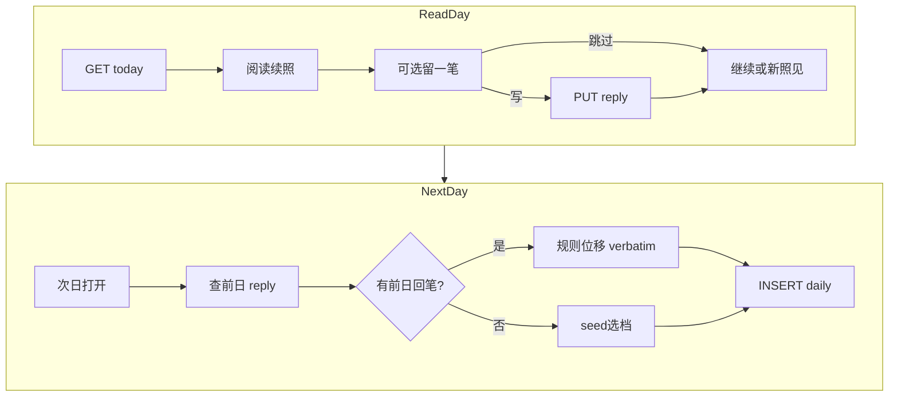
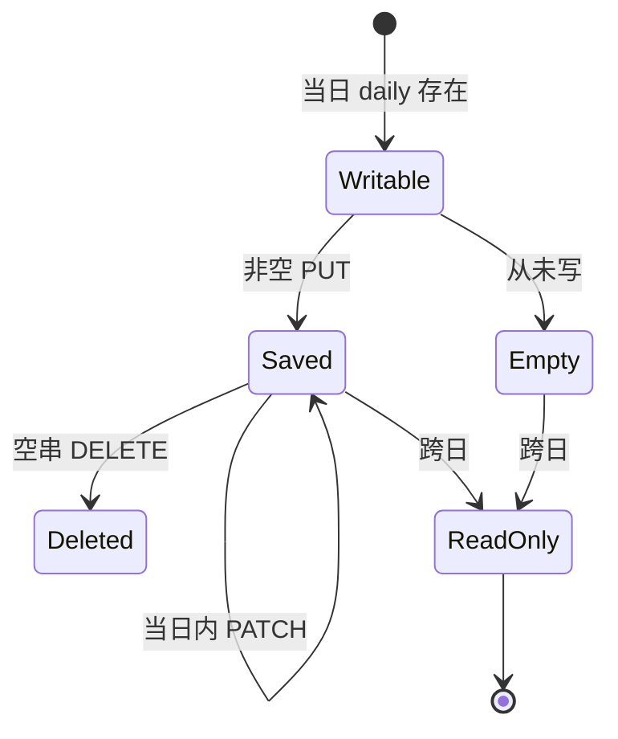

# PRD: 镜脉 · 回笔

## 文首属性

| 属性 | 值 |
|------|-----|
| 状态 | 工程：partial（见文末「工程验收状态」章） |
| 范围 | 镜脉回笔、`interpret_mirror_thread_reply`、`PUT/PATCH /api/mirror-thread/reply`、today 前日回笔注入位移、MirrorThreadInsight 回笔 UI |
| 关联文档 | [docs/product-brief.md](../docs/product-brief.md)、[docs/supabase-tables.md](../docs/supabase-tables.md)、[docs/backend-best-practices.md](../docs/backend-best-practices.md)、[docs/supabase-migration-practices.md](../docs/supabase-migration-practices.md)、[AGENTS.md](../../AGENTS.md) |
| 背景 PRD | [prd-00003-mirror-thread-daily-insight.md](./prd-00003-mirror-thread-daily-insight.md)（镜脉 R0：只读续照）、[prd-00004-mirror-thread-seed-pregen.md](./prd-00004-mirror-thread-seed-pregen.md)（seed v2 选档拼装） |
| 父 PRD | [prd-00003-mirror-thread-daily-insight.md](./prd-00003-mirror-thread-daily-insight.md) |
| 参考 Feature Spec | [specs/features/feat-00002-mirror-thread-reply.md](../features/feat-00002-mirror-thread-reply.md) |
| 序号 | 00005 |

---

## 背景与问题

### 现状

镜微镜脉续照 R0 + seed v2 已上线（[prd-00003](./prd-00003-mirror-thread-daily-insight.md)、[prd-00004](./prd-00004-mirror-thread-seed-pregen.md)）：

- 明日之约 + 今日续照（echo Hero / shift / 若有余力）。
- 打开日 **零 LLM** 选档拼装 daily（seed `ready` 时 P95 < 500ms）。
- [`MirrorThreadInsight.tsx`](../../src/components/IChing/MirrorThreadInsight.tsx) **刻意只读**——无回笔输入框。

**当前留存链路的结构缺口：**

| 段落 | 现状 | 用户感知 |
|------|------|----------|
| 若有余力 | 只读追问，无写入口 | 开放环悬在空中，无法亲手闭合 |
| 位移 | seed 预写 / 规则模板，仅锚定报告 | 缺少 **用户对续照** 的即时声音 |
| 回访动机 | 「明天 AI 还会照见你」 | 缺「明天会照见 **我自己写的话**」 |

### 要解决的问题

| 痛点 | 说明 |
|------|------|
| 开放环未闭合 | feat-00001 用蔡加尼克开了环；用户无法回应今天的镜 |
| 单向叙事 | 跨日回访无轻量 co-author 入口 |
| 外因留存禁区 | 不可 streak / 打卡 / 闸卡 / 写回笔换额度 |

### 价值假设

- **为谁**：已登录、当日有续照可读的回访用户。
- **做什么**：续照下方 **可选**「留一笔」（≤120 字）；次日 daily 位移 **verbatim 照见** 前日回笔（MVP 规则模板，打开日零 LLM）。
- **为何现在**：00003/00004 解决了「明天还会照见你」；本 PRD 解决「让用户成为故事的 co-author，而非观众」。
- **北极星行为**（继承 00003）：续照阅读 ≥30s 或进入关联档案。**新增**：回笔率、写回笔 → D+1 回访漏斗。

---

## 目标与非目标

### 目标（Release 0 / MVP）

- **可选回笔 UI**：`MirrorThreadInsight` 折叠区「若有余力，留一笔」；maxLength 120；blur / 轻量保存。
- **持久化**：新表 `interpret_mirror_thread_reply`，`(user_id, insight_date)` 唯一，FK `daily_id`。
- **API**：`PUT/PATCH /api/mirror-thread/reply`；`GET /api/mirror-thread/today` 扩展 `userReply`。
- **次日位移**：拼装 daily 时读 **前一日** 非空回笔 → `buildReplyAwareShiftFallback` 规则模板 verbatim 引用。
- **编辑策略**：东八区当日内可改/删（空串 = 删除）；跨日只读。
- **无 hard gate**：不依赖 read beacon ≥1s 才可写。
- **不消耗解读额度**；双运行时一致。

### 非目标

- streak、连续写回笔、打卡、奖励、强制写回笔才能继续照见。
- 回笔分享、排行榜、他人可见。
- 邮件 / Push 提醒。
- MVP 打开日 LLM；R1 seed 增量 refresh；R2 会员加长 LLM。
- 缺席日补发；daily 已生成后 retroactive 改 shift。

### 成功标准

| 指标 | 标准 |
|------|------|
| 闭环 | 有 daily 的用户可保存回笔；次日 shift 含前日 verbatim |
| 性能 | 有 seed 时 GET `/today` P95 仍 < 500ms（回笔仅多一次 SELECT） |
| 幂等 | 同日 PATCH 覆盖；唯一 `(user_id, insight_date)` |
| 零回归 | 从不写回笔用户体验与现网一致 |
| 文案合规 | grep **不得** streak / 打卡 / 连续登录 / 奖励 |
| 额度隔离 | 回笔 / today 路径 **不** 调用 `consume_interpret_quota` |

---

## 术语

| 术语 | 含义 |
|------|------|
| **回笔** | 用户对当日续照的可选短回应，绑定 `(user_id, insight_date)` |
| **前日回笔** | `insight_date - 1` 的非空 `reply_text` |
| **verbatim 照见** | 位移段规则模板原样引用用户回笔 |
| **规则位移（回笔版）** | 有前日回笔时的固定 shift 模板，零打开日 LLM |

（镜脉、今日续照、明日之约、seed 等术语继承 [prd-00003](./prd-00003-mirror-thread-daily-insight.md)、[prd-00004](./prd-00004-mirror-thread-seed-pregen.md)。）

---

## 已拍板规则

| # | 规则 | 结论 |
|---|------|------|
| 1 | 驱动力 | 内因：用户想看见自己的话被再照 |
| 2 | 绑定 | `(user_id, insight_date)` 与 daily 1:1 |
| 3 | 字数 | ≤120 字，服务端校验 |
| 4 | 编辑 | 当日可改/删；跨日只读 |
| 5 | 次日衔接 MVP | 规则模板 verbatim；打开日零 LLM |
| 6 | 门槛 | 无 hard read gate |
| 7 | 空回笔 | 与只读体验等价；shift 走原 seed 路径 |
| 8 | 时区 | 东八区自然日 |
| 9 | 无 daily | 不可写回笔；409/404 |
| 10 | 未登录 | 401；不展示回笔 UI |

### 敏感能力

| 能力 | 约束 |
|------|------|
| 回笔读写 | 须登录 + HttpOnly Cookie；`service_role` 服务端；RLS 无 anon 直访 |
| 用户 UGC | 仅本人可见；禁止分享回笔 |
| 额度 | **禁止** `consume_interpret_quota` |
| 文案 | **禁止** streak / 打卡 / 连续登录 / 奖励 |

### 待定（见「假设与待确认」）

| # | 项 | 状态 |
|---|-----|------|
| O1 | seed 回笔后异步 refresh | R1 |
| O2 | history 展示历史日回笔只读 | R1 |
| O3 | 断网 localStorage 草稿 | R1 可选 |
| O4 | 会员回笔 → 更长 LLM shift | R2 |

---

## 用户与角色

| 角色 | 目标 |
|------|------|
| 免费 / 会员回访用户 | 读完续照后可选留一笔；次日看自己的话被照见 |
| 只读用户 | 不写回笔；体验与现网一致 |
| 产品 | 提升内因 D+1 回访；观测回笔漏斗 |
| 工程 | 幂等、双运行时、不破坏 today P95 |
| 合规 | 私密 UGC；无外因文案 |

---

## 功能域

### 0. 设计说明：闭合开放环

**镜脉回笔不是打卡**：无连续天数、无任务完成、无奖励。它是 feat-00001「若有余力」的 **可写延伸**——用户若被触动，可留一笔；若不写，毫无损失。

**内生动力学**：

1. **自我参照效应**：次日 shift verbatim 引用用户原话。
2. **蔡加尼克闭合**：开放追问 → 用户可选回应 → 次日被照见 → 新开放环。
3. **co-author 叙事**：用户与镜微共同书写个人叙事线。

### 0.1 镜微用户语言（文案规范）

继承 [prd-00003 §0.1](./prd-00003-mirror-thread-daily-insight.md)；**新增触点**：

| 触点 | 定稿文案 | 备注 |
|------|----------|------|
| 回笔区标题 | 若有余力，留一笔 | 折叠区；默认折叠 |
| 回笔 placeholder | 把你此刻的回响留在这里，明日会再照见一笔。 | 邀请式 |
| 保存成功（若展示） | 已记下。 | 禁止「任务完成」「+1」 |
| 保存失败 toast | 暂未记下，请稍后再试。 | 非阻断 |
| 跨日只读 | （无额外 guilt 文案；只读展示原文） | |
| 回笔版位移模板 | 你昨日留下：「{reply}」——隔了一夜，这句话是否多了一层滋味？照见不是为了给答案，而是多一个温柔的停顿。 | `{reply}` verbatim |

**禁用词**（继承 00003）：streak、打卡、连续登录、连续签到、奖励、任务、断签、补签、你断了 N 天。

### 1. 数据库（Supabase migration）

**新表 `interpret_mirror_thread_reply`：**

| 字段 | 类型 | 说明 |
|------|------|------|
| `id` | `uuid` | 主键 |
| `user_id` | `uuid` | FK → `auth.users`，ON DELETE CASCADE |
| `insight_date` | `date` | 东八区自然日 |
| `daily_id` | `uuid` | FK → `interpret_mirror_thread_daily`，ON DELETE CASCADE |
| `reply_text` | `text` | ≤120 字 |
| `created_at` | `timestamptz` | 创建 |
| `updated_at` | `timestamptz` | 更新 |

**约束**：唯一 `(user_id, insight_date)`。

**RLS**：已开启，无 policy；仅 `service_role` 经服务端访问。

**迁移**：`pnpm run db:migration:new -- interpret_mirror_thread_reply` → 编辑 SQL → `pnpm run db:migrate`。

### 2. 服务端：回笔 API

新建或扩展 [`server/mirror-thread-handlers.ts`](../../server/mirror-thread-handlers.ts)：

| 步骤 | 行为 |
|------|------|
| 鉴权 | Cookie 会话 `sub` = `user_id` |
| 校验 daily | 东八区当日 `interpret_mirror_thread_daily` 须存在 |
| 校验长度 | `replyText.trim()` ≤120；空 = DELETE |
| 当日编辑 | `insight_date` = 东八区今日才允许 PUT；跨日 403（或只读 GET） |
| upsert | `(user_id, insight_date)` 冲突则 UPDATE `reply_text`, `updated_at` |

### 3. 服务端：today 前日回笔注入

在 `resolveDailyContent` / daily INSERT 前：

| 步骤 | 行为 |
|------|------|
| 查前日回笔 | `insight_date - 1` 且 `reply_text` 非空 |
| 有回笔 | `shift_text = buildReplyAwareShiftFallback(reply_text)`；**跳过** seed shift 选档 |
| 无回笔 | 现有 00004 seed 选档 / 规则降级 |
| 已生成 daily | **不** retroactive 更新 |

[`server/prompts/mirror-thread-shift.ts`](../../server/prompts/mirror-thread-shift.ts) 新增：

```typescript
export function buildReplyAwareShiftFallback(replyText: string): string {
  return `你昨日留下：「${replyText}」——隔了一夜，这句话是否多了一层滋味？照见不是为了给答案，而是多一个温柔的停顿。`;
}
```

### 4. HTTP API

#### `PUT /api/mirror-thread/reply`

**Body**：`{ replyText: string }`（可选 `insightDate` 默认东八区今日）

**响应 200**：

```json
{
  "insightDate": "2026-06-30",
  "replyText": "原来我怕的不是失败，是被人看见",
  "updatedAt": "2026-06-30T03:00:00.000Z"
}
```

**错误**：401 未登录；404/409 无 daily；422 超长；403 跨日编辑。

#### `GET /api/mirror-thread/today`（扩展）

在现有 JSON 增加：`userReply: string | null`（当日已保存回笔）。

### 5. 前端

| 组件 | 变更 |
|------|------|
| [`MirrorThreadInsight.tsx`](../../src/components/IChing/MirrorThreadInsight.tsx) | optionalPrompt 下折叠回笔区；Textarea maxLength 120 |
| [`src/lib/mirror-thread-api.ts`](../../src/lib/mirror-thread-api.ts) | `putMirrorThreadReply`；`MirrorThreadToday.userReply` |
| [`Home.tsx`](../../src/pages/Home.tsx) | 接线 reply 保存回调 |

**交互**：默认折叠；不强制写；保存不阻断 CTA。

### 6. 双运行时

- Express：[`server.ts`](../../server.ts) 注册 `PUT/PATCH /api/mirror-thread/reply`
- Vercel：[`api/mirror-thread/reply.ts`](../../api/mirror-thread/reply.ts)

---

## 用户故事地图

| 阶段 | 故事 | 验收要点 |
|------|------|----------|
| 回访 | 作为读完续照的用户，我希望可选用一两句回应 | 折叠区；120 字；无任务感 |
| 回访 | 作为用户，不写回笔也不应被惩罚 | 与现网一致；CTA 可用 |
| 回访 | 作为用户，我希望当日可改回笔 | PATCH 覆盖 |
| 次日 | 作为昨日写回笔的用户，我希望看见自己的话被照见 | shift verbatim 含 reply |
| 次日 | 作为只读用户，shift 应与现网一致 | 无前日回笔 → seed 路径 |
| 性能 | 作为用户，续照应仍秒开 | today P95 < 500ms（有 seed） |
| 安全 | 作为未登录用户，我不能写回笔 | 401 |
| 合规 | 作为产品，文案无外因字样 | grep 禁用词 |
| 额度 | 作为用户，回笔不扣解读额度 | 不调用 consume |

### Release 切片

| 版本 | 范围 | 可验收结果 |
|------|------|------------|
| **R0（MVP）** | migration reply 表；PUT reply；today 前日注入 + userReply；MirrorThreadInsight UI | 完整读→写→次日照见闭环 |
| **R1** | seed 回笔后 refresh；history 历史回笔只读；可选草稿 | 位移更细腻；断网体验 |
| **R2（可选）** | 会员 LLM shift on reply | 不写入 R0/R1 验收 |

---

## 核心流程与状态机图

### 全局业务流程



### 回笔实体生命周期



**死胡同预警：**

- 强制写回笔才能 CTA → **禁止**。
- 打开日 LLM 处理回笔 → **禁止** MVP。
- daily 已生成后改 shift → **禁止** retroactive。

---

## 数据与 API 衔接

- **表**：`interpret_mirror_thread_daily`（依赖）、**新** `interpret_mirror_thread_reply`。
- **身份**：Cookie 会话；与 prd-00001 一致。
- **日切**：东八区；与 daily 一致。
- **依赖**：prd-00003 daily 已生成；prd-00004 seed 路径在无回笔时不变。
- **文档漂移（R0 后须改）**：
  - [`docs/product-brief.md`](../docs/product-brief.md) §3 / §5：镜脉·回笔、PUT reply API。
  - [`docs/supabase-tables.md`](../docs/supabase-tables.md)：`interpret_mirror_thread_reply`。
  - [`AGENTS.md`](../../AGENTS.md) 产品一句：可补充回笔闭合环。

---

## 依赖

| 依赖 | 说明 |
|------|------|
| 镜脉续照 R0 | [prd-00003](./prd-00003-mirror-thread-daily-insight.md) daily + UI |
| Seed v2 | [prd-00004](./prd-00004-mirror-thread-seed-pregen.md) 无前日回笔时的 shift 路径 |
| 登录 | [prd-00001-email-otp-login.md](./prd-00001-email-otp-login.md) |
| Supabase | 已 link；service_role 可用 |

---

## 风险与缓解

| 风险 | 缓解 |
|------|------|
| 用户回笔含敏感内容 | 仅本人可见；不做分享；RLS |
| verbatim 注入 XSS | 服务端存储纯文本；React 默认转义 |
| today P95 回退 | 前日 reply 单次 indexed SELECT |
| 与 seed shift 冲突 | 有前日回笔时 **优先** 规则回笔模板，不混用 seed 档 |
| 外因文案 | grep + §0.1 |
| 强制写作反弹 | 可选 + 默认折叠 + 无 gate |

---

## 假设与待确认

| # | 项 | 结论 |
|---|-----|------|
| 1 | 无 daily 写回笔 | 409/404；前端不展示输入 |
| 2 | 跨日 PATCH | 403 或只读 |
| 3 | seed refresh | R1 |
| 4 | 本地草稿 | R1 可选 |

### 冲突与决议需求

无与现有 PRD 冲突；**闭合** 00003 开放环，不修改 autosave / seed / 额度契约。

---

## 修订记录

| 日期 | 说明 |
|------|------|
| 2026-06-30 | 初稿：基于 feat-00002-mirror-thread-reply 落盘；绑定 insight_date、MVP 规则 verbatim、无 hard gate |

---

## 1. 工程验收状态

> 由 `/team:prd-accept` 维护；勿手工编造「通过」。最后更新：2026-06-30T04:30:00Z，main@f48405f，范围：all。

### 总览

| 项 | 内容 |
|----|------|
| 工程状态 | `partial` |
| 验收判定 | **R0 + R1 核心通过**；UI 入口形态与 PRD「折叠区」表述略有差异；today P95 无自动化压测 |
| 最近验收 | 2026-06-30，main@f48405f |
| 代码提交 | f48405f（镜脉回笔全链路：migration、API、前端 UI、R1 seed refresh / history / 草稿） |
| 摘要 | 读→写→次日照见闭环已落地；双运行时一致；禁用词 grep 零命中；`pnpm run lint` 通过 |

### Release 交付

| Release | 状态 | 说明 |
|---------|------|------|
| R0 | 通过 | migration、PUT reply、today 前日注入 + `userReply`、MirrorThreadInsight UI、文档同步 |
| R1 | 通过 | `refreshSeedShiftForReply`、history「镜脉留笔」、`localStorage` 草稿 |
| R2 | 范围外 | 会员 LLM shift on reply 未实现 |

### 功能验收清单（Agent 优先读此表）

| ID | 能力摘要 | Release | 状态 | 证据 |
|----|----------|---------|------|------|
| FEAT-00002-01-DB | `interpret_mirror_thread_reply` 表与迁移 | R0 | 通过 | `supabase/migrations/20260630120000_interpret_mirror_thread_reply.sql` |
| FEAT-00002-02-BE | `PUT/PATCH /api/mirror-thread/reply`（401/403/409/422、空串删除） | R0 | 通过 | `server/mirror-thread-handlers.ts` `handleMirrorThreadReply`；`server.ts`；`api/mirror-thread/reply.ts` |
| FEAT-00002-03-BE | today 拼装前日回笔位移 verbatim | R0 | 通过 | `applyPreviousDayReplyShift`、`buildReplyAwareShiftFallback`（`server/prompts/mirror-thread-shift.ts`） |
| FEAT-00002-04-BE | GET today 扩展 `userReply` | R0 | 通过 | `MirrorThreadTodayJson.userReply`；`rowToJson` |
| FEAT-00002-05-FE | MirrorThreadInsight 回笔 UI（≤120、blur 保存、toast） | R0 | 部分 | `MirrorThreadInsight.tsx` `MirrorThreadReplySection`；实现为邀请卡片+书写态，非 PRD 原文 Collapsible「默认折叠」 |
| FEAT-00002-06-FE | 跨日只读、错误 toast、不阻断 CTA | R0 | 通过 | `mirrorReplyEditable`（`Home.tsx`）；`showReadOnly`；`TOAST_SAVE_FAILED` |
| FEAT-00002-07-FE | API client 与 Home 接线 | R0 | 通过 | `src/lib/mirror-thread-api.ts` `putMirrorThreadReply`；`Home.tsx` `handleReplySave` |
| FEAT-00002-08-BE | 双运行时路由；不扣额度 | R0 | 通过 | `server.ts` + `api/mirror-thread/reply.ts`；镜脉路径无 `consume_interpret_quota` |
| FEAT-00002-09-DOC | product-brief / supabase-tables / AGENTS | R0 | 通过 | `docs/product-brief.md` §3/§5；`docs/supabase-tables.md`；`AGENTS.md` |
| R1-01 | 回笔后 seed shift 异步 refresh | R1 | 通过 | `refreshSeedShiftForReply`（`server/mirror-thread-seed.ts`）；`handleMirrorThreadReply` fire-and-forget |
| R1-02 | history「镜脉留笔」只读列表 | R1 | 通过 | `History.tsx`；`fetchMirrorThreadReplies`；`GET /api/mirror-thread/replies` |
| R1-03 | 断网 localStorage 草稿 | R1 | 通过 | `src/lib/mirror-thread-reply-draft.ts`；失败时 `saveMirrorThreadReplyDraft` |
| EXTRA-01 | GET 单条/列表 reply API | R0+ | 通过 | `handleMirrorThreadGetReply` / `GetReplies`；`api/mirror-thread/replies.ts` |
| EXTRA-02 | 文案禁用词合规 | R0 | 通过 | `src/` grep streak/打卡/连续登录/奖励 等零命中（2026-06-30） |
| PERF-01 | today P95 < 500ms（有 seed） | R0 | 部分 | 回笔路径仅多 indexed SELECT；**无**自动化 P95 压测证据 |

### 未完成与遗留

- **次日位移 E2E**：前日回笔 → 次日 `shift_text` verbatim 仅有代码路径证据，未在验收日跨日实测（需 D+1 或改库日期验证）。
- **远端 migration**：迁移文件已合入；各环境是否已 `pnpm run db:migrate` 由部署侧确认。
- **R2**：会员加长 LLM shift 未排期。

### 质量检查

| 检查项 | 状态 |
|--------|------|
| `pnpm run lint` | 通过（2026-06-30，main@f48405f） |
| 文档与仓库实现同步 | 通过 |
| 浏览器手测（登录态续照回笔） | 通过（PUT/today/replies、保存 toast、档案置顶续照） |

---
统计：通过 13 / 部分 2 / 未实现 0 / 范围外 1（R2）
