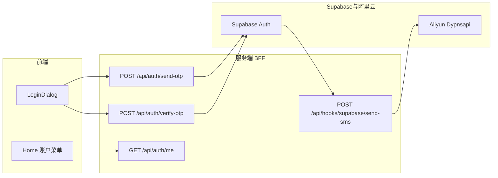
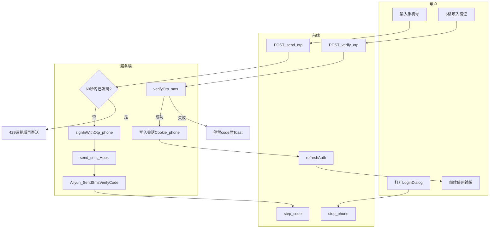
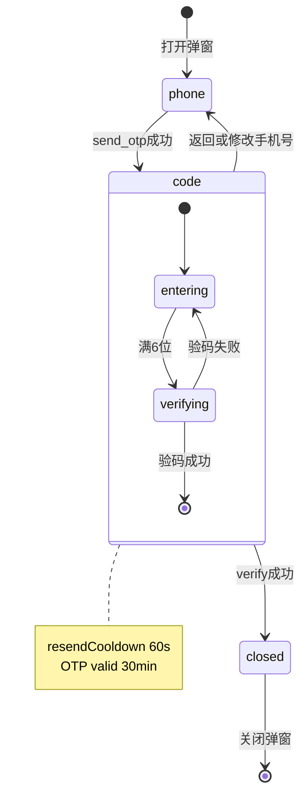
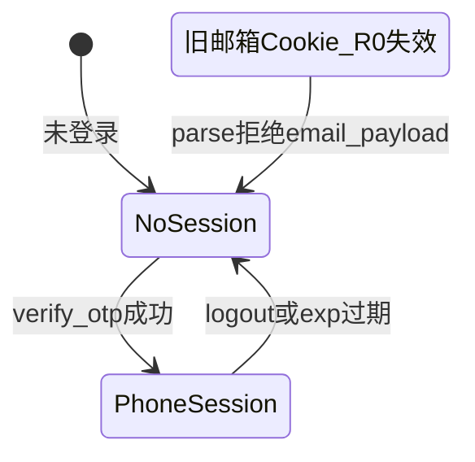

# PRD: 手机号六位镜证登录

## 文首属性

| 属性 | 值 |
|------|-----|
| 状态 | 工程：`partial`（见文末「工程验收状态」章）；R0+R1 代码已合入，运维 E2E 与 OTP 有效期文案待对齐 |
| 范围 | 登录弹窗、Auth API、Send SMS Hook、阿里云短信、Supabase Phone 配置；**完全移除**邮箱 OTP 主路径 |
| 关联文档 | docs/product-brief.md、docs/backend-best-practices.md、docs/supabase-tables.md、AGENTS.md |
| 取代 PRD | [prd-00001-email-otp-login.md](./prd-00001-email-otp-login.md)（邮箱镜证，硬切换后不再作为主登录） |
| 参考实现 | 互远 quammediaweb：`app/api/hooks/supabase/send-sms/route.ts`、`lib/aliyun-sms.ts`、`lib/supabase-send-sms-hook.ts`、`lib/phone.ts` |
| UI 参考 | [login-otp-six-boxes-ui-reference.png](./reference/login-otp-six-boxes-ui-reference.png)（6 格布局沿用；第一屏改为手机号） |
| 序号 | 00006 |

---

## 背景与问题

### 现状

镜微当前通过 **邮箱六位镜证** 登录（[`LoginDialog.tsx`](../../src/components/auth/LoginDialog.tsx)）：

1. 用户输入邮箱 → `POST /api/auth/send-otp`（`signInWithOtp({ email })`）。
2. 用户收邮件 → 在弹窗第二屏填入 6 位镜证 → `POST /api/auth/verify-otp`。
3. 验码成功后写入本站 **HttpOnly 签名 Cookie**（[`server/auth-handlers.ts`](../../server/auth-handlers.ts)），`UserSessionPayload` 含 `email`。

[`docs/product-brief.md`](../../docs/product-brief.md) §3 记为「邮箱六位镜证登录」；§5 API 表描述 `send-otp` 请求体为 `email`。本 PRD 落地后须同步 brief 与 AGENTS.md。

### 要解决的问题

| 痛点 | 说明 |
|------|------|
| 邮件链路割裂 | 用户需离开镜微打开邮件客户端，移动端体验差 |
| 邮件预取风险 | 部分邮件安全网关预取链接（邮箱 OTP 虽已缓解，但收信仍依赖外部 App） |
| 产品方向 | **新用户**应在国内手机号场景下，于应用内收短信、填 6 位数字完成登录 |
| 技术复用 | 互远 quammediaweb 已验证 **Supabase Send SMS Hook → 阿里云 Dypnsapi** 链路，可直接移植 |

### 价值假设

- **为谁**：需登录起卦、同步观心档案、额度与镜脉的国内注册用户（含新注册）。
- **做什么**：用 **+86 手机号 + 6 位短信镜证** 完全替换邮箱镜证；首次验码即注册。
- **为何现在**：短信在应用内闭环；参考实现可复用；避免长期维护邮箱与短信双轨。
- **硬切换**：旧邮箱 `auth.users` **不自动迁移**；存量用户须用手机号重新注册（新 `sub`，旧档案不关联）。

---

## 目标与非目标

### 目标（MVP / Release 0）

- 发码：服务端 `signInWithOtp({ phone: E164 })`；短信经 Supabase **Send SMS HTTP Hook** → 本站 `/api/hooks/supabase/send-sms` → **阿里云 Dypnsapi** 透传 OTP。
- 验码：`POST /api/auth/verify-otp`，`verifyOtp({ type: 'sms' })` 后写入与现网一致的会话 Cookie（字段改为 `phone`）。
- UI：`LoginDialog` 两屏——**手机号（+86）** → **6 格镜证输入**（3 + `-` + 3）；镜微文案定稿表。
- 规则：**验证码有效 30 分钟**；同号 **重发间隔 60 秒**（延续镜微邮箱 PRD，不采用参考项目 30s）。
- **完全移除**邮箱发码/验码 UI 与 API 请求体中的 `email` 字段。
- `GET /api/auth/me` 返回 `user.phone`（E.164）与 `phoneMasked`（如 `138****5678`）。

### 非目标

- 邮箱 OTP / 魔法链接登录（硬切换后不做）。
- 国际区号（R0 固定 **+86** 大陆 11 位）。
- 存量邮箱账号自助绑定手机号或运营合并工具。
- 密码登录、第三方 OAuth 新增。
- 客户端持久化 Supabase `refresh_token`（仍仅用服务端换发的应用 Cookie）。
- 发码前勾选用户协议（参考 quammediaweb 有；镜微 R0 **不加**，见 Release 2 可选）。
- Captcha / 人机验证 R0。

---

## 术语

| 术语 | 含义 |
|------|------|
| 镜证 | 产品文案中对「6 位 OTP」的称呼（邮箱场景称「信中之码」，手机号场景称「讯中之码」） |
| OTP | Supabase Auth 一次性密码；短信场景为 **6 位数字** |
| E.164 | 带国家码手机号，本站统一为 `+86` + 11 位大陆号码 |
| Send SMS Hook | Supabase Auth 在发手机 OTP 时调用的 HTTP Webhook，本站实现于 `/api/hooks/supabase/send-sms` |
| 脱敏手机号 | UI 展示用，如 `138****5678` |
| 应用会话 Cookie | `seeme_user_session`，由 `USER_SESSION_SECRET` 签名的 HttpOnly Cookie |
| 硬切换 | 不迁移旧邮箱用户；旧 Cookie 含 `email` 的 payload **R0 不再解析** |

---

## 已拍板规则

| 规则 | 结论 |
|------|------|
| 登录方式 | **仅** +86 手机号 6 位短信镜证 |
| 存量用户 | **硬切换**，不迁移；旧邮箱账号视为独立历史身份 |
| Auth 提供商 | Supabase Auth Phone OTP（`SUPABASE_URL` + `SUPABASE_ANON_KEY`） |
| 短信通道 | Supabase Hook → 阿里云 Dypnsapi（OTP **透传**，禁止模板 `##code##`） |
| 会话 | 验码成功后继续 **自定义 HttpOnly Cookie**；payload `sub` + `phone`（E.164）+ `exp` |
| 验证码有效期 | **30 分钟**（1800 秒）；Supabase 与阿里云模板 `min` 参数对齐为 `30` |
| 重发间隔 | **60 秒**（同号两次 `send-otp`） |
| OTP 输入 UI | **6 个独立格**，布局 3 + `-` + 3 |
| 满 6 位 | 自动调用验码 API |
| API 路径 | **保留** `POST /api/auth/send-otp`、`POST /api/auth/verify-otp`（请求体改为 `phone`，**破坏性变更**） |
| 旧 Cookie | R0 **不接受**含 `email` 的旧 session payload |
| `/auth/callback` | 非登录主路径；可保留提示页 |
| `POST /api/auth/session` | 保持 **410 Gone** |

### 敏感能力

| 能力 | 约束 |
|------|------|
| 发码 | 须校验大陆 11 位手机号；60 秒内同 E.164 不可重复发码（应用层 + Supabase 限流取较严） |
| 验码 | 仅服务端持有 anon key 调 `verifyOtp`；不向浏览器下发长期 Supabase session |
| Hook | `SEND_SMS_HOOK_SECRET` 验签；非法签名 403 |
| 密钥 | `USER_SESSION_SECRET`、`SUPABASE_*`、`ALIYUN_*` 仅服务端；禁止写入前端 bundle |

---

## 用户与角色

| 角色 | 目标 |
|------|------|
| 内省用户（访客→注册） | 在弹窗内用手机号完成登录，同步档案与额度 |
| 运营 / 支持 | 减少邮件类工单；知悉存量邮箱用户需重新用手机号注册 |
| 工程 | Express + Vercel 双运行时行为一致；复用 `server/*` 共享逻辑 |
| 运维 | 配置 Supabase Phone、Send SMS Hook URL、阿里云签名模板 |

---

## product-brief 漂移清单（Release 0 后须改）

| 文档位置 | 当前表述 | 落地后应以何为准 |
|----------|----------|------------------|
| product-brief §3 功能矩阵 | 邮箱六位镜证登录 | **手机号六位镜证登录** |
| product-brief §5 `send-otp` | 寄送邮箱六位镜证 | 寄送手机号六位镜证（60s 冷却） |
| product-brief §5 `verify-otp` | （隐含 email） | 验码 body `{ phone, token }`；`me` 含 `phoneMasked` |
| AGENTS.md 产品一句 | 邮箱六位镜证 | **手机号六位镜证** |
| `.env.example` | 邮箱魔法链接注释 | Phone OTP + `SEND_SMS_HOOK_SECRET` + `ALIYUN_*` |
| prd-00001 | 邮箱 OTP 主 PRD | 标记 **superseded**，由本文接管 |

---

## Supabase 与阿里云配置（Release 0 前置）

### Supabase Dashboard

| 配置项 | 要求 |
|--------|------|
| Auth → Providers → **Phone** | 启用 |
| Auth → Hooks → **Send SMS** | Type HTTP；URL `https://<origin>/api/hooks/supabase/send-sms`；Secret → `SEND_SMS_HOOK_SECRET` |
| Phone OTP 长度 | **6** 位（与 UI、`MirrorOtpInput` 对齐） |
| Phone OTP Expiration | **1800** 秒（30 分钟） |
| Auth → Providers → **Email** | OTP 主登录停用；可不删 Provider，但产品不再暴露邮箱登录 UI |
| Site URL | 生产/预览域名合法；Hook URL 须 **公网可达** |

### 本地 Hook 联调说明

Supabase 从云端回调 Hook，**localhost 不可直接被 Hook**。可选：

- ngrok / Cloudflare Tunnel 暴露本地 `3000`
- 仅在 **Vercel Preview** 环境联调发信
- Supabase CLI 本地栈 + 隧道（若团队已配置）

### 阿里云 Dypnsapi

| 变量 | 说明 |
|------|------|
| `ALIYUN_ACCESS_KEY_ID` / `ALIYUN_ACCESS_KEY_SECRET` | RAM AK/SK |
| `ALIYUN_SMS_SIGN_NAME` | 可选，默认 `速通互联验证码` |
| `ALIYUN_SMS_TEMPLATE_CODE` | 可选，默认 `100001` |
| `ALIYUN_SMS_VALID_MINUTES` | 可选，默认与 OTP 有效期对齐 **`30`** |
| `SEND_SMS_HOOK_SECRET` | Dashboard Hooks 完整 secret（`v1,whsec_...`） |

**模板约束**：`templateParam` 透传 Supabase 生成的 `code`（OTP），**禁止**使用阿里云 `##code##` 占位符（会与 Supabase 库内码不一致）。

依赖（用户本地安装）：

```bash
pnpm add standardwebhooks @alicloud/dypnsapi20170525 @alicloud/openapi-client @alicloud/tea-util @alicloud/credentials
```

---

## 功能域

### 1. 架构总览



### 2. 登录弹窗（`LoginDialog`）

**步骤：** `phone` → `code` → 关闭并刷新 `auth/me`。

#### 第一屏（phone）

- 标题保留：**「开启并同步你的档案」**及内省说明。
- 输入：固定展示 **+86** 前缀；用户输入 **11 位大陆手机号**（`type="tel"`，`inputMode="numeric"`，`autoComplete="tel-national"`）。
- 主按钮：**「寄送六位镜证」**（或定稿「寄送六位讯证」——见文案表，R0 推荐保留「镜证」统一术语）。
- Toast 成功：**「镜证已寄至你的手机」**。
- 图标：`Phone` 替换现网 `Mail`。

#### 第二屏（code）

布局沿用 [`./reference/login-otp-six-boxes-ui-reference.png`](./reference/login-otp-six-boxes-ui-reference.png)（6 格分框 + 返回 + 倒计时）。

| 区域 | 规格 |
|------|------|
| 导航 | 左上「返回」→ 回第一屏；保留已填手机号 |
| 标题 | **照见讯中之码** |
| 说明 | 我们已向 **{脱敏手机号}** 寄出一组六位镜证，请于 **三十分钟** 内填入下方。 |
| 输入 | 6 独立方框，3 + `-` + 3；仅 `0-9`；满 6 位自动验码 |
| 重发 | 冷却：「**{n}** 秒后可重新寄送镜证」；可点：「重新寄送镜证」 |
| 次要 | 「修改手机号」 |
| 页脚 | **镜微镜像档案 · 加密存储您的每一次照见** |

**手机号脱敏规则（定稿）：** 保留前 3 位 + `****` + 后 4 位，例：`13812345678` → `138****5678`。

### 3. 镜微文案定稿表

| 场景 | 文案 |
|------|------|
| 第一屏主按钮 | 寄送六位镜证 |
| 发码成功 Toast | 镜证已寄至你的手机 |
| 第二屏标题 | 照见讯中之码 |
| 第二屏说明 | 我们已向 **{脱敏手机号}** 寄出一组六位镜证，请于三十分钟内填入下方。 |
| 重发（冷却） | {n} 秒后可重新寄送镜证 |
| 重发（可点） | 重新寄送镜证 |
| 返回 | 返回 |
| 修改手机号 | 修改手机号 |
| 验码成功 Toast | 登录成功，欢迎来到镜微 |
| 验码失败 Toast | 镜证有误或已失效，请再照见一次 |
| 过期提示 | 镜证已逾三十分钟，请重新寄送 |
| 重发过快 | 请稍后再寄送镜证 |
| 格式错误 | 请输入有效的手机号 |
| sr-only（code） | 照见讯中之码 |

**禁止：**「请输入手机号验证码」「短信验证码」等通用运营商标题。

### 4. HTTP API

| 方法 | 路径 | 请求体 | 成功响应 | 说明 |
|------|------|--------|----------|------|
| POST | `/api/auth/send-otp` | `{ "phone": string }`（11 位或 E.164，服务端规范化为 E.164） | `{ "ok": true, "resendAvailableAt": ISO8601 }` | 60s 内同号 → **429**；`signInWithOtp({ phone })` |
| POST | `/api/auth/verify-otp` | `{ "phone", "token" }`（6 位字符串） | `{ "ok": true, "user": { id, phone } }` + Set-Cookie | `verifyOtp` type `sms` |
| GET | `/api/auth/me` | — | `{ user: { id, phone, phoneMasked }, entitlements?, ... }` | `phone` 为 E.164 |
| POST | `/api/auth/logout` | — | 不变 | |
| POST | `/api/auth/session` | — | **410 Gone** | 保持废弃 |
| POST | `/api/hooks/supabase/send-sms` | Supabase Hook 载荷（raw body + 签名头） | `{}` 200 | 验签后发阿里云；非用户直接调用 |

**破坏性变更：**

- `send-otp` / `verify-otp` 不再接受 `email`；传 `email` 返回 **400**。
- `UserSessionPayload` 字段 `email` → `phone`；旧 Cookie 失效。
- `AuthUser` 类型 `email` → `phone`。

**错误码（沿用）：** `OTP_COOLDOWN` | `OTP_INVALID` | `OTP_EXPIRED` | `OTP_RATE_LIMIT`

### 5. 新增 / 修改模块（工程映射）

| 路径 | 职责 |
|------|------|
| `server/phone.ts` | `isValidChinaMobile`、`parseChinaMobileToE164`、`maskChinaMobile` |
| `server/aliyun-sms.ts` | `sendSupabaseOtpSms`（自 quammediaweb 移植，ESM 风格） |
| `server/supabase-send-sms-hook.ts` | `verifySendSmsHook`（standardwebhooks） |
| `api/hooks/supabase/send-sms.ts` | Vercel 路由 |
| `server.ts` | 注册 `POST /api/hooks/supabase/send-sms` |
| `server/auth-handlers.ts` | Phone `signInWithOtp` / `verifyOtp(type:'sms')` |
| `server/auth-otp-cooldown.ts` | 冷却 key 改为 E.164 phone |
| `server/user-session-cookie.ts` | `UserSessionPayload.phone` |
| `src/lib/auth-api.ts` | `postSendLoginPhone`、`AuthUser.phone` |
| `src/components/auth/LoginDialog.tsx` | 手机号两屏 UI |
| `src/pages/Home.tsx` | 账户菜单 `phoneMasked`、头像首字（手机号末四位或默认字） |
| `src/lib/mask-phone.ts` | 前端脱敏（或与 `server/phone` 逻辑镜像） |

**可删除 / 停用：**

- `src/lib/mask-email.ts` 在登录流中的引用（文件可保留至 R1 清理）
- `postSendLoginEmail` 等邮箱 API 封装

### 6. 发码冷却（应用层）

- 服务端以 **E.164 phone** 为键记录 `lastSentAt`（进程内 Map，与现 [`auth-otp-cooldown.ts`](../../server/auth-otp-cooldown.ts) 同模式）。
- `now - lastSentAt < 60s` → 429，`resendAvailableAt`。
- Vercel 多实例 Map 不共享——R1 可外置 KV（见 prd-00001 R1）。

---

## 用户故事地图与版本切片

### 旅程主干

| 阶段 | 用户目标 | 系统触点 | Entry/Exit |
|------|----------|----------|------------|
| 唤起 | 起卦/档案需登录 | Home → `LoginDialog` open | Entry |
| 留号 | 输入 +86 手机号 | `phone` 屏 | |
| 收证 | 收到 6 位短信镜证 | 短信 + Hook + `send-otp` | |
| 填入 | 6 格输入镜证 | `code` 屏 + `verify-otp` | |
| 入镜 | 成为登录用户 | Cookie + `auth/me` | Exit：弹窗关闭、`refreshAuth` |

### 故事地图

| 阶段 | 故事 | 验收要点 |
|------|------|----------|
| 留号 | 作为用户，我想输入大陆手机号寄送镜证，以便在应用内完成登录 | +86 前缀展示；11 位校验；`send-otp` 200；Toast「镜证已寄至你的手机」 |
| 收证 | 作为用户，我想在三十分钟内完成填入，以便镜证仍有效 | UI 说明含「三十分钟」；Supabase Expiration=1800；超时验码失败 |
| 收证 | 作为用户，我想收到含 6 位数字的短信 | Hook 200；短信内容与 Supabase OTP 一致 |
| 填入 | 作为用户，我想在第二屏用 6 格照见讯中之码 | 标题「照见讯中之码」；3+`-`+3；脱敏手机号 |
| 填入 | 作为用户，我想粘贴六位数字自动验码 | 粘贴填满 6 格后自动 `verify-otp` |
| 纠错 | 作为用户，我想在镜证错误时保留输入 | 失败默认不清空；Toast 镜微口吻 |
| 重发 | 作为用户，我想在 60 秒后可重新寄送 | 60s 倒计时 + API 429 |
| 返回 | 作为用户，我想返回修改手机号 | 「返回」「修改手机号」可用 |
| 入镜 | 作为用户，我想验码后保持登录态同步档案 | Cookie 含 `phone`；`me` 返回 `phoneMasked` 与 `entitlements` |
| 账户 | 作为用户，我在顶栏菜单看到脱敏手机号而非邮箱 | Home 账户菜单展示 `138****5678` |
| 安全 | 作为系统，我想限制刷短信 | 60s 重发 + Supabase 限流 + 阿里云流控映射 429 |
| 切换 | 作为运营，旧邮箱不可再登录 | 无邮箱 UI；`send-otp` 拒收 `email` |

### Release 切片

| 版本 | 范围 | 可验收结果 |
|------|------|------------|
| **R0（MVP）** | Phone send/verify API、Send SMS Hook、阿里云、LoginDialog 两屏、`me` 返回 `phoneMasked`、会话 payload 改 `phone`、brief/AGENTS 同步、拒收 email body | 新用户全程弹窗内短信 OTP 登录；真实 +86 收信验码 ≤2 分钟（人工抽检） |
| **R1** | `phone.ts` + hook payload 单测；删除邮箱登录死代码；`mask-email` 引用清理；E2E 抽检清单文档化 | `pnpm test` 覆盖手机号解析与 Hook payload |
| **R2（可选）** | 发码前用户协议勾选；外置 KV 发码冷却；OTP 格 a11y 读屏标签 | 合规与多实例强一致 |

---

## 核心流程与状态机图

### 主业务流程（泳道）



### LoginDialog 与 OTP 状态



### 会话 Cookie 状态（硬切换）



**死胡同预警：**

- Hook URL 不可达 → 用户收不到短信，停留在 `code` 屏——上线前必须 Preview/生产验 Hook。
- `SEND_SMS_HOOK_SECRET` 未配置 → Hook 500，发码失败。
- 阿里云签名/模板未备案 → R0 阻塞。

---

## 数据与 API 衔接

- **身份**：Cookie 内 `sub` 仍为 Supabase `auth.users.id`；[`interpret_saved_report`](../../docs/supabase-tables.md) 等 RLS 以 `auth.uid()` 为准，**不因登录方式变更改表结构**。
- **无新表**：发码冷却 R0 进程内 Map。
- **用户主键变化**：硬切换后同一自然人若用手机号重新注册，将得到 **新 `sub`**，旧邮箱账号下的档案 **不自动关联**——产品须接受或在运营侧人工处理（非本 PRD 范围）。
- **Hook 路由**：不属于用户 Cookie 鉴权路径；仅接受 Supabase 签名请求。

---

## 成功标准

| 指标 | 标准 |
|------|------|
| 功能 | 100% 新登录走手机号 OTP 弹窗；`verify-otp` + Cookie + `me` 打通 |
| 短信 | 真实 +86 号：发码 → 收 6 位短信 → 登录成功，人工抽检 10 次 ≤2 分钟/次 |
| 体验 | 第二屏 6 格 + 镜微文案表；账户菜单展示脱敏手机号 |
| 安全 | 60s 内同号不可重复发码；Hook 验签；密钥不进前端 bundle |
| 切换 | 无邮箱登录 UI；API 拒收 `email` |
| 运维 | Supabase Phone 启用、Hook URL 可达、阿里云模板透传 OTP |

---

## 依赖

| 依赖 | 负责人 | 说明 |
|------|--------|------|
| Supabase Phone Provider | 运维 | Dashboard 启用 |
| Send SMS Hook URL | 运维 + 工程 | 公网 HTTPS 指向 `/api/hooks/supabase/send-sms` |
| 阿里云签名/模板 | 运维 | 备案完成；`ALIYUN_*` 填入环境 |
| `SEND_SMS_HOOK_SECRET` | 运维 | 与 Dashboard 一致 |
| npm 依赖 | 工程 | `standardwebhooks`、阿里云 SDK（用户本地 `pnpm add`） |
| 双运行时部署 | 工程 | `server.ts` + `api/*` 同步 |

---

## 风险与缓解

| 风险 | 缓解 |
|------|------|
| Hook 本地不可达 | Preview 环境联调；或隧道 |
| 阿里云流控 | 映射 `OTP_RATE_LIMIT` + 镜微 Toast |
| 存量邮箱用户投诉 | 上线前公告硬切换；旧 Cookie 自然过期 |
| 多实例冷却不一致 | R1 外置 KV；R0 文档注明 |
| 模板 `##code##` 误用 | Code review + 参考 quammediaweb 注释 |
| 短信费用刷量 | 60s 冷却 + Supabase rate limit |

---

## 假设与待确认

| # | 项 | 默认假设 |
|---|-----|----------|
| 1 | OTP 有效期 | Supabase **1800s**；`ALIYUN_SMS_VALID_MINUTES=30` |
| 2 | 旧 Cookie 兼容 | R0 **不接受** `email` payload |
| 3 | 发码冷却存储 | R0 进程内 `Map` |
| 4 | 验码失败后是否清空格 | **保留**（与邮箱 PRD 一致） |
| 5 | 阿里云测试签名 | 测试环境已有可用签名；若无则 R0 阻塞 |
| 6 | 第一屏 CTA 用词 | 统一用「镜证」而非「讯证」（仅第二屏标题用「讯」） |
| 7 | `send-otp` 路径名 | 保留不改名，减少路由变更面 |

---

## 修订记录

| 日期 | 说明 |
|------|------|
| 2026-07-06 | 初稿：手机号 OTP 硬切换替换邮箱；Send SMS Hook + 阿里云；+86 only；60s/30min；取代 prd-00001 |

---

## 1. 工程验收状态

> 由 `/team:prd-accept` 维护；勿手工编造「通过」。最后更新：2026-07-06T10:08:00Z，main@a121312，范围：all。

### 总览

| 项 | 内容 |
|----|------|
| 工程状态 | `partial` |
| 验收判定 | **R0+R1 代码路径通过**；运维侧 Supabase/Hook 配置与真实 +86 全流程 E2E 待人工确认；OTP 有效期实现为 **10 分钟**（与 PRD 正文 30 分钟不一致） |
| 最近验收 | 2026-07-06，main@a121312 |
| 代码提交 | 09729c7（手机号 OTP 全链路）；a121312（修复 Hook 阿里云 SDK ESM 导入与 11 位本地号格式） |
| 摘要 | Phone send/verify、Hook→阿里云、LoginDialog 两屏、会话 `phone`、`me.phoneMasked`、邮箱硬切换、单测与 E2E 清单已落地；`pnpm run lint` / `pnpm test` 通过 |

### Release 交付

| Release | 状态 | 说明 |
|---------|------|------|
| R0 | 部分 | 工程代码与文档同步完成；Supabase Dashboard（Phone/Hook/过期秒数）与公网 Hook 可达性、10 次真实收信验码待运维/人工抽检 |
| R1 | 通过 | `phone`/`hook` 单测（`node:test`+`tsx`）、邮箱死代码清理、`mask-email` 删除、E2E 清单文档 |
| R2 | 范围外 | 用户协议勾选、外置 KV 冷却、a11y 读屏标签未实现 |

### 功能验收清单（Agent 优先读此表）

| ID | 能力摘要 | Release | 状态 | 证据 |
|----|----------|---------|------|------|
| FEAT-00006-01-BE | `signInWithOtp({ phone })` + 60s 冷却 | R0 | 通过 | `server/auth-handlers.ts` `handleSendLoginOtp`；`server/auth-otp-cooldown.ts` |
| FEAT-00006-02-BE | `verifyOtp({ type:'sms' })` + Cookie `phone` | R0 | 通过 | `server/auth-handlers.ts` `handleVerifyLoginOtp`；`server/user-session-cookie.ts` |
| FEAT-00006-03-BE | 拒收 `email` body；旧 email Cookie 失效 | R0 | 通过 | `rejectEmailBody`；`parseUserSessionToken` 仅接受 `phone` |
| FEAT-00006-04-BE | `GET /api/auth/me` 含 `phone`/`phoneMasked` | R0 | 通过 | `handleMe` + `maskChinaMobile`（`server/phone.ts`） |
| FEAT-00006-05-BE | Send SMS Hook 验签 + 阿里云透传 OTP | R0 | 通过 | `server/supabase-send-sms-hook.ts`；`server/aliyun-sms.ts`；`server/send-sms-hook-handler.ts` |
| FEAT-00006-06-BE | 双运行时 Hook 路由（raw body） | R0 | 通过 | `server.ts`（`express.raw` 先于 `json`）；`api/hooks/supabase/send-sms.ts` |
| FEAT-00006-07-FE | LoginDialog +86 两屏、镜微文案 | R0 | 通过 | `src/components/auth/LoginDialog.tsx`；`MirrorOtpInput.tsx` |
| FEAT-00006-08-FE | `postSendLoginPhone` / `AuthUser.phone` | R0 | 通过 | `src/lib/auth-api.ts`；`src/lib/mask-phone.ts` |
| FEAT-00006-09-FE | Home 账户菜单脱敏手机号 | R0 | 通过 | `src/pages/Home.tsx` `displayPhone` / `initialFromPhone` |
| FEAT-00006-10-DOC | brief / AGENTS / `.env.example` | R0 | 通过 | `docs/product-brief.md`；`AGENTS.md`；`.env.example` |
| FEAT-00006-11-OPS | Supabase Phone + Hook URL + 过期配置 | R0 | 部分 | 代码就绪；Dashboard 启用/Hook 公网 URL/**600s** 需运维确认（PRD 正文仍写 1800s） |
| FEAT-00006-12-E2E | 真实 +86 发码→收信→登录 ≤2min | R0 | 部分 | 本地曾现 Hook 500（SDK 导入已修）；测试服部署后按 `docs/faqs/phone-otp-login-e2e-checklist.md` 抽检 |
| FEAT-00006-13-RULE | OTP 有效期 10 分钟（产品变更） | R0 | 部分 | `server/aliyun-sms.ts` `DEFAULT_VALID_MINUTES=10`；UI「十分钟」；**PRD 正文/假设表仍为 30 分钟，待修订** |
| R1-01 | `server/phone.test.ts` 单测 | R1 | 通过 | `pnpm test` 5 cases |
| R1-02 | `supabase-send-sms-hook.test.ts` 验签单测 | R1 | 通过 | `pnpm test` 3 cases |
| R1-03 | 删除邮箱登录死代码 | R1 | 通过 | 无 `postSendLoginEmail`/`mask-email.ts`；grep 登录流无 email |
| R1-04 | E2E 抽检清单文档 | R1 | 通过 | `docs/faqs/phone-otp-login-e2e-checklist.md` |
| R1-05 | 测试框架 | R1 | 部分 | 使用 `node --import tsx --test`；PRD R1 曾写 vitest，未引入 vitest 包 |

### 未完成与遗留

- **PRD 漂移**：正文「三十分钟 / 1800s / `ALIYUN_SMS_VALID_MINUTES=30`」与实现 **10 分钟**不一致，建议产品修订 PRD 或回退实现。
- **运维 checklist**：Supabase Phone Provider、Send SMS Hook HTTPS URL、`SEND_SMS_HOOK_SECRET`、`ALIYUN_*` 需在目标环境逐项勾选（见 E2E 清单前置）。
- **测试服部署**：Hook 修复（a121312）须部署到 Supabase Hook 指向的公网 origin 后，再复测发码。
- **R2**：协议勾选、KV 冷却、OTP a11y 未排期。

### 质量检查

| 检查项 | 状态 |
|--------|------|
| `pnpm run lint` | 通过（2026-07-06，main@a121312） |
| `pnpm test` | 通过（8/8，`server/phone.test.ts` + `server/supabase-send-sms-hook.test.ts`） |
| 文档与仓库实现同步 | 部分（PRD 正文 OTP 时长未同步为 10 分钟） |
| 浏览器手测（localhost 发码） | 部分（依赖远端 Hook；SDK 修复后本地 Hook+阿里云单测 OK） |

---
统计：通过 15 / 部分 5 / 未实现 0 / 范围外 1（R2）
