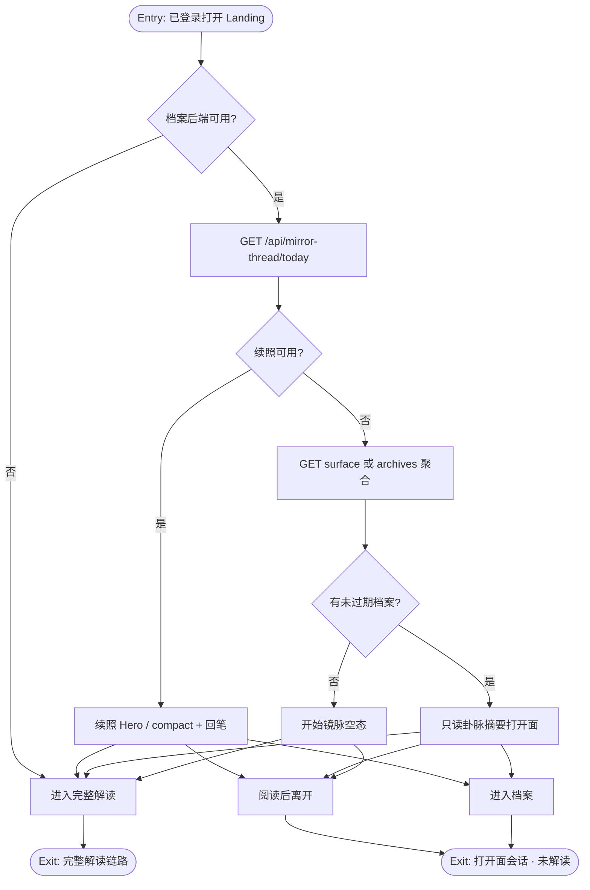
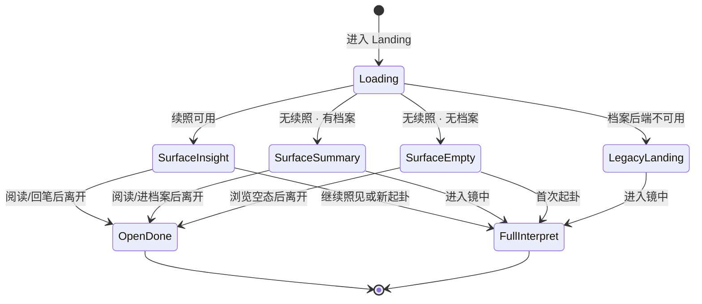

# PRD: 镜脉 · 非解读日打开面

## 文首属性

| 属性 | 值 |
|------|-----|
| 状态 | 工程：partial（见文末「工程验收状态」） |
| 范围 | Landing/History 镜脉着陆增强；无今日续照时的卦脉摘要与空态；摘要 API（或 archives 聚合）；打开面会话埋点；**不**改续照/回笔契约 |
| 关联文档 | docs/product-brief.md、docs/supabase-tables.md、docs/backend-best-practices.md、docs/frontend-best-practices.md、AGENTS.md |
| 父 PRD | specs/prds/prd-00003-mirror-thread-daily-insight.md |
| 相关 PRD | specs/prds/prd-00004-mirror-thread-seed-pregen.md、specs/prds/prd-00005-mirror-thread-reply.md |
| 参考 Feature Spec | specs/features/feat-00003-mirror-open-without-interpret.md |
| 序号 | 00007 |

---

## 背景与问题

### 现状

镜微已具备「有今日续照」时的内因回访闭环：

- 明日之约 → seed 预写 → 今日续照（prd-00003 / 00004）
- 可选回笔 → 次日 verbatim 照见（prd-00005）
- 完整主链路仍是：困惑 → 起卦 → 四镜 → 观心报告（扣解读额度）

产品原则：**不预言命运，只映照叙事**。留存禁止签到、streak、催更弹窗外驱。

### 要解决的问题

当 **今日续照不可用**（无 seed/daily、档案为空或全过期、或缺席导致无 insight）时，Landing 逻辑塌缩为 **唯一完整解读漏斗**（`showMirrorHero` / `showMirrorStrip` 均依赖 `mirrorThreadInsight`）。History 空态同样只导向「起一卦」。

| 痛点 | 说明 |
|------|------|
| 钩子不可用即空白 | 非解读日打开后没有「轻量被照见」落点 |
| 北极星错位 | 打开行为被重新导向完整解读，抬高摩擦 |
| 空档案惩罚感 | 新用户/过期用户缺少「开始镜脉」的温和空态（非任务） |
| 外驱诱惑 | 若用签到补洞，将破坏品牌与既有镜脉设计 |

**探索结论（已确认）**：增强镜脉着陆，而非新建第二日活产品；严格只映照。

---

## 目标与非目标

### 目标（Release 0 / MVP）

1. 已登录且档案后端可用时，**无今日续照**的 Landing 仍有打开面：有未过期档案 → 只读卦脉摘要；无 → 「开始你的镜脉」空态。
2. **有今日续照**时，既有 Hero / compact / 回笔体验不变；R0 不平行插入第二同等 Hero。
3. 卦脉摘要为规则聚合（最近 N 条未过期档案本卦名等），**打开日零 LLM**，**不扣**解读额度。
4. 文案严格映照：禁用吉凶、运势、宜忌、签到/连续天数话术。
5. 可观测：能区分「打开面会话」与「升级为完整解读」的会话。

### 成功标准（可度量）

| 指标 | 目标（R0 上线后观察窗建议 ≥14 天） |
|------|-------------------------------------|
| 打开面会话占比 | 已登录 Landing 会话中，未起卦成功的轻量会话可统计；相对基线「无续照日打开即离开/仅起卦」有可对比日志 |
| 有档案且无续照日的打开回访 | 该类用户 D+1 / D+7 再次打开率不低于上线前同队列（若有埋点基线）；至少能输出队列漏斗 |
| 回归 | 有续照日的 Hero/回笔路径零功能回归 |
| 性能 | 摘要接口 P95 对齐轻量 list（无 LLM）；不拖垮 Landing 首屏 |
| 合规文案 | 打开面字符串对照禁用词表零命中 |

### 非目标

- 签到、连续打开天数、徽章、积分、每日登录奖励、任务中心、Push/邮件催打开
- 吉凶断语、时令「今日运势」、投资/医疗建议
- 独立「每日运势」类第二主入口
- R0 新增「片刻完整四镜/轻量解读」主功能（另立项）
- R0 打开日 LLM 叙事弧；公开社交 Feed

---

## 术语

| 术语 | 含义 |
|------|------|
| 非完整解读日 | 东八区自然日内用户未完成（或不打算完成）起卦+观心报告主链路 |
| 打开面 | Landing/History 上供「只打开、不解读」的轻量镜面 UI/内容 |
| 打开面会话 | 看见打开面（摘要/空态/续照阅读或回笔）且未成功发起新完整解读 |
| 卦脉摘要 | 未过期档案规则聚合的只读近期本卦（+可选困惑截断） |
| 续照可用 | `GET /api/mirror-thread/today` 非 204 且前端持有 insight |
| 严格映照 | 不预言命运，只映照叙事与卦象意象 |

---

## 已拍板规则 / 取舍

| # | 议题 | 结论 | 状态 |
|---|------|------|------|
| 1 | 北极星 | 提高非完整解读日打开频次 | 已定 |
| 2 | 话术边界 | 严格只映照 | 已定 |
| 3 | 与镜脉关系 | 增强着陆，非第二日活产品 | 已定 |
| 4 | 无续照内容 | 有档案→摘要；无→空态 | 已定 |
| 5 | 打开日 LLM | R0 禁止 | 已定 |
| 6 | 额度 | 不调用 `consume_interpret_quota` | 已定 |
| 7 | 外驱 | 禁止签到/streak/催更弹窗 | 已定 |
| 8 | 摘要 N | 默认 **5**（3～7 可调常量） | 已定（工程可改常量） |
| 9 | History | Landing 必须；History 复用同源组件或空态文案对齐 | 已定方向 |
| 10 | API 形态 | 优先 `GET /api/mirror-thread/surface`；或扩展 archives——PR 二选一文档化 | 待工程 |
| 11 | 主题词 | R0：本卦名 + 固定模板句；困惑截断可选 | 已定方向 |
| 12 | 会员差异文案 | R0 同一套 | 已定 |

---

## 用户与角色

| 角色 | 目标 |
|------|------|
| 已登录、有档案、今日无续照 | 打开即看见近期足迹，无需起卦 |
| 已登录、今日有续照 | 体验与现网一致 |
| 已登录、无档案 | 温和开始镜脉，非任务压迫 |
| 访客 | 不展示打开面增强 |
| 产品/研发 | 可验收、可回归、不破坏额度与原则 |

---

## 功能域

| 域 | 说明 |
|----|------|
| Landing 打开面分支 | 续照 / 摘要 / 空态三态；与 `Home.tsx` 镜脉 gating 对齐 |
| History 文案对齐 | 空态与可选摘要块与 Landing 同源原则 |
| 摘要数据 | 未过期 `interpret_saved_report` 最近 N 条本卦等字段 |
| 文案词表 | 禁用词与「近期足迹/镜脉」自称 |
| 观测 | `mirror_surface_open` 类事件 + 是否升级解读标记 |
| 回归 | prd-00003/00004/00005 路径不变 |

---

## 用户故事地图与版本切片

### 旅程主干

| 步骤 | 节点 | 用户动作 | 系统 | Entry/Exit |
|------|------|----------|------|------------|
| 0 | Entry | 已登录打开 App → Landing | 校验会话与档案后端 | **Entry** |
| 1 | 判续照 | — | `GET /api/mirror-thread/today` | |
| 2a | 续照面 | 阅读/回笔/收起 | Hero/compact（既有） | |
| 2b | 摘要面 | 阅读近期卦脉；可选进档案 | 展示规则摘要 | |
| 2c | 空态面 | 阅读「开始镜脉」 | 空态 + 原则句 | |
| 3 | 轻量闭环 | 离开或仅浏览 | 记打开面会话 | **Exit(Teardown)** 未解读 |
| 4 | 自愿升级 | 进入镜中 / 继续照见 | 既有起卦/解读 | **Exit** 进入主链路 |
| 5 | 跨日回访 | 再打开 | 摘要更丰富或续照恢复 | 循环 |

### 用户故事地图（含验收要点）

**阶段 A · 打开即有面**

| 故事 | 验收要点 |
|------|----------|
| 作为有档案且无续照的用户，我想看到近期卦脉摘要，以便不起卦也愿意打开 | 展示只读摘要；无签到/运势词；解读入口不唯一霸占首屏心智 |
| 作为无档案用户，我想看到开始镜脉的空态，以便理解下一步而非被催打卡 | 空态 + 严格映照原则句；CTA 引导首次解读；无连续天数 |
| 作为有续照用户，我想体验与现在一样，以便不被新功能打扰 | Hero/compact/回笔与现网一致；无第二平行 Hero |

**阶段 B · 数据与性能**

| 故事 | 验收要点 |
|------|----------|
| 作为前端，我想一次拿到规则摘要，以便打开日零 LLM | 摘要 API 或等价聚合；不扣额度；无档案返回空列表 |
| 作为用户，我想摘要失败时仍能用产品，以便不白屏 | 摘要失败降级隐藏/轻量提示；起卦仍可用 |

**阶段 C · 品牌与观测**

| 故事 | 验收要点 |
|------|----------|
| 作为品牌方，我希望文案不含吉凶运势，以便守住不预言 | 禁用词表零命中 |
| 作为产品，我想区分打开面与完整解读，以便验证北极星 | 埋点可分流；升级解读可标记 |

### Release 切片

| Release | 范围 | 可验收结果 |
|---------|------|------------|
| **R0（MVP）** | Landing 三态；卦脉摘要规则聚合；空态文案；History 空态对齐；不扣额度；零 LLM；禁用词；轻量埋点；续照/回笔回归 | 无续照有档案可见摘要；无档案见空态；有续照体验不变 |
| **R1（可选）** | History 复用摘要块；困惑截断进模板；摘要文案微调；埋点看板 | History 与 Landing 摘要同源 |
| **R2（可选）** | 轻量 LLM「叙事弧一句」（仍禁吉凶）；会员差异化文案 | 另评合规与成本后再做 |

---

## 核心流程与状态机图

### 主业务流程图

### 打开面状态图

**死胡同预警（禁止）**

- 空态/摘要使用签到、连续天数、领奖话术
- 打开面成功后强制跳转完整解读
- 打开日为摘要调用 LLM
- 与续照并列两个同等权重 Hero

---

## 数据与 API 衔接

| 项 | 说明 |
|----|------|
| 复用 | `GET /api/mirror-thread/today`、archives 列表、`interpret_saved_report`（未过期）、回笔 API（不改契约） |
| 建议新增 | `GET /api/mirror-thread/surface` → `{ items: [{ archiveId, hexagramName, questionPreview?, createdAt }], empty: boolean }`；N 默认 5 |
| 替代方案 | 扩展 `GET /api/archives` 聚合字段；PR 必须写明选定方案 |
| 额度 | 全路径禁止 `consume_interpret_quota` |
| 运行时 | Express + Vercel `api/*` 共用 server handler（docs/backend-best-practices.md） |
| 前端入口 | `src/pages/Home.tsx`、镜脉相关组件；History 空态文案组件 |

---

## 假设与待确认 / 开放项

| # | 项 | 默认假设 |
|---|----|----------|
| 1 | surface vs archives 扩展 | 优先独立 `surface`，便于权限与缓存语义清晰 |
| 2 | History 是否展示摘要块 | R0 至少空态文案对齐；摘要块可 R1 |
| 3 | 固定模板句最终文案 | 工程实现时与产品过一眼禁用词 |
| 4 | 埋点存储 | 可先对齐现有 mirror read beacon 的日志风格 |
| 5 | 与「片刻映照」关系 | 另立 Feature/PRD；本 PRD 不包含 |

### 冲突与决议需求

无与 product-brief 原则冲突；本 PRD **强化**「不预言 / 不签到」约束。若文案评审出现运势向表述，以本 PRD 禁用词为准驳回。

---

## 修订记录

| 日期 | 说明 |
|------|------|
| 2026-07-13 | 初稿：基于 feat-00003 与已确认默认假设落盘 prd-00007 |

---

## 风险与缓解

| 风险 | 缓解 |
|------|------|
| 摘要被当成每日运势传播 | 自称「近期足迹/镜脉」；禁用词；内容随档案稳定而非每日随机 |
| 双入口分流（摘要 vs 续照） | 有续照时不展示平行 Hero |
| 无续照用户仍只点起卦 | 摘要置于首屏可读区；观测打开面 vs 升级比例再迭代 |
| 接口拖慢 Landing | 轻量 list、无 LLM、失败降级 |

---

## 依赖

- 已上线：登录、云端档案、镜脉 today/seed/回笔（prd-00003～00005）
- 工程：双运行时路由注册、前端 Landing 状态分支
- 不依赖：会员购买链路、Push 系统

---

## 1. 工程验收状态

> 由 `/team:prd-accept` 维护；勿手工编造「通过」。最后更新：2026-07-13T03:05:29Z，main@1a2963b（工作区含未提交实现），范围：R0,R1。
> 参考 Feature Spec：[feat-00003-mirror-open-without-interpret.md](../features/feat-00003-mirror-open-without-interpret.md)（本验收以 PRD 为准，不单独回写 feat）。

### 总览

| 项 | 值 |
|----|-----|
| 工程状态 | partial |
| 验收判定 | R0 主路径通过；R1 部分项为「部分」（困惑截断未上 Landing 耳语；无独立埋点看板） |
| 最近验收 | 2026-07-13T03:05:29Z |
| 代码提交 | main@1a2963b（实现尚未 commit） |
| 摘要 | ① 独立 `GET /api/mirror-thread/surface`（N=5、零 LLM、不扣额度）+ `POST …/surface-open` ② Landing：有续照 Hero/strip 不变；无续照→耳语/空态轻提示；`enabled:false` 仍拉 surface ③ History 空态文案同源；无续照不挂摘要卡（列表即足迹）④ R2 LLM/会员文案范围外 |

### Release 交付

| Release | 状态 | 说明 |
|---------|------|------|
| R0 | 通过 | Landing 三态、surface API、空态、History 空态对齐、埋点日志、续照路径不抢戏 |
| R1 | 部分 | 同源原则以「Landing 耳语 + History 列表」落地（不重复挂卡）；API 已有 `questionPreview`，耳语未展示；无 BI 看板 |
| R2 | 范围外 | 轻量 LLM 叙事弧 / 会员差异化——本次未纳入 |

### 功能验收清单（Agent 优先读此表）

| ID | 能力摘要 | Release | 状态 | 证据 |
|----|----------|---------|------|------|
| F-01 | Landing 无续照+有档案：可见近期足迹打开面 | R0 | 通过 | [`MirrorSurfaceWhisper`](../../src/components/IChing/MirrorSurfaceCard.tsx)；[`Home.tsx`](../../src/pages/Home.tsx) `showSurfaceSummary`；耳语「你的近期足迹 · {卦名}」，点进档案 |
| F-02 | Landing 无续照+无档案：开始镜脉空态 | R0 | 通过 | [`MirrorSurfaceEmptyWhisper`](../../src/components/IChing/MirrorSurfaceCard.tsx)；[`mirror-surface-copy.ts`](../../src/lib/mirror-surface-copy.ts) |
| F-03 | 有续照：Hero/compact，无第二平行 Hero | R0 | 通过 | [`Home.tsx`](../../src/pages/Home.tsx) `showMirrorGate` / `showMirrorStrip`；有 insight 时不渲染 surface 耳语 |
| F-04 | `GET /api/mirror-thread/surface` 规则聚合 N=5 | R0 | 通过 | [`handleMirrorThreadSurface`](../../server/mirror-thread-handlers.ts)；[`api/mirror-thread/surface.ts`](../../api/mirror-thread/surface.ts)；[`server.ts`](../../server.ts)；`SURFACE_ARCHIVE_LIMIT=5`；含 `hexagramName`/`questionPreview`/`empty` |
| F-05 | 打开面不扣额度、零 LLM | R0 | 通过 | surface handler 仅 list `interpret_saved_report`；无 `consume_interpret_quota`、无 seed/LLM |
| F-06 | `enabled:false`（续照未达资格）仍拉 surface | R0 | 通过 | [`Home.tsx`](../../src/pages/Home.tsx) `loadMirrorThread` → `loadMirrorSurface`（修复验收 bug） |
| F-07 | 摘要失败降级、起卦仍可用 | R0 | 通过 | `fetchMirrorThreadSurface` catch → `mirrorSurface=null`；漏斗 textarea/进入镜中仍在 |
| F-08 | History 空态文案对齐 | R0 | 通过 | [`History.tsx`](../../src/components/IChing/History.tsx) 用 `MIRROR_SURFACE_EMPTY_*` |
| F-09 | 禁用词 / 严格映照文案 | R0 | 通过 | [`mirror-surface-copy.ts`](../../src/lib/mirror-surface-copy.ts) 注释禁用词表；自称「近期足迹」 |
| F-10 | `mirror_surface_open` + `escalatedToInterpret` | R0 | 通过 | [`handleMirrorThreadSurfaceOpen`](../../server/mirror-thread-handlers.ts)；[`postMirrorSurfaceOpenBeacon`](../../src/lib/mirror-thread-api.ts)；Landing 离开/`pagehide`/`startDivination` |
| F-11 | History 与 Landing 摘要同源（R1） | R1 | 通过 | 工程取舍：不重复挂摘要卡；History `historyMirrorBlock` 仅续照 Hero；足迹由档案列表承担，与 surface 同源数据 |
| F-12 | 困惑截断进 Landing 模板 | R1 | 部分 | API 已返回 `questionPreview`；Landing 耳语仅卦名，未展示「关于…」 |
| F-13 | 埋点看板 | R1 | 部分 | 结构化 `console.info` 可分流检索；无独立看板/可视化 |
| F-14 | R2 LLM 叙事弧 / 会员差异文案 | R2 | 范围外 | — |

### 未完成与遗留

- Landing 耳语是否纳入 `questionPreview`（R1 文案微调）待产品确认。
- 埋点看板：若需漏斗面板，另立观测任务；当前依赖日志。
- 实现仍在工作区未 commit；合入前建议再跑一轮 UI 回归（有续照日 Hero）。
- R2 明确不做。

### 质量检查

| 检查项 | 状态 |
|--------|------|
| pnpm test | 通过（8/8，既有 phone/SMS hook；无本特性单测） |
| pnpm lint | 通过（`tsc --noEmit`） |
| 文档与 OpenAPI 同步 | 部分（PRD/feat 已落盘；`product-brief` API 表未强制同步本轮） |

---
统计：通过 11 / 部分 2 / 未实现 0 / 范围外 1
